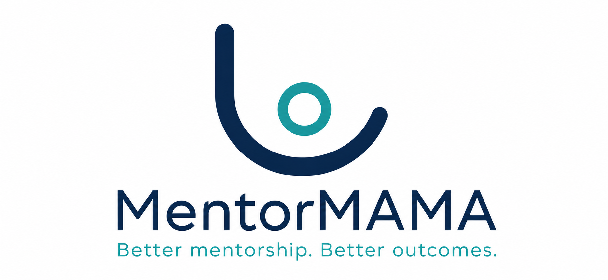

<div align="center">
  
  <br />
  <p><strong>A digital mentorship toolkit for safer midwifery clinical placement</strong></p>
</div>

---

## 📖 Overview

**MentorMAMA** is a mobile-first digital capacity-building and workflow platform designed to improve student mentorship in maternity units across County Referral Hospitals in Kenya. 

Clinical placement is the most critical phase of midwifery education, but mentorship is often informal, inconsistent, and constrained by high student-to-mentor ratios. MentorMAMA bridges this gap by combining short digital mentor training, a structured labour ward induction checklist, mentorship session logs, student feedback, and real-time visibility dashboards for academic and facility coordinators.

This project is developed in collaboration with:
- **JKUAT School of Nursing** (Academic coordination & framework validation)
- **JHUB Africa** (Technical validation & collaborative development)
- **AfyaVentures** (Program validation & pilot support)

## 🚀 Core Product Workflows

The platform is role-based, supporting tailored journeys for each user:

1. **Midwifery Students:** Receive clear clinical expectations, complete orientation, log placement activities, and submit confidential feedback regarding the safety and respect of their learning environment.
2. **Clinical Mentors:** Access short CPD-aligned training modules, execute the labour ward induction checklist for new students, and record high-impact, 3-minute mentorship session logs.
3. **Nurse Managers / Ward In-Charges:** Monitor induction completion, assign mentors, and review escalated safeguarding concerns in real-time.
4. **University Coordinators:** Track cohort progress and export data for regulatory reporting.

## 🛠️ Technical Architecture

The platform uses a modern, mobile-first approach, prioritizing speed, low-bandwidth accessibility, and an exceptional user experience on smartphones.

- **Frontend:** Progressive Web App (PWA) built with **React**, **TypeScript**, and **Vite**.
- **Styling:** **Tailwind CSS** implementing a strict, custom design system.
- **Animations:** **GSAP** for premium, low-overhead UI transitions.
- **Package Manager:** **pnpm** (Monorepo architecture using Turborepo workspaces).

### Design System & Typography
- **Core Colors:** Midnight Navy (`#112B4A`), Ocean Teal (`#2BA6A6`), Warm Mist (`#F8FAF8`), Soft Stone (`#E8ECEB`), Terracotta (`#E98F72`).
- **Typography:** `Manrope` (Headings) and `Inter` (UI/Body).

## 🛡️ Privacy, Security, & Ethics

MentorMAMA enforces strict data protection boundaries designed for healthcare environments:
- **No Patient Data:** The MVP explicitly prevents the collection of patient-identifiable data (e.g., EMR, phone numbers, medical record numbers). It is exclusively an educational workflow tool.
- **Confidentiality:** Student feedback forms support anonymous and confidential escalation pathways.
- **Role-Based Access Control (RBAC):** Mentors only see data for their assigned students, and managers only view data for their active wards.

## 💻 Developer Setup

Ensure you have **Node.js** (v18+) and **pnpm** installed.

1. **Clone the repository:**
   ```bash
   git clone https://github.com/JHUB-AFRICA/mentor-mama.git
   cd mentor-mama
   ```

2. **Install dependencies:**
   ```bash
   pnpm install
   ```

3. **Start the local development server:**
   ```bash
   pnpm --filter @mentormama/web dev
   ```
   *The application will typically start on `http://localhost:5173`.*

4. **Lint and Build commands:**
   ```bash
   # Run Linter
   pnpm --filter @mentormama/web lint

   # Build for Production
   pnpm --filter @mentormama/web build
   ```

## 📄 License & Confidentiality

This repository contains proprietary information, designs, and source code. All rights are reserved by the collaborative project partners. Unauthorized copying, distribution, or adaptation is strictly prohibited.
