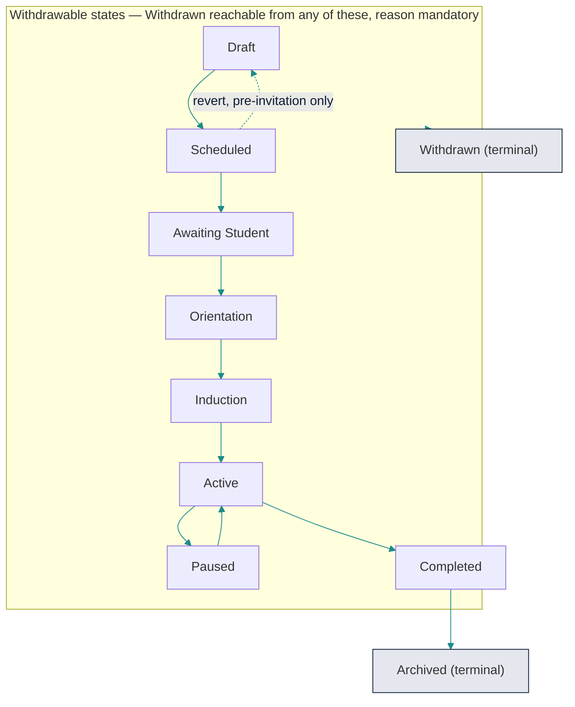
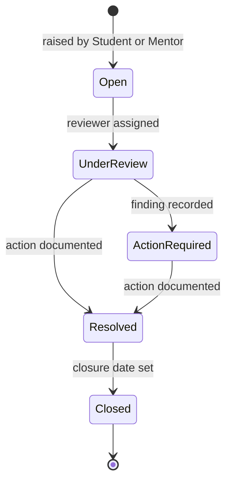

# MentorMAMA — Stage 3: Business Rules & Domain Invariants

**The enforceable constitution of the domain**

| Field | Detail |
| --- | --- |
| Product | MentorMAMA — Digital Mentorship Toolkit for Safer Midwifery Clinical Placement |
| Prepared by | Sinaps Technology — Bouric Okwaro Enos (Ric), Co-Founder & Team Lead |
| Document type | Stage 3 of the design sequence: Business Rules & Domain Invariants |
| Precedes | Stage 3.5 (Use Cases & Sequence Diagrams) → Stage 4 (Module Architecture) → Stage 5 (Database Architecture) |
| Builds on | Stage 1 Business Discovery Report v1.0; Stage 2 Domain Model (Parts 1 & 2); Developer Concept Note v1.0; SADD v1.0 |
| Version | 1.2 (incorporates JKUAT decisions of 30 July 2026 — see Appendix B) |
| Date | July 2026 |

---

## 1. Purpose of This Stage

Stage 2 defined **what exists**. This stage defines **what is allowed**.

Every rule in this document is written to be enforced by code, not by convention. Each one carries an
identifier, an owner (the layer that enforces it), and a failure mode (the domain error raised when it is
violated). A rule that cannot be stated with those three properties is not a rule — it is a preference, and it
belongs in the product backlog, not here.

This matters more for MentorMAMA than for an average workflow product for two reasons carried forward
from Stage 1:

1. **Two independent institutions share one object.** A university and a hospital both act on the same
   Placement while having zero authority inside each other's jurisdiction. Rules are the only thing preventing
   one side from silently overriding the other.
2. **Part of the data is safeguarding-sensitive.** Escalations and student feedback carry real-world
   consequences for real people. "The UI does not show that button" is not an access-control model.

### 1.1 How to read this document

- **POL-xx** — Business Policies. How the mentorship programme operates. Change slowly, by stakeholder decision.
- **INV-xx** — Domain Invariants. Must be true at every commit boundary. No role, including Program
  Administrator, may violate one.
- **WFR-xx** — Workflow Rules. Which state transitions are legal, and under what guard.
- **AUTH-xx** — Authorization Rules. Who may perform an action, over which scope.

Each rule table carries an **Enforced at** column with one of:

| Value | Meaning |
| --- | --- |
| `DB` | Database constraint, unique index, check constraint, or foreign key |
| `TXN` | Guard inside a database transaction, with row lock or version check |
| `SVC` | Domain service / application layer |
| `MW` | Request middleware (authentication, scope resolution) |
| `EVT` | Post-commit event handler |

Rules enforced only at `SVC` and above are not enforced at all against direct database access or a future
second write path. Where a rule is safeguarding-critical or data-integrity-critical, it is pushed down to `DB`
or `TXN` deliberately.

---

## 2. Part 1 — Business Policies

### 2.1 Placement policies

| ID | Policy | Enforced at | Notes |
| --- | --- | --- | --- |
| POL-001 | A Placement concerns exactly one Student. | `DB` | One active Student Assignment per Placement. A second student is a second placement. |
| POL-002 | A Placement belongs to exactly one Institution. | `TXN` | **Derived**, not independently editable — see POL-006. |
| POL-003 | A Placement belongs to exactly one Facility. | `TXN` | **Derived**, not independently editable — see POL-006. |
| POL-004 | A Placement always has exactly one active Ward Assignment. Ward changes close the current assignment and open a new one; history is never overwritten. | `TXN` | Rotation and mid-placement ward transfer are normal, not exceptional. |
| POL-005 | A Placement has exactly one active Mentor Assignment at a time. Reassignment closes the current assignment and opens a new one. | `TXN` | **Revised from draft** — see POL-005a. |
| POL-006 | `institution_id` and `facility_id` may be denormalised onto Placement for row-level scoping performance, but must always equal the value derived from Cohort (institution) and the active Ward Assignment (facility). | `TXN` | Derive, don't duplicate. They are a cached projection, never a second source of truth. |
| POL-007 | The number of Placements in states `Orientation`, `Induction`, `Active`, or `Paused` in a Ward may not exceed that Ward's `max_students`. | `TXN` | Requires a row lock on the Ward during placement admission. See INV-16. |
| POL-008 | A Cohort's `planned_capacity` is a planning target, not a constraint. Exceeding it warns; it never blocks. | `SVC` | Consistent with Stage 1 §9: capacity negotiation is deliberately out of the MVP as a workflow. |
| POL-020 | A Placement carries **both** planned and actual dates: `planned_start` / `planned_end` (set at creation, never mutated) and `actual_start` / `actual_end` (set as the placement runs). A pause extends `actual_end` by the paused duration so the student's total mentorship time is preserved. | `TXN` | Confirmed by JKUAT, 30 July 2026 (OD-01 resolved). Both windows stay reportable, and interruption is measurable as the difference |
| POL-021 | Every Pause Interval records a reason from a controlled vocabulary, so causes of training interruption are countable rather than buried in free text: `student_illness`, `student_personal`, `industrial_action`, `facility_closure`, `ward_capacity`, `academic_or_examinations`, `mentor_unavailability`, `safeguarding_investigation`, `public_health_emergency`, `other` (+ mandatory free text when `other`). | `DB` | Requested by Dr. Nyariki, 30 July 2026 — the analytical purpose of recording a pause is identifying *why* training is interrupted |

**POL-005a — Why co-mentorship is out of scope.** The 1.0 draft allowed "additional mentors, with one marked
Primary." That is dropped. Neither Stage 1, Stage 2, nor the concept note establishes co-mentorship, and its
real shape is unknown: does a co-mentor have write access to sessions, or read only? Does the induction
checklist need two sign-offs? Whose training completion gates the placement? Building a `is_primary` flag now
means guessing at three unanswered questions and then defending the guess in the schema forever. Mentor
Assignment already preserves history through open/close, so co-mentorship is a clean Phase 2 extension
(`MentorAssignment.role`) rather than a Day-1 invariant.

### 2.2 Training and readiness policies

| ID | Policy | Enforced at | Notes |
| --- | --- | --- | --- |
| POL-009 | A Placement may not enter `Awaiting Student` unless the assigned Mentor has completed all modules marked *required* for the programme. | `TXN` | Controlled by programme flag `require_mentor_training_before_placement` (default: **on**). See OD-02. |
| POL-010 | Training Module completion is facility-independent and outlives any single Placement. Reassigning or ending a placement never invalidates a completion record. | `DB` | Stage 1 §7 — Training Module is deliberately adjacent to, not owned by, Placement. |
| POL-011 | Module completion requires a quiz score at or above the module's `pass_mark`. A failed attempt is recorded, not discarded. | `SVC` | Attempt history is evidence for CPD reporting. |

### 2.3 Feedback and confidentiality policies

| ID | Policy | Enforced at | Notes |
| --- | --- | --- | --- |
| POL-012 | Submitted Feedback is append-only. A correction creates a new revision linked to the original; the original is never mutated or deleted. | `DB` | Immutability is the point — this is safeguarding-adjacent evidence. |
| POL-013 | A Mentor may never read individual Feedback about themselves. Mentors see aggregates only, and only once a minimum of **3** submissions exist. **The threshold applies to every figure actually displayed, not to the total** — see POL-013a. | `SVC` | Confirmed by JKUAT, 30 July 2026 (OD-03 resolved). The min-n threshold is what stops "aggregate" from being a single identifiable student |
| POL-013a | No mentor-visible view may break an aggregate down by any student attribute — sex, age, year of study, course, registration cohort — or by any filter that narrows below the threshold. Suppression is evaluated per displayed cell, not per query. | `SVC` | A breakdown is a re-identification tool. Four responses filtered to "year 3" can be one student even though the total passed min-3. Raised by Dr. Nyariki, 30 July 2026 |
| POL-013b | Sex and gender are not collected anywhere in the MVP. If sex-disaggregated reporting is later required for the research evaluation, the attribute is held on the University-owned Student master record, reported only at Cohort or Institution level under POL-013/013a, and never exposed in any mentor-facing view. | `DB` (field absent) | See OD-12 |
| POL-014 | Feedback supports two modes. **Confidential (default):** attached to the Placement, readable by the Ward Manager/In-charge and University Coordinator only, and analysable per placement. **Anonymous:** attached to Cohort + Facility + Ward only — **never** to the Placement or Student. | `DB` | Confirmed by Dr. Nyariki. A Placement identifies exactly one student, so anonymous feedback linked to a placement is not anonymous. A Programme Administrator has no individual-feedback access unless a future governance decision explicitly grants it. |
| POL-014a | Anonymity is chosen per submission by the student, defaulting to confidential. The interface must state, before submission, that an anonymous response cannot be followed up and will not appear in placement-level analysis. | `SVC` (UI contract) | Requested by Dr. Nyariki for students placed under a single mentor, where confidential still feels identifiable |
| POL-015 | Every open-text field that can be submitted by any role must render the no-patient-identifiers instruction at the point of entry. | `SVC` (UI contract) | Carried from the Concept Note §8 data-protection rule. |

### 2.4 Cross-institution data policies

| ID | Policy | Enforced at | Notes |
| --- | --- | --- | --- |
| POL-016 | The University side (Coordinator) may read Mentorship Session **metadata** — date, type, topics, duration — but not the free-text fields (`what_was_covered`, `feedback_given`). | `SVC` + `MW` | Stage 1 §8: hospital owns raw entries; university sees aggregate/summary unless escalated. |
| POL-017 | The University side never reads Mentor master records (cadre, years of practice, digital literacy). | `MW` | Hospital staff records are hospital-owned. |
| POL-018 | The Hospital side reads Student master records only for students placed with that facility. | `MW` | University owns the student master record. |
| POL-019 | Escalation *counts and severities* may surface on any authorised dashboard. Escalation *description and action text* may not. | `SVC` | See INV-13. |

---

## 3. Part 2 — Role Capability Summary

The full authorization model is Part 8. This section states the non-negotiables in plain language, because
these are the sentences stakeholders will read.

**A Student can** view their own placement, complete orientation, submit feedback and confidence
self-assessments, raise an escalation, and view their own session history.
**A Student cannot** create a placement, assign a mentor, change a ward, approve their own induction, edit
or delete a session, or see another student's anything.

**A Mentor can** complete training, complete the induction checklist for placements they are assigned to, log
sessions for those placements, and review their own follow-ups.
**A Mentor cannot** log or edit a session on a placement they are not currently assigned to, edit another
mentor's session, edit their own session after the correction window (POL/WFR-013), or read individual
feedback about themselves.

**A Nurse Manager can** assign and reassign mentors within their facility, monitor induction and session
activity, review and resolve escalations, pause and close placements, and export facility reports.
**A Nurse Manager cannot** see another facility's placements, alter cohort membership, or act on a
university-owned record.

**A University Coordinator can** create cohorts, enrol students, allocate students to facilities and wards,
issue placement invitations, monitor their institution's placements across facilities, and export institution
reports.
**A University Coordinator cannot** access another institution's data, assign mentors, complete an induction,
log a session, or read hospital staff records.

**A Program Administrator can** configure institutions, facilities, wards, users, modules, and content, and
read programme-wide analytics.
**A Program Administrator cannot** violate an invariant. Configuration authority is not domain authority — the
Program Administrator has no path to log a session on someone's behalf, edit submitted feedback, or force an
illegal state transition. (They can perform authorised *overrides* where a rule explicitly defines one, and
every such override is audited with a mandatory reason.)

---

## 4. Part 3 — Domain Invariants

An invariant holds at every transaction boundary, for every actor, through every code path.

| ID | Invariant | Enforced at | Error raised |
| --- | --- | --- | --- |
| INV-01 | A Placement cannot exist without exactly one active Student Assignment. | `DB` | `PlacementRequiresStudent` |
| INV-02 | A Placement cannot enter `Active` until its Induction Checklist is complete (all required items answered and signed by the mentor). | `TXN` | `InductionIncomplete` |
| INV-03 | A Mentorship Session belongs to exactly one Placement — not to a Student, not to a Mentor. | `DB` | — (schema-level) |
| INV-04 | A Mentorship Session's `session_date` must fall inside the Placement period, and must not fall inside a recorded Pause interval. | `TXN` | `SessionOutsidePlacementWindow` |
| INV-05 | A Mentorship Session may only be created while the Placement is in state `Active`. | `TXN` | `PlacementNotActive` |
| INV-06 | An Induction Checklist item may only be completed while the Placement is in state `Induction`. | `TXN` | `InvalidTransition` |
| INV-07 | A Placement cannot transition to `Completed` while it has an Escalation in any state other than `Closed`, unless an authorised deferral override is recorded. | `TXN` | `OpenEscalationBlocksCompletion` |
| INV-08 | A Placement cannot transition to `Completed` without a submitted final assessment (student exit survey + endline confidence rating). | `TXN` | `FinalAssessmentMissing` |
| INV-09 | Placements in a terminal state (`Archived`, `Withdrawn`) are immutable. No field, no child record, no exception. | `DB` + `TXN` | `PlacementArchived` |
| INV-10 | No operational record is ever hard-deleted. Removal means soft-archive with the audit trail preserved. | `DB` | — (no delete endpoints exist) |
| INV-11 | Every write is attributable to an authenticated actor, with actor, timestamp, action, target, and — where the action is an override — a reason. | `TXN` | `UnattributedWrite` |
| INV-12 | A Placement has exactly one active Mentor Assignment and exactly one active Ward Assignment at any instant. | `DB` (partial unique index) | `MentorAlreadyAssigned` / `WardAlreadyAssigned` |
| INV-13 | An Escalation's `description` and `action_taken` fields are readable only by the assigned reviewer, the submitter, and a Program Administrator. No dashboard, export, aggregate, or notification payload may contain them. | `MW` + `SVC` | `EscalationAccessDenied` |
| INV-14 | Submitted Feedback and submitted Assessments are immutable. Corrections are new revisions. | `DB` | `FeedbackImmutable` |
| INV-15 | All scored values stay inside their declared range: confidence and competency scores 0–100; Likert responses 1–5. | `DB` (check constraint) | `ScoreOutOfRange` |
| INV-16 | Active placements in a Ward never exceed `Ward.max_students`. | `TXN` (row lock) | `WardCapacityExceeded` |
| INV-17 | A Placement's denormalised `institution_id` / `facility_id` always equal the values derived from Cohort and the active Ward Assignment. | `TXN` | `ScopeDerivationMismatch` |
| INV-18 | No field anywhere in the schema stores patient-identifiable data. Enforced structurally: no such field exists to write to. | `DB` (schema review gate) | — |

**On INV-07 and INV-08 together.** The 1.0 draft contained a circularity: it said a placement reaches
`Completed` when the final evaluation is submitted, *and* that a final assessment cannot exist before
completion. Resolved here in one direction: the final assessment is a **precondition** of completion, not a
consequence of it. It may be submitted from the placement's closing window onward (on or after the end date,
or once closure is initiated), and INV-08 then gates the transition.

---

## 5. Part 4 — Workflow Rules

### 5.1 The Placement state model

Ten states. Eight linear, two lateral.

| State | Meaning | Who is waiting on what |
| --- | --- | --- |
| `Draft` | Coordinator is assembling the placement. Not visible to student or mentor. | Coordinator |
| `Scheduled` | Student, ward, and mentor are all assigned; dates are valid. Nothing has been communicated yet. | Coordinator, to invite |
| `Awaiting Student` | Placement invitation issued. Student has been told. | Student, to confirm |
| `Orientation` | Student confirmed; completing pre-arrival learning. | Student |
| `Induction` | Student has physically arrived; mentor is working through the labour ward checklist. | Mentor |
| `Active` | Normal mentorship. Sessions are logged, feedback submitted, escalations possible. | Mentor and Student |
| `Paused` | Temporarily suspended with a recorded reason (student illness, industrial action, facility closure). | Nurse Manager, to resume |
| `Completed` | Placement finished, final assessment submitted, escalations closed. | System, to archive |
| `Archived` | Read-only forever. Reportable. | Nobody — terminal |
| `Withdrawn` | Ended before completion. Read-only forever. Reason mandatory. | Nobody — terminal |

**Follow-up Required is not a state.** The Stage 2 draft floated it as an optional ninth state; it is
formalised here as a **derived indicator on an `Active` placement**, computed from open follow-ups, missed
session cadence, and open escalations. Making it a state would double the state space (every rule would need
an `Active`-or-`Follow-up` clause) while adding no transition guard that isn't already expressible as a query.

### 5.2 The Placement transition table

This table is the enforced rule set. A transition not listed here does not exist, and attempting it raises
`InvalidTransition`.

| # | From | To | Guard (all must hold) | Initiated by |
| --- | --- | --- | --- | --- |
| T-01 | `Draft` | `Scheduled` | Student Assignment, Ward Assignment, and Mentor Assignment all exist; `start_date < end_date`; ward capacity available (INV-16) | **System-derived** on assignment set becoming complete |
| T-02 | `Draft` | `Withdrawn` | Reason recorded | Coordinator, Program Admin |
| T-03 | `Scheduled` | `Awaiting Student` | Assigned mentor's required training complete (POL-009); placement invitation dispatched | Coordinator |
| T-04 | `Scheduled` | `Draft` | — | Coordinator, Program Admin |
| T-05 | `Scheduled` | `Withdrawn` | Reason recorded | Coordinator, Nurse Manager, Program Admin |
| T-06 | `Awaiting Student` | `Orientation` | Student has confirmed the placement | **System-derived** on student confirmation |
| T-07 | `Awaiting Student` | `Withdrawn` | Reason recorded | Coordinator, Nurse Manager, Program Admin |
| T-08 | `Orientation` | `Induction` | Required orientation content complete **or** Nurse Manager override with recorded reason | Mentor, Nurse Manager |
| T-09 | `Orientation` | `Withdrawn` | Reason recorded | Coordinator, Nurse Manager, Program Admin |
| T-10 | `Induction` | `Active` | Induction Checklist complete and mentor-signed (INV-02) | **System-derived** on checklist completion |
| T-11 | `Induction` | `Withdrawn` | Reason recorded | Coordinator, Nurse Manager, Program Admin |
| T-12 | `Active` | `Paused` | Reason recorded; `resume_expected_by` optional | Nurse Manager, Coordinator, Program Admin |
| T-13 | `Active` | `Completed` | End date reached **or** authorised early closure; final assessment submitted (INV-08); no non-`Closed` escalations, or deferral override recorded (INV-07) | Nurse Manager (Program Admin fallback) |
| T-14 | `Active` | `Withdrawn` | Reason recorded | Coordinator, Nurse Manager, Program Admin |
| T-15 | `Paused` | `Active` | Pause interval closed and recorded | Nurse Manager, Coordinator, Program Admin |
| T-16 | `Paused` | `Withdrawn` | Reason recorded | Coordinator, Nurse Manager, Program Admin |
| T-17 | `Completed` | `Archived` | Archive delay elapsed (programme-configurable, default 30 days) **or** explicit Program Admin action | **System-derived** (scheduled job) or Program Admin |



*Guards are omitted from the diagram; the transition table above is authoritative. `Active → Completed`
requires the placement end date (or authorised early closure), a submitted final assessment, and no open
escalations. `Induction → Active` requires a complete induction checklist.*

**WFR-001 — Why `Scheduled → Draft` is allowed but `Awaiting Student → Draft` is not.** Before the invitation
goes out, nothing has been communicated to anyone outside the coordinator's office; reverting to `Draft`
because ward capacity fell through is bookkeeping. Once the student has been told they have a placement,
quietly returning it to planning erases a real-world communication. From `Awaiting Student` onward, backing
out is `Withdrawn` — visible, reason-bearing, and auditable — not a silent disappearance.

**WFR-002 — System-derived transitions.** T-01, T-06, T-10, and T-17 are not buttons. They fire when their
guard becomes satisfiable, and are audited against the actor whose action completed the guard. This matters
for T-01 specifically: the assignment set is completed by *two different institutions* (Coordinator allocates
the ward, Nurse Manager assigns the mentor), and neither has authority to press the other's button.

**WFR-003 — Pause semantics.** A Pause Interval is a first-class record — `started_at` (date of interruption),
`ended_at` (date of resumption), `reason` from the POL-021 vocabulary, free text where required, and the acting
actor. A placement may accumulate several. While paused: no sessions may be logged (INV-05), no induction items
may be completed, and feedback and escalations remain open to the student (WFR-020).

On resumption, `actual_end` is extended by the paused duration (POL-020), preserving the student's total
mentorship time while `planned_start`/`planned_end` retain the original window. Two figures therefore become
directly reportable and are required indicators: **days interrupted** and **causes of interruption**, by
facility and by cohort.

**WFR-004 — Withdrawal semantics.** `Withdrawn` is terminal and immutable, and requires a reason drawn from a
controlled vocabulary (`student_withdrew`, `academic_decision`, `facility_capacity`, `safeguarding`,
`administrative_error`, `other` + free text). A withdrawn placement remains fully reportable; it is not a
delete.

### 5.3 The Escalation state model

Escalation has its own lifecycle, independent of Placement — established in Stage 2 and formalised here.
Given that safeguarding is the highest-consequence workflow in the product, it does not get to be the one
lifecycle without a transition table.

| State | Meaning |
| --- | --- |
| `Open` | Raised. Notified. No reviewer yet. |
| `Under Review` | A reviewer is assigned and investigating. |
| `Action Required` | Investigation concluded that something must change; the action is not yet done. |
| `Resolved` | Action documented and complete. |
| `Closed` | Formally closed with a closure date. Terminal. |

| # | From | To | Guard | Initiated by |
| --- | --- | --- | --- | --- |
| E-01 | — | `Open` | Category, severity, and description present; no patient identifiers | Student, Mentor |
| E-02 | `Open` | `Under Review` | Reviewer assigned, and reviewer is authorised for the escalation's scope | Nurse Manager, Coordinator, Program Admin |
| E-03 | `Under Review` | `Action Required` | Finding recorded | Assigned reviewer |
| E-04 | `Under Review` | `Resolved` | `action_taken` documented | Assigned reviewer |
| E-05 | `Action Required` | `Resolved` | `action_taken` documented | Assigned reviewer |
| E-06 | `Resolved` | `Closed` | `closure_date` set | Assigned reviewer, Nurse Manager, Program Admin |



**WFR-005 — No reopen.** `Closed` is terminal. A recurrence is a **new** Escalation, optionally carrying
`related_escalation_id`. Reopening would make the audit trail of a safeguarding record ambiguous about when it
was and was not under active review.

**WFR-006 — External referral is an outcome, not a state.** The SADD's "escalated further" (to institutional
safeguarding processes outside the system) is recorded as a resolution outcome
(`resolution_outcome = referred_externally`) with a referral note, not as a sixth state. The system cannot
model a workflow it does not own.

**WFR-007 — Severity-based routing.** On `Open`: notify the facility's Nurse Manager always; additionally
notify the University Coordinator when `severity = high`. This routes notification only — never content
(INV-13).

**WFR-008 — Reviewer conflict of interest.** The subject of an escalation may not be its reviewer. Where the
only facility-scoped reviewer is the subject, assignment escalates to the University Coordinator or Program
Administrator.

---

## 6. Part 5 — Mentorship Session Rules

| ID | Rule | Enforced at | Error |
| --- | --- | --- | --- |
| WFR-009 | A Session requires: Placement, Mentor, `session_date`, `session_type`, and at least one topic. | `DB` | `SessionValidationFailed` |
| WFR-010 | Optional: `what_was_covered`, `feedback_given`, `follow_up_action`, `time_spent_min`. | — | — |
| WFR-011 | The Mentor on a Session must be the Placement's **active** Mentor Assignment at the time of creation. | `TXN` | `UnauthorizedFacilityAccess` |
| WFR-012 | A Mentor may never create, edit, or void a Session belonging to another Mentor. | `MW` + `TXN` | `UnauthorizedFacilityAccess` |
| WFR-013 | A Mentor may correct their own Session within **24 hours** of creation. After that it is append-only: a correction is a linked revision. | `TXN` | `SessionCorrectionWindowClosed` |
| WFR-014 | **Duplicate rule:** a Session is a duplicate if it matches an existing Session on Placement + Mentor + `session_date` **and** was submitted within a 5-minute window of it. Duplicates are rejected idempotently — the client receives the original record, not an error page. | `TXN` (+ client idempotency key) | `DuplicateSession` |
| WFR-015 | A Session may not be logged while the Placement is in any state other than `Active` (INV-05), and its `session_date` may not fall inside a Pause interval (INV-04). | `TXN` | `PlacementNotActive` / `SessionOutsidePlacementWindow` |

**On WFR-014.** The draft rule was "same mentor, same placement, same time." Exact timestamp equality
essentially never occurs — even an accidental double-tap is tens or hundreds of milliseconds apart, and an
offline draft replayed twice can be minutes apart. The rule needs a real window and an idempotency key from
the client, because the offline-first design in the Concept Note guarantees retry-driven double submission
will happen in the field.

---

## 7. Part 6 — Assessment & Feedback Rules

| ID | Rule | Enforced at | Error |
| --- | --- | --- | --- |
| WFR-016 | Feedback and Assessments are immutable once submitted; corrections are new revisions (INV-14). | `DB` | `FeedbackImmutable` |
| WFR-017 | Confidence and competency scores are 0–100; Likert responses are 1–5 (INV-15). | `DB` | `ScoreOutOfRange` |
| WFR-018 | A **baseline** confidence self-assessment may only be submitted while the Placement is in `Orientation` or `Induction`. | `SVC` | `AssessmentOutOfWindow` |
| WFR-019 | A **final** assessment (exit survey + endline confidence) may only be submitted on or after the Placement's `end_date`, or once closure has been initiated. It is a precondition of `Completed` (INV-08). | `TXN` | `AssessmentOutOfWindow` |
| WFR-020 | Periodic feedback may be submitted at any time while the Placement is in `Orientation`, `Induction`, `Active`, or `Paused`. A paused student must keep their voice. | `SVC` | `PlacementNotActive` |
| WFR-021 | Confidence change is **derived** (endline − baseline), never stored as an editable field. | `SVC` | — |
| WFR-022 | Progress Summary (training %, induction %, session cadence, assessment %) is computed on read, never authored. | `SVC` | — |

---

## 8. Part 7 — Notification Rules

| ID | Rule | Enforced at |
| --- | --- | --- |
| WFR-023 | The Notification context never decides. It executes. It contains no business logic and reads no domain state to make a decision. | `EVT` |
| WFR-024 | Notifications are triggered exclusively by domain events, never by direct calls from another context. | `EVT` |
| WFR-025 | A notification payload may never contain an Escalation `description` or `action_taken`, individual Feedback text, or any free-text session field. Payloads carry identifiers and a template key. | `EVT` |
| WFR-026 | Notification dispatch failure never fails the originating business transaction. Events are written to a transactional outbox in-transaction and dispatched after commit, with retry. | `TXN` + `EVT` |

WFR-026 is a correction to how "atomicity" was described in the 1.0 draft — see §10.

---

## 9. Part 8 — Authorization Rules

### 9.1 The scope model

Every authenticated request resolves to a **scope tuple** at the middleware layer, derived from the user
record — never from client-supplied parameters:

```text
scope = { program_id, role, institution_id?, facility_id?, ward_ids?, user_id }
```

| ID | Rule | Enforced at |
| --- | --- | --- |
| AUTH-001 | Scope is derived server-side from the authenticated user on every request. A scope value present in a request body or query string is ignored. | `MW` |
| AUTH-002 | Every query against a scoped entity is filtered by scope at the data-access layer, not the view layer. An endpoint that forgets its filter must return nothing, not everything. | `MW` + `SVC` |
| AUTH-003 | Every user belongs to exactly one organisation — an Institution or a Facility — except Program Administrators, who are scoped to a Programme. | `DB` |
| AUTH-004 | Cross-scope reads are impossible by construction, not by UI omission. Direct API access with a valid token from another facility returns 404, not 403 (a 403 confirms the record exists). | `MW` |
| AUTH-005 | Field-level restrictions (INV-13, POL-016, POL-017) are applied by the serialisation layer, so no code path can leak a restricted field by returning a "full" object. | `SVC` |

### 9.2 Action matrix

`✓` permitted · `A` aggregate/derived only · `M` metadata only, no free text · `—` denied

| Action | Student | Mentor | Nurse Manager | Coordinator | Program Admin |
| --- | --- | --- | --- | --- | --- |
| Create institution / facility / ward | — | — | — | — | ✓ |
| Create cohort, enrol students | — | — | — | ✓ (own institution) | ✓ |
| Create placement, allocate ward | — | — | — | ✓ (own institution) | ✓ |
| Assign / reassign mentor | — | — | ✓ (own facility) | — | ✓ |
| Issue placement invitation | — | — | — | ✓ | ✓ |
| Confirm placement | ✓ (own) | — | — | — | — |
| Complete induction checklist | — | ✓ (assigned) | ✓ (own facility) | — | — |
| Log mentorship session | — | ✓ (assigned) | — | — | — |
| Read session free text | ✓ (own) | ✓ (own entries) | ✓ (own facility) | **M** | ✓ |
| Submit feedback / confidence | ✓ (own) | — | — | — | — |
| Read individual feedback | ✓ (own) | **A** (min 3) | ✓ (own facility) | ✓ (own institution) | — |
| Raise escalation | ✓ | ✓ | ✓ | ✓ | ✓ |
| Read escalation description | ✓ (own submissions) | ✓ (own submissions) | ✓ (if assigned reviewer) | ✓ (if assigned reviewer) | ✓ |
| Read escalation counts / severity | — | — | ✓ (own facility) | ✓ (own institution) | ✓ |
| Review / resolve / close escalation | — | — | ✓ (own facility) | ✓ (high severity, own institution) | ✓ |
| Pause / resume placement | — | — | ✓ | ✓ | ✓ |
| Complete placement | — | — | ✓ | — | ✓ |
| Withdraw placement | — | — | ✓ | ✓ | ✓ |
| Archive placement | — | — | — | — | ✓ |
| Complete training module | — | ✓ (own) | ✓ (own) | — | — |
| Publish / edit training content | — | — | — | — | ✓ |
| Read mentor master record | — | ✓ (own) | ✓ (own facility) | — | ✓ |
| Read student master record | ✓ (own) | ✓ (assigned) | ✓ (placed at facility) | ✓ (own institution) | ✓ |
| Export facility report | — | — | ✓ (own facility) | — | ✓ |
| Export institution report | — | — | — | ✓ (own institution) | ✓ |
| Export programme report | — | — | — | — | ✓ |

**AUTH-006 — Nurse Manager scope is the facility, filterable by ward.** At pilot scale a facility is one
maternity unit, so facility-scoped and ward-scoped are the same set; ward-level narrowing exists as a filter,
not as an authorization boundary. Revisit if a pilot facility runs more than one mentoring unit — see **OD-04**.

**AUTH-007 — Coordinator escalation authority is severity-gated.** A Coordinator may review escalations from
their own institution's placements at `severity = high`, matching Stage 1 §8 ("University sees it only above a
severity threshold or on resolution failure"). They are not a general facility reviewer.

---

## 10. Part 9 — Transaction Boundaries

Each row is one atomic unit. Everything inside commits together or not at all. Everything after the arrow
happens **after** commit, driven by the outbox.

| ID | Operation | Inside the transaction | After commit (outbox) |
| --- | --- | --- | --- |
| TX-01 | Create placement | Placement row; Student Assignment; Ward Assignment; ward capacity check with row lock; derived scope fields; audit entry; `PlacementCreated` event row | Notifications; dashboard projection refresh |
| TX-02 | Assign / reassign mentor | Close current Mentor Assignment; open new one; partial-unique check (INV-12); T-01 guard re-evaluation; audit entry; `MentorAssigned` event row | Notify mentor and student; dashboards |
| TX-03 | Complete induction | Final checklist item; checklist status; T-10 transition to `Active`; audit entries; `InductionCompleted` + `PlacementActivated` event rows | Notifications; progress recomputation |
| TX-04 | Log session | Duplicate check (WFR-014); state and window guards (INV-04, INV-05); Session row; audit entry; `SessionLogged` event row | Progress recomputation; follow-up flag; supervisor notification if `follow_up = supervisor_review` |
| TX-05 | Submit feedback | Feedback row (immutable); anonymity routing (POL-014); audit entry; `FeedbackSubmitted` event row | Analytics projection |
| TX-06 | Raise escalation | Escalation row in `Open`; audit entry; `EscalationRaised` event row | Severity-based notification routing (WFR-007) |
| TX-07 | Resolve / close escalation | Guard check (E-04/E-05/E-06); status; `action_taken`; `closure_date`; audit entry; `EscalationClosed` event row | Notify submitter (status only, never content); dashboards |
| TX-08 | Complete placement | INV-07 and INV-08 guards; state change; audit entry; `PlacementCompleted` event row | Final report generation; certificate; notifications |
| TX-09 | Export data | Export record with actor, scope, filters, row count; audit entry | File generation and delivery |

| ID | Rule | Enforced at |
| --- | --- | --- |
| WFR-027 | No external I/O — email, SMS, file generation, third-party API — occurs inside a business transaction. | `SVC` |
| WFR-028 | Every state transition takes a row lock (or optimistic version check) on the Placement, so two concurrent transitions cannot both pass their guard. | `TXN` |
| WFR-029 | Ward capacity checks (INV-16) take a lock on the Ward row, not a read-then-write. | `TXN` |

**On "all or nothing".** The 1.0 draft listed notification and dashboard updates inside the atomic unit for
mentor assignment. That is not implementable: an email provider timeout would roll back a legitimate
assignment, and a committed email cannot be un-sent by a rollback. The correct boundary is the transactional
outbox above — the *decision* is atomic, the *side effects* are eventually consistent and retryable.

---

## 11. Part 10 — Audit Rules

| ID | Rule | Enforced at |
| --- | --- | --- |
| WFR-030 | Every write produces an append-only Audit entry: actor, role, scope, timestamp, action, entity type, entity id, before/after for changed fields. | `TXN` |
| WFR-031 | Audit entries are immutable and never deleted, including when their subject record is soft-archived. | `DB` |
| WFR-032 | Reads are audited for three categories only: Escalation description access, individual Feedback access, and data exports. Auditing all reads at pilot scale buys noise, not safety. | `SVC` |
| WFR-033 | Every override permitted by a rule in this document (T-08 orientation override, INV-07 deferral, POL-009 training bypass) requires a mandatory free-text reason and is audited as an override, not as a normal write. | `TXN` |
| WFR-034 | Audit entries contain no restricted field values — an audit of an escalation edit records that the description changed, not what it changed to. | `SVC` |

---

## 12. Part 11 — Domain Error Vocabulary

Shared verbatim across backend, frontend, and test suites. One error code, one meaning, one message
catalogue.

| Code | HTTP | Meaning |
| --- | --- | --- |
| `PlacementRequiresStudent` | 422 | Placement write would leave it without an active student assignment |
| `PlacementAlreadyActive` | 409 | Transition attempted on an already-active placement |
| `PlacementNotActive` | 409 | Action requires state `Active` (session logging) |
| `PlacementClosed` | 409 | Placement is `Completed`; operational writes rejected |
| `PlacementArchived` | 409 | Placement is in a terminal state and immutable |
| `InvalidTransition` | 409 | Requested state transition is not in the transition table |
| `InductionIncomplete` | 409 | Activation blocked; required checklist items outstanding |
| `FinalAssessmentMissing` | 409 | Completion blocked; exit survey / endline confidence not submitted |
| `OpenEscalationBlocksCompletion` | 409 | Completion blocked by a non-`Closed` escalation |
| `MentorAlreadyAssigned` | 409 | An active mentor assignment already exists |
| `WardAlreadyAssigned` | 409 | An active ward assignment already exists |
| `StudentAlreadyAssigned` | 409 | Student already has an overlapping active placement |
| `WardCapacityExceeded` | 409 | Ward `max_students` would be exceeded |
| `TrainingIncomplete` | 409 | Assigned mentor has not completed required modules |
| `DuplicateSession` | 200 | Idempotent duplicate; original record returned |
| `SessionOutsidePlacementWindow` | 422 | `session_date` outside placement period or inside a pause interval |
| `SessionValidationFailed` | 422 | Required session fields missing |
| `SessionCorrectionWindowClosed` | 409 | Session edit attempted after the 24-hour window |
| `FeedbackImmutable` | 409 | Edit attempted on submitted feedback or assessment |
| `AssessmentOutOfWindow` | 409 | Assessment submitted outside its permitted placement states |
| `ScoreOutOfRange` | 422 | Score outside its declared range |
| `InvalidEscalationTransition` | 409 | Escalation transition not in the escalation table |
| `EscalationAccessDenied` | 404 | Restricted escalation field requested by an unauthorised actor |
| `ReviewerConflictOfInterest` | 409 | Assigned reviewer is the subject of the escalation |
| `UnauthorizedFacilityAccess` | 404 | Cross-scope access attempt (404, never 403 — see AUTH-004) |
| `ScopeDerivationMismatch` | 500 | Denormalised scope fields diverged from derived values — an integrity bug, not user error |
| `UnattributedWrite` | 500 | Write attempted with no authenticated actor — an integrity bug |
| `OverrideReasonRequired` | 422 | Override attempted without a reason |

---

## 13. Part 12 — Open Decisions Register

These are product decisions, not engineering ones. Each is logged rather than guessed, with a recommendation
and the consequence of deferring. This is the same discipline applied to the capacity-negotiation question in
Stage 1 §9.

| ID | Question | Status | Resolution |
| --- | --- | --- | --- |
| OD-01 | When a Placement is paused, does the end date extend, or does it resume inside the original window with less active time? | **Resolved** — JKUAT, 30 July 2026 | Extend. `actual_end` moves by the paused duration; `planned_start`/`planned_end` retain the original window (POL-020). Confirmed implicitly by the request to record date of interruption, date of resumption, and date of completion separately. **Stage 5 unblocked** |
| OD-02 | Should mentor training completion hard-block a placement reaching `Awaiting Student`? | Decided by Sinaps | Default **on**, per-programme flag, Program Admin override with a mandatory reason (WFR-033) |
| OD-03 | Feedback visibility model and the min-n aggregate threshold | **Resolved** — JKUAT, 30 July 2026 | Nurse Manager and Coordinator read individual responses; Mentor sees aggregates at n ≥ 3. Threshold applies **per displayed figure**, and no mentor-visible breakdown by any student attribute (POL-013, POL-013a) |
| OD-04 | Is a Nurse Manager's authorization boundary the facility or the ward? | Decided by Sinaps | Facility, ward as filter (AUTH-006) |
| OD-05 | Archive delay after completion | Decided by Sinaps | 30 days, programme-configurable |
| OD-06 | What does anonymous feedback attach to? | **Resolved** — JKUAT, 30 July 2026 | Both modes supported. Confidential is the default and links to the Placement; anonymous attaches to Cohort + Facility + Ward only, chosen per submission, with the trade-off stated in the interface before submission (POL-014, POL-014a) |
| OD-07 | Who may authorise early completion before the end date? | Decided by Sinaps | Nurse Manager with a reason; Coordinator notified, not consulted |
| OD-08 | Can a Placement complete with a low-severity escalation still open (INV-07)? | Decided by Sinaps | Yes, via explicit deferral override by Coordinator or Program Admin with a reason. High severity is never deferrable |
| OD-12 | Does the research evaluation require sex-disaggregated reporting? | **Open** — asked of JKUAT, 30 July 2026 | If yes: attribute lives on the University-owned Student master record, reported at Cohort/Institution level only under POL-013/013a, never in a mentor-facing view (POL-013b). If no: the field is not collected at all. Blocks nothing; affects Stage 5 only if the answer is yes |

---

## 14. Part 13 — The MentorMAMA Constitution

One page. Every contributor reads this before writing code.

**Identity**
Every user belongs to exactly one organisation, or is a Programme Administrator. Every action is attributable
to an authenticated actor. Scope is derived on the server; the client is never trusted with it.

**Placement**
A placement concerns one student, at one facility, in one ward at a time, with one mentor at a time. It owns
every operational record produced during it: induction, sessions, progress, assessments. Its
`institution_id` and `facility_id` are derived values, cached for speed, never authored. It moves only along
the transition table in §5.2, and it cannot become `Active` until induction is complete.

**Mentorship**
Sessions belong to placements, not to people. They may only be logged while the placement is `Active`, only
by the currently assigned mentor, only within the placement window, and never inside a pause. A mentor never
touches another mentor's records.

**Assessment**
Feedback and assessments are immutable once submitted; corrections are revisions. Progress is computed, never
stored as an editable truth. A mentor never sees individual feedback about themselves.

**Safeguarding**
Escalation content is readable only by the assigned reviewer, the submitter, and a Programme Administrator —
enforced in serialisation, not in the UI. Escalation has its own lifecycle and never redefines a placement's.
Counts travel to dashboards; content never does. The subject of an escalation never reviews it.

**Audit**
No operational data is ever hard-deleted. Every write is logged. Every override carries a reason. Terminal
states are immutable, permanently.

**Boundaries**
Notification executes; it never decides. Contexts communicate through domain events, not direct calls.
Decisions are atomic; side effects are eventually consistent and retryable. No external I/O inside a
transaction.

**Privacy**
No patient-identifiable data exists anywhere in the schema. There is no field to write it to.

---

## 15. What Stage 3.5 Delivers Next

Everything to this point is static: entities, rules, relationships. Stage 3.5 makes the system **move**,
before any module boundary or endpoint is drawn. For each of these workflows we will produce a sequence
diagram and a step table naming the actor, the guards checked in order, the services involved, the events
raised, the records written, and the transaction boundary:

1. Student onboarding and placement invitation
2. Placement creation and ward allocation
3. Mentor assignment and reassignment
4. Orientation → arrival → induction completion → activation
5. Mentorship session logging (including the offline retry path)
6. Feedback and assessment submission (including anonymous routing)
7. Escalation raise → review → resolution → closure
8. Placement completion, reporting, and archival

This is the artifact that makes Stage 4 (module architecture) and the API surface obvious rather than
invented. It is also where the original SADD's weakest area gets repaired: it specified REST endpoints
(§6.3) without ever having walked through what actually happens, in order, when a session is logged.

---

## Appendix A — Traceability

| Source | Where it lands in Stage 3 |
| --- | --- |
| Stage 1 §7 (Placement as aggregate root) | POL-001–007, INV-01–12 |
| Stage 1 §8 (Data ownership table) | POL-016–019, INV-13, AUTH matrix |
| Stage 1 §9 (Capacity decision) | POL-008 |
| Stage 2 (Placement lifecycle, corrected) | §5.1, §5.2 — including `Paused` and `Withdrawn` |
| Stage 2 §9.2 (Escalation independence) | §5.3, INV-07 |
| Stage 2 (Domain events) | WFR-023–026, TX-01–09 |
| Concept Note §8 (Data capture / no patient data) | POL-015, INV-18 |
| Concept Note §13 (Privacy & ethics) | INV-13, WFR-030–034, AUTH-001–005 |
| Concept Note Appendix A (Session log) | WFR-009–015 |
| Concept Note Appendix C (Permission matrix) | §9.2 |
| SADD §3.3 (Escalation lifecycle) | §5.3, WFR-006, WFR-007 |
| SADD §6.2 (Multi-tenancy scoping) | POL-006, INV-17, AUTH-001–004 |
| SADD §5.5 (Auditability) | WFR-030–034 |

## Appendix B — Revision Notes

### B.1 — v1.2: JKUAT decisions of 30 July 2026

| # | Change | Source |
| --- | --- | --- |
| 1 | POL-020 added: planned and actual dates both stored; a pause extends `actual_end`. **OD-01 resolved, Stage 5 unblocked** | Dr. Nyariki's request to record date of interruption, resumption, and completion separately |
| 2 | POL-021 added: pause reason drawn from a controlled ten-value vocabulary rather than free text, so causes of training interruption are countable. WFR-003 rewritten accordingly, and "days interrupted" plus "causes of interruption" become required indicators | Dr. Nyariki — the analytical purpose of recording a pause is identifying why training is interrupted |
| 3 | POL-013a added: the min-3 threshold applies to **every displayed figure**, not the total, and no mentor-visible view may break an aggregate down by any student attribute | Dr. Nyariki's question about sex/gender being re-identifying. The mechanism generalises past gender: any breakdown is a re-identification tool |
| 4 | POL-013b added: sex and gender are not collected in the MVP; if later required, they live on the University-owned student record and never reach a mentor-facing view | Same |
| 5 | POL-014 rewritten: **both** confidential (default, placement-linked) and anonymous (cohort/facility/ward only) modes are supported, chosen per submission (POL-014a), with the trade-off stated before submission. **OD-03 and OD-06 resolved** | Dr. Nyariki approved confidential as default and asked that anonymity remain possible where a student is placed under a single mentor |
| 6 | OD-12 opened: does the research evaluation need sex-disaggregated reporting? | Follow-up question arising from item 3 |

### B.2 — v1.1: corrections to the v1.0 draft

| # | Change | Reason |
| --- | --- | --- |
| 1 | Transition table extended from 8 linear states to the full 10, adding `Paused` and `Withdrawn` rows | The v1.0 table silently dropped the lateral states that Stage 2's correction had introduced. Since the table is the enforced rule set, shipping it as-is would have deleted that correction from the implementation. |
| 2 | `Scheduled → Draft` resolved from "maybe, depends" to: permitted, but not from `Awaiting Student` onward (WFR-001) | A business rule cannot ship as "depends." |
| 3 | Co-mentorship (`is_primary`) removed; POL-005 simplified to one active Mentor Assignment | Scope creep by the same test applied to capacity negotiation in Stage 1 — it solves a problem the pilot does not have, with three unanswered sub-questions. |
| 4 | Added INV-05 (sessions only while `Active`) and INV-07 (no completion with an open escalation) | Both were implied by Stage 2 but never written down. Without INV-05, logging a session on a `Draft` placement was forbidden by nothing. |
| 5 | Escalation given its own state model, transition table, and access invariant (§5.3, INV-13) | v1.0 formalised Placement transitions in detail and left the safeguarding-critical lifecycle with no formal rules at all. |
| 6 | POL-002/003 rewritten as derived-not-duplicated, with INV-17 to enforce it | The SADD wants `facility_id`/`institution_id` denormalised for row-level scoping; without an invariant they become two independently-editable fields that usually agree. |
| 7 | Duplicate-session rule given a 5-minute window and an idempotency key (WFR-014) | Exact timestamp equality never occurs; offline retry guarantees duplicates minutes apart. |
| 8 | Final-assessment circularity resolved: it is a precondition of `Completed`, not a consequence (INV-08, WFR-019) | v1.0 stated both directions and was unimplementable as written. |
| 9 | Notification/dashboard side effects moved out of the atomic unit into a transactional outbox (WFR-026, §10) | v1.0's "everything or nothing" would have rolled back valid assignments on an email timeout, and cannot un-send a sent email. |
| 10 | Added INV-16 / POL-007 (ward capacity) and WFR-028/029 (locking) | `Ward.max_students` exists in the Concept Note data model but was never enforced by any rule. |
| 11 | Added POL-013 min-n threshold and POL-014 anonymous-routing rule | "Mentor sees aggregate" re-identifies the student when the aggregate is one response; anonymous feedback attached to a placement is not anonymous. |
| 12 | Follow-up Required formalised as a derived indicator, not a state (§5.1) | Avoids doubling the state space for a condition already expressible as a query. |
| 13 | Added WFR-008 (reviewer conflict of interest) and AUTH-007 (severity-gated coordinator authority) | Both follow directly from Stage 1 §8 but had no rule. |
| 14 | Open Decisions Register added (§13), including the pause/end-date question | Open questions get logged, with a recommendation and a blocking assessment — not left implicit. |

---

*End of Stage 3: Business Rules & Domain Invariants — Sinaps Technology / JHUB Africa. Confidential.*
