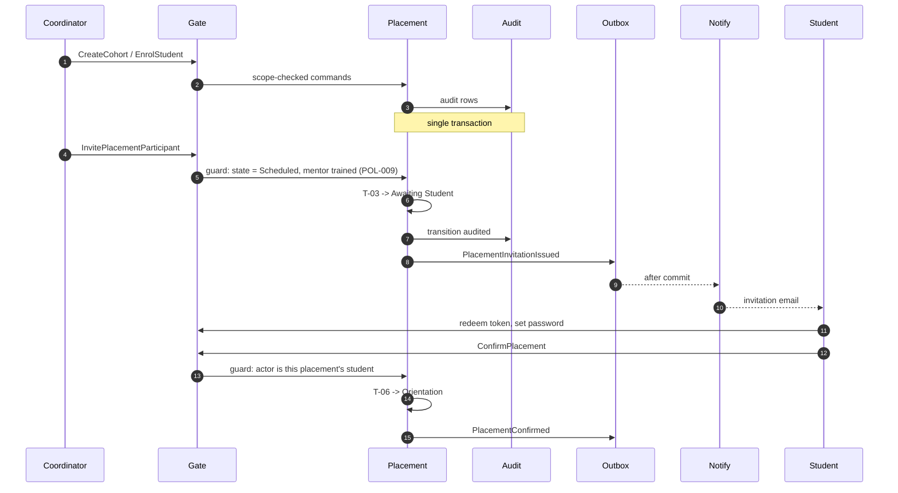
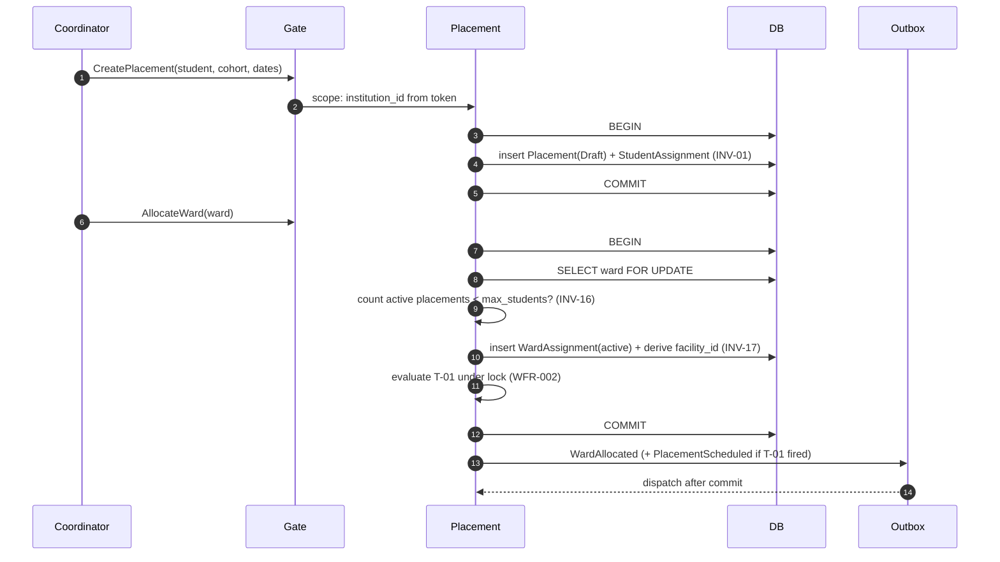
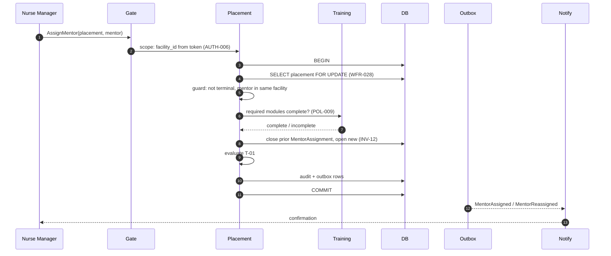
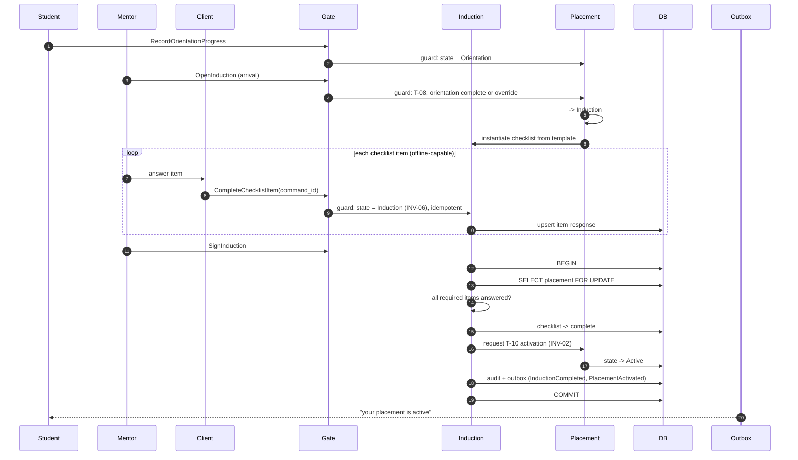
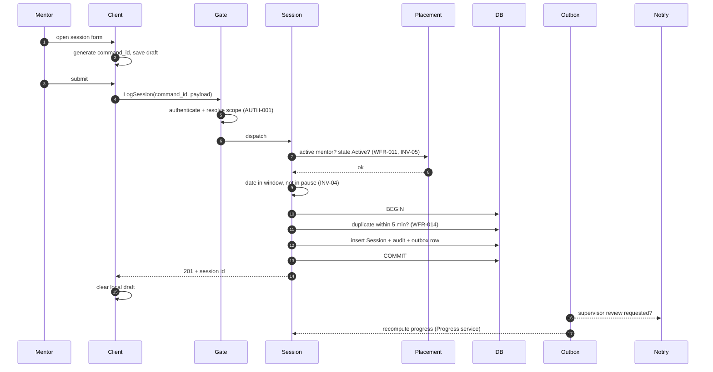
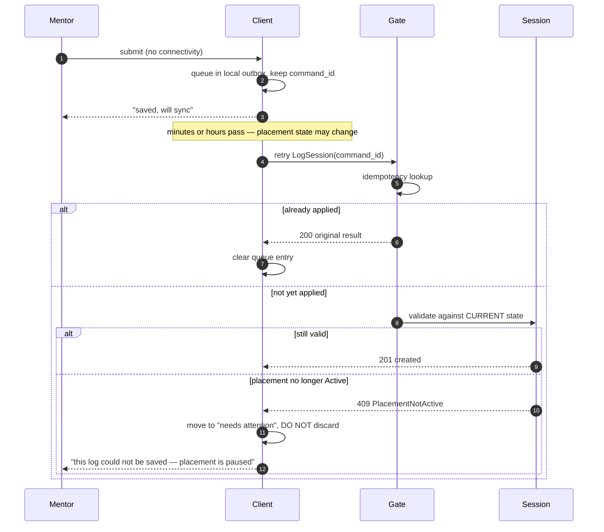
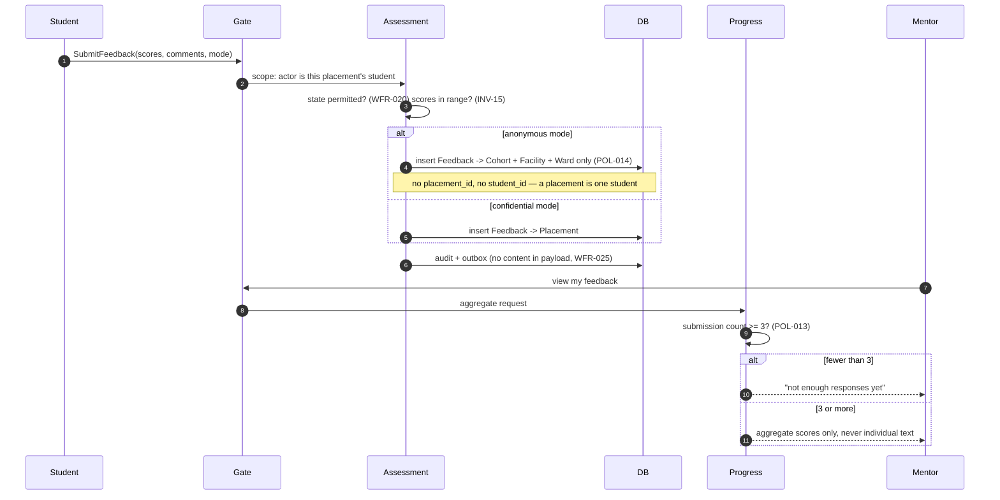
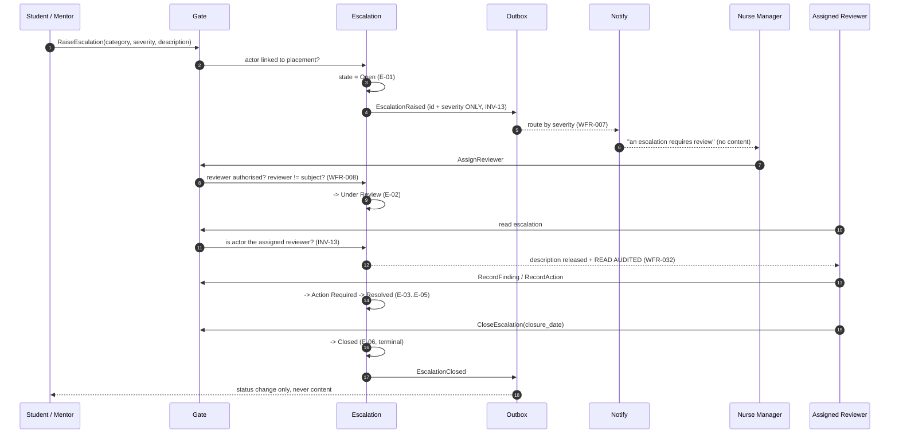
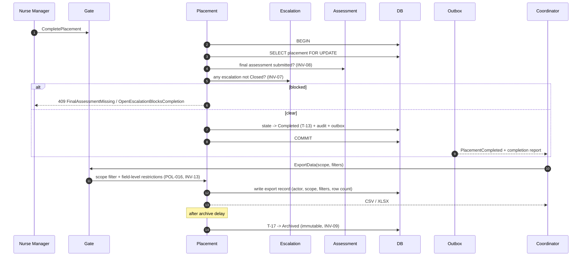

# MentorMAMA — Stage 3.5: Use Cases & Sequence Diagrams

**Making the static model move, before a single module boundary is drawn**

| Field | Detail |
| --- | --- |
| Product | MentorMAMA — Digital Mentorship Toolkit for Safer Midwifery Clinical Placement |
| Prepared by | Sinaps Technology — Bouric Okwaro Enos (Ric), Co-Founder & Team Lead |
| Document type | Stage 3.5 of the design sequence: Use Cases & Sequence Diagrams |
| Precedes | Stage 4 (Module Architecture) → Stage 5 (Database Architecture) → Stage 6 (API Design) |
| Builds on | Stage 3 Business Rules & Domain Invariants v1.1; Stage 2 Domain Model; Stage 1 Business Discovery v1.0 |
| Version | 1.1 (JKUAT decisions of 30 July 2026 incorporated — §12) |
| Date | July 2026 |

---

## 1. Why This Stage Exists

Stages 1 through 3 produced a static system: entities, ownership, rules, invariants, transitions. Nothing in
them describes *sequence* — what happens, in what order, holding which lock, raising which event.

That gap is where the original SADD went wrong. It specified REST endpoints (v1.0 §6.3) and a table schema
(§5) before anyone had walked through what actually occurs when a mentor taps "Save" on a session log from a
ward with two bars of signal. The endpoints looked reasonable and were still wrong, because an endpoint list
is a *consequence* of workflow, not an input to it.

This document walks all eight core workflows step by step. For each one it names:

- the initiating actor and the preconditions that must already hold
- every guard checked, **in the order checked** (order matters: cheap authorization checks precede expensive
  integrity checks, and every check precedes the first write)
- what is written, inside which transaction boundary
- which domain events are raised, and what happens after commit
- the exception paths — not just the happy path

### 1.1 What this stage deliberately does not do

No HTTP verbs. No URL paths. No table or column names. No framework specifics. Operations are named as
**commands** (`LogSession`, `AssignMentor`) because a command is a domain concept, while an endpoint is a
transport decision belonging to Stage 6. Appendix A collects the full command surface these workflows imply —
that list is the input to Stage 4, not a substitute for it.

### 1.2 Reading the diagrams

Participants are consistent across all eight diagrams:

| Participant | What it is |
| --- | --- |
| `Client` | The PWA, including its local draft store and outbox |
| `Gate` | Request pipeline: authentication, scope resolution (AUTH-001), idempotency |
| `Placement` | Placement domain service — owner of the state machine |
| `Induction`, `Session`, `Assessment`, `Escalation`, `Training` | Domain services within their bounded contexts |
| `Progress` | Derived-metrics service — computes, never stores authored truth |
| `Audit` | Append-only audit writer (WFR-030) |
| `Outbox` | Transactional event outbox (WFR-026) |
| `Notify` | Notification dispatcher — executes, never decides (WFR-023) |

Rule references (`INV-05`, `T-10`, `TX-04`, `POL-014`) point to Stage 3. If a step in this document
contradicts Stage 3, Stage 3 wins and this document is the defect.

---

## 2. Cross-Cutting Mechanics

These four mechanics recur in every workflow. They are stated once here rather than repeated eight times.

### 2.1 Scope resolution happens before anything else

Every request resolves `scope = { program_id, role, institution_id?, facility_id?, ward_ids?, user_id }` from
the authenticated principal (AUTH-001). No workflow step below ever reads a scope value from the request body.
A cross-scope access attempt terminates at `Gate` with `UnauthorizedFacilityAccess` rendered as **404**, never
403 (AUTH-004) — a 403 confirms the record exists, which is itself a leak when the record is a placement at
another facility.

### 2.2 Guard order is part of the specification

Every workflow checks guards in this order, and the order is not cosmetic:

1. **Authentication** — is there an actor at all (INV-11)
2. **Authorization** — may this actor perform this command in this scope (Part 8)
3. **Existence and scope of the target** — does the target exist *within* the actor's scope
4. **State** — is the aggregate in a state where this command is legal (transition table, INV-05, INV-06)
5. **Integrity** — do the domain invariants still hold after this change (INV-04, INV-16, INV-12)
6. **Idempotency** — has this exact command already been applied (WFR-014)

Checking integrity before authorization leaks information through error messages. Checking state after writing
leaves the aggregate briefly illegal. This order is what makes the invariants defensible.

### 2.3 Every write is one transaction, every side effect is outside it

The pattern is identical in all eight workflows and matches Stage 3 §10:

```
BEGIN
  lock aggregate row (WFR-028)
  re-check guards under lock
  write domain rows
  write audit row            (WFR-030)
  write outbox event row     (WFR-026)
COMMIT
  -> outbox worker dispatches: notifications, projections, exports
```

Re-checking guards **under the lock** is the part teams skip. A guard checked before `BEGIN` is a guard checked
against stale state; two concurrent `CompleteInduction` calls both pass a pre-lock check and both try to
activate the placement.

### 2.4 Offline is a first-class path, not an error path

The Concept Note requires draft-saving and retry sync on the ward floor, which means **every mutating command
in the mentor and student journeys will be replayed at least once**. Consequences, applied throughout:

- The client generates a `command_id` (UUID) at *form-open* time, not at send time, and reuses it across
  retries.
- The server treats `command_id` as an idempotency key: a replay returns the original result, not a duplicate
  and not an error.
- Retries can arrive **minutes or hours late**, after the placement's state has changed. A replayed session log
  is validated against the state at *arrival* time, not at draft time (see W-05 §7.4). This is the single most
  under-specified behaviour in the original SADD.

---

## 3. Workflow W-01 — Student Onboarding & Placement Invitation

| Field | Detail |
| --- | --- |
| Primary actor | University Coordinator |
| Secondary actors | Student, Notification Service |
| Trigger | A new term's cohort needs students placed |
| Preconditions | Coordinator authenticated, scoped to their Institution; Facility and Ward exist (created by Program Admin) |
| Commands | `CreateCohort`, `EnrolStudent`, `InvitePlacementParticipant`, `ConfirmPlacement` |
| Rules exercised | POL-008, AUTH-003, T-03, T-06, INV-11 |

### 3.1 Step table

| # | Actor | Step | Guards checked | Writes | Events |
| --- | --- | --- | --- | --- | --- |
| 1 | Coordinator | `CreateCohort` (name, dates, `planned_capacity`) | Role = Coordinator; `institution_id` from scope; `start < end` | Cohort; Audit | `CohortCreated` |
| 2 | Coordinator | `EnrolStudent` (bulk or single) | Cohort in scope; student not already in an overlapping cohort | Student record; Cohort membership; Audit | `StudentEnrolled` |
| 3 | — | *Placement created* — see **W-02** | — | — | — |
| 4 | Coordinator | `InvitePlacementParticipant` on a `Scheduled` placement | Placement in scope; state = `Scheduled`; mentor training complete (POL-009) | Placement → `Awaiting Student` (T-03); invitation token; Audit | `PlacementInvitationIssued` |
| 5 | Notify | Dispatch invitation (email) | Post-commit only | Notification record | — |
| 6 | Student | Redeem invitation, set password | Token valid, unexpired, unredeemed | User activation; Audit | `AccountActivated` |
| 7 | Student | `ConfirmPlacement` | Actor is the placement's student; state = `Awaiting Student` | Placement → `Orientation` (T-06); Audit | `PlacementConfirmed` |

### 3.2 Sequence



### 3.3 Exceptions

| Condition | Behaviour |
| --- | --- |
| Student already has an overlapping active placement | `StudentAlreadyAssigned`; enrolment allowed, placement creation blocked |
| Invitation token expired | Reissue is a new command producing a new token; the old token stays dead and audited |
| Student never confirms | Placement remains `Awaiting Student` indefinitely; surfaced on the Coordinator dashboard as a stalled placement. **No automatic withdrawal** — an unconfirmed placement is a human follow-up, not a timeout |
| Mentor training incomplete at step 4 | `TrainingIncomplete`; Program Admin may override with a reason (WFR-033) |

---

## 4. Workflow W-02 — Placement Creation & Ward Allocation

| Field | Detail |
| --- | --- |
| Primary actor | University Coordinator (Program Admin may act on their behalf during pilot setup) |
| Trigger | Coordinator allocates a named student to a named ward |
| Preconditions | Cohort exists; Student enrolled; Facility and Ward exist |
| Commands | `CreatePlacement`, `AllocateWard`, `TransferWard` |
| Rules exercised | POL-001, POL-004, POL-006, POL-007, INV-01, INV-12, INV-16, INV-17, T-01 |

This is the workflow where the two-institution boundary bites: the Coordinator allocates the ward, but the
Nurse Manager assigns the mentor (W-03). Neither can complete the placement alone, and neither may press the
other's button. That is why `T-01 (Draft → Scheduled)` is **system-derived** — it fires when the assignment set
becomes complete, whichever institution completed it (WFR-002).

### 4.1 Step table

| # | Actor | Step | Guards checked | Writes | Events |
| --- | --- | --- | --- | --- | --- |
| 1 | Coordinator | `CreatePlacement` (student, cohort, dates) | Cohort in institution scope; student is a member; `start < end` | Placement (`Draft`); Student Assignment; Audit | `PlacementCreated` |
| 2 | Coordinator | `AllocateWard` (ward) | Ward exists; **lock Ward row**; active placements < `max_students` (INV-16) | Ward Assignment (active); derived `facility_id` (INV-17); Audit | `WardAllocated` |
| 3 | System | Evaluate T-01 under the same lock | Student + Ward + Mentor assignments all present; dates valid; capacity held | Placement → `Scheduled` | `PlacementScheduled` |
| 4 | Outbox | Post-commit | — | — | Notify Nurse Manager that a placement awaits a mentor |

### 4.2 Sequence



### 4.3 Exceptions

| Condition | Behaviour |
| --- | --- |
| Ward at capacity | `WardCapacityExceeded`. The placement stays in `Draft` — it is not silently queued. Capacity negotiation remains an offline conversation (Stage 1 §9) |
| Two coordinators allocate the last slot concurrently | The Ward row lock serialises them; the second receives `WardCapacityExceeded`. This is exactly why INV-16 is `TXN` and not `SVC` |
| `TransferWard` mid-placement | Closes the current Ward Assignment, opens a new one, re-checks capacity on the target ward, re-derives `facility_id`. If the target ward is in a different facility, this is a **withdrawal and a new placement**, not a transfer — a placement cannot change facility (POL-003) |
| Cohort deleted | Not possible; cohorts soft-archive, and archiving a cohort with non-terminal placements is blocked |

---

## 5. Workflow W-03 — Mentor Assignment & Reassignment

| Field | Detail |
| --- | --- |
| Primary actor | Nurse Manager (Program Admin fallback) |
| Trigger | A `Draft`/`Scheduled` placement needs a mentor, or staffing changes mid-placement |
| Preconditions | Placement exists within the Nurse Manager's facility; candidate mentor employed at that facility |
| Commands | `AssignMentor`, `ReassignMentor` |
| Rules exercised | POL-005, POL-009, INV-12, T-01, TX-02, AUTH-006 |

### 5.1 Step table

| # | Actor | Step | Guards checked | Writes | Events |
| --- | --- | --- | --- | --- | --- |
| 1 | Nurse Manager | `AssignMentor(placement, mentor)` | Placement's `facility_id` = scope facility; mentor belongs to that facility; placement not terminal | Mentor Assignment (active); Audit | `MentorAssigned` |
| 2 | System | Evaluate T-01 | Assignment set complete | Placement → `Scheduled` | `PlacementScheduled` |
| 3 | Nurse Manager | `ReassignMentor(placement, new mentor)` | As above; **lock Placement row**; new ≠ current mentor | Close current assignment (`ended_at`, reason); open new; Audit ×2 | `MentorReassigned` |
| 4 | Outbox | Post-commit | — | Notification record | Notify incoming mentor, outgoing mentor, student |

### 5.2 Sequence



### 5.3 Reassignment semantics — what survives and what does not

This is the question the SADD's `reassignMentor()` method left unanswered, and the reason Stage 2 split
assignments into their own sub-entities:

| Artifact | On reassignment |
| --- | --- |
| Sessions logged by the outgoing mentor | **Retained**, attributed to the outgoing mentor, still owned by the placement (INV-03) |
| Induction checklist, if already complete | **Retained.** Induction belongs to the placement, not the mentor; a new mentor does not re-induct |
| Induction checklist, if in progress | **Retained and continuable** by the incoming mentor. Partial induction is not discarded because staffing changed |
| Placement state | **Unchanged.** Reassignment is not a transition; an `Active` placement stays `Active` |
| Outgoing mentor's access | Revoked immediately for new writes; retains read access to their own past entries (WFR-012) |
| Feedback already submitted about the outgoing mentor | Retained, and still attributed to the assignment period in which it was given |

### 5.4 Exceptions

| Condition | Behaviour |
| --- | --- |
| Mentor's required training incomplete | Assignment is **permitted**; the placement simply cannot pass T-03 until training completes or is overridden. Blocking assignment would stall wards for a paperwork reason |
| Mentor belongs to another facility | `UnauthorizedFacilityAccess` (404) |
| Placement is `Completed`/`Archived`/`Withdrawn` | `PlacementArchived` / `PlacementClosed` (INV-09) |
| Mentor account deactivated mid-placement | Placement is flagged as needing reassignment on the Nurse Manager dashboard; state is untouched. Sessions cannot be logged, because the assignment is inactive (WFR-011) |

---

## 6. Workflow W-04 — Orientation → Arrival → Induction → Activation

| Field | Detail |
| --- | --- |
| Primary actors | Student (orientation), Clinical Mentor (induction) |
| Trigger | Student confirms placement; later, student physically arrives at the unit |
| Commands | `RecordOrientationProgress`, `OpenInduction`, `CompleteChecklistItem`, `SignInduction` |
| Rules exercised | INV-02, INV-06, T-08, T-10, TX-03 |

This workflow contains the system's single most important invariant: **a placement cannot become `Active`
until induction is complete** (INV-02). Everything about how it is sequenced exists to make that
unbypassable.

### 6.1 Step table

| # | Actor | Step | Guards checked | Writes | Events |
| --- | --- | --- | --- | --- | --- |
| 1 | Student | `RecordOrientationProgress` | State = `Orientation`; actor is this placement's student | Orientation completion rows; Audit | `OrientationProgressed` |
| 2 | Mentor / NM | `OpenInduction` (student has arrived) | State = `Orientation`; required orientation complete **or** override with reason (T-08, WFR-033) | Placement → `Induction`; Induction Checklist (from active template); Audit | `InductionOpened` |
| 3 | Mentor | `CompleteChecklistItem` (×N, offline-capable) | State = `Induction` (INV-06); actor is active mentor; idempotent on `command_id` | Checklist item response; Audit | `ChecklistItemCompleted` |
| 4 | Mentor | `SignInduction` | **Lock Placement**; all required items answered; actor is active mentor | Checklist → complete; **Placement → `Active` (T-10)**; Audit ×2 | `InductionCompleted`, `PlacementActivated` |
| 5 | Outbox | Post-commit | — | — | Notify student + Nurse Manager; recompute progress |

**Steps 3 and 4 are separate commands but a single transaction at step 4** (TX-03). The final item completion,
the checklist status change, and the placement activation commit together — otherwise a crash between them
leaves a complete checklist with an inactive placement, and a mentor who cannot log the session they just
delivered.

### 6.2 Sequence



### 6.3 Exceptions

| Condition | Behaviour |
| --- | --- |
| Student arrives without completing orientation | Nurse Manager override at T-08 with a recorded reason. Real wards do not turn students away for unfinished e-learning; the override is visible, not silent |
| Mentor signs induction with items unanswered | `InductionIncomplete` — the transition is refused, not the checklist |
| Placement paused mid-induction | Item completion is refused (INV-06 requires `Induction`; `Paused` is not it). Queued offline items are held client-side and replayed on resume — see W-05 §7.4 |
| Two mentors sign concurrently | Placement row lock serialises; the second sees the placement already `Active` and receives the idempotent success, not `PlacementAlreadyActive` |
| Checklist template changed after instantiation | The placement keeps the template version it was instantiated with. Templates are versioned; live checklists never mutate underneath a mentor |

---

## 7. Workflow W-05 — Mentorship Session Logging (with the offline retry path)

| Field | Detail |
| --- | --- |
| Primary actor | Clinical Mentor |
| Trigger | Mentor completes a mentorship interaction; must log in under 3 minutes |
| Preconditions | Placement `Active`; actor is the active Mentor Assignment |
| Commands | `LogSession`, `CorrectSession` |
| Rules exercised | INV-03, INV-04, INV-05, WFR-009 – WFR-015, TX-04 |

This is the highest-frequency write in the system, the one performed on a ward floor with bad signal, and
therefore the one whose failure modes matter most.

### 7.1 Step table

| # | Actor | Step | Guards checked (in order) | Writes | Events |
| --- | --- | --- | --- | --- | --- |
| 1 | Client | Form opens; `command_id` generated; draft saved locally | — | Local draft | — |
| 2 | Client | `LogSession(command_id, …)` | — | — | — |
| 3 | Gate | Authenticate; resolve scope; idempotency lookup on `command_id` | Replay → return original result (200) | — | — |
| 4 | Session | Authorization | Actor is the placement's **active** mentor (WFR-011) | — | — |
| 5 | Session | State | Placement = `Active` (INV-05) | — | — |
| 6 | Session | Window | `session_date` inside placement period and outside every pause interval (INV-04) | — | — |
| 7 | Session | Payload | Placement, mentor, date, type, ≥1 topic present (WFR-009) | — | — |
| 8 | Session | Duplicate | Same placement + mentor + date, submitted within 5 min (WFR-014) | — | — |
| 9 | Session | Commit | — | Session; Audit; Outbox | `SessionLogged` |
| 10 | Outbox | Post-commit | — | Notification if `follow_up = supervisor_review` | Progress recompute; follow-up flag |

### 7.2 Sequence — online path



### 7.3 Sequence — offline retry path



### 7.4 The late-replay decision, stated explicitly

A queued session log validated **at arrival**, not at draft time, can legitimately fail — the placement may
have been paused or withdrawn in the interim. Three options exist, and the choice is a product decision, so it
is recorded rather than assumed:

| Option | Consequence |
| --- | --- |
| Reject and discard | Mentor loses documented work they performed. Unacceptable |
| **Reject and retain client-side for human resolution (adopted)** | Mentor sees a "needs attention" queue; a Nurse Manager can resume the placement, or the mentor can discard deliberately. Nothing is lost silently |
| Accept retroactively against past state | Breaks INV-04/INV-05 and lets a paused placement accumulate activity. Rejected |

**Adopted:** reject, retain, surface. The client never silently drops a mentor's work, and the server never
relaxes an invariant to accommodate a late arrival. Logged as **OD-09** for stakeholder confirmation, since it
implies a visible "unsynced logs" affordance in the mentor UI that the Concept Note does not describe.

### 7.5 Exceptions

| Condition | Behaviour |
| --- | --- |
| Double-tap on Save | Same `command_id` → idempotent 200; no duplicate row |
| Two genuine sessions, same student, same day | Permitted. WFR-014's 5-minute window exists precisely so a morning and an afternoon session are not conflated |
| Mentor reassigned between draft and sync | `UnauthorizedFacilityAccess`; the log is retained client-side and routed to the Nurse Manager for reattribution. A session is never silently reattributed to a different mentor |
| Correction after 24h | `SessionCorrectionWindowClosed`; mentor may file a linked revision instead (WFR-013) |
| Clock skew on the device | `session_date` is a date, not a timestamp; server records `submitted_at` from server time. Never trust the device clock for the duplicate window |

---

## 8. Workflow W-06 — Feedback & Assessment Submission (including anonymous routing)

| Field | Detail |
| --- | --- |
| Primary actor | Student |
| Trigger | Periodic feedback, baseline confidence, or end-of-placement exit survey |
| Commands | `SubmitFeedback`, `SubmitBaselineConfidence`, `SubmitFinalAssessment` |
| Rules exercised | POL-012, POL-013, POL-014, INV-08, INV-14, INV-15, WFR-018 – WFR-021, TX-05 |

### 8.1 Step table

| # | Actor | Step | Guards checked | Writes | Events |
| --- | --- | --- | --- | --- | --- |
| 1 | Student | `SubmitBaselineConfidence` | State ∈ {`Orientation`, `Induction`} (WFR-018); scores in range (INV-15) | Assessment (immutable); Audit | `BaselineSubmitted` |
| 2 | Student | `SubmitFeedback` | State ∈ {`Orientation`, `Induction`, `Active`, `Paused`} (WFR-020); scores in range | Feedback (immutable) — **routed per anonymity mode** | `FeedbackSubmitted` |
| 3 | System | Anonymity routing | Mode is chosen per submission, defaulting to **confidential** (POL-014a). Confidential attaches to the Placement. Anonymous attaches to Cohort + Facility + Ward and holds **no** placement or student reference (POL-014) | — | — |
| 4 | Student | `SubmitFinalAssessment` | On/after `end_date` or closure initiated (WFR-019); baseline exists | Assessment (immutable); Audit | `FinalAssessmentSubmitted` |
| 5 | Progress | On read | ≥3 submissions before any mentor-visible aggregate (POL-013) | — (computed) | — |

### 8.2 Sequence



### 8.3 Exceptions

| Condition | Behaviour |
| --- | --- |
| Student edits submitted feedback | `FeedbackImmutable`; a linked revision is created (POL-012) |
| Final assessment before end date | `AssessmentOutOfWindow`, unless closure has been initiated (WFR-019) |
| Confidence score 105 | `ScoreOutOfRange` at the DB check constraint, not just the form |
| Mentor requests feedback with n = 1 | Aggregate withheld. The response is "not enough responses", not an empty aggregate — an empty aggregate tells the mentor a response exists |
| Mentor filters an aggregate that passes n ≥ 3 in total but not per slice | Suppressed. The threshold is evaluated on the figure actually displayed, and no mentor-visible view offers attribute breakdowns at all (POL-013a) |
| Anonymous feedback needs follow-up | The student can flag "unresolved concern" without deanonymising; it routes as an Escalation (W-07) which has its own identity rules. **Anonymity and follow-up are separate mechanisms** and must not be conflated |

---

## 9. Workflow W-07 — Escalation: Raise → Review → Resolve → Close

| Field | Detail |
| --- | --- |
| Primary actors | Student or Mentor (raise); Nurse Manager / Coordinator (review) |
| Trigger | A serious concern about safety, conduct, or the learning environment |
| Commands | `RaiseEscalation`, `AssignReviewer`, `RecordFinding`, `RecordAction`, `CloseEscalation` |
| Rules exercised | INV-13, E-01 – E-06, WFR-005 – WFR-008, POL-019, TX-06, TX-07 |

This is the safeguarding-critical path and carries the strictest access control in the product. Note what is
*absent* from every step below: no escalation content is ever placed in a notification, an event payload, an
audit value, or a dashboard.

### 9.1 Step table

| # | Actor | Step | Guards checked | Writes | Events |
| --- | --- | --- | --- | --- | --- |
| 1 | Student/Mentor | `RaiseEscalation` (category, severity, description) | Actor linked to the placement; description present | Escalation (`Open`); Audit | `EscalationRaised` (id + severity only) |
| 2 | Outbox | Route notification | Nurse Manager always; + Coordinator if `severity = high` (WFR-007) | Notification (no content, WFR-025) | — |
| 3 | NM / Coord | `AssignReviewer` | Reviewer authorised for scope; **reviewer ≠ subject** (WFR-008) | Escalation → `Under Review` (E-02); Audit | `EscalationUnderReview` |
| 4 | Reviewer | `RecordFinding` | Actor is assigned reviewer | Escalation → `Action Required` (E-03); Audit | — |
| 5 | Reviewer | `RecordAction` | `action_taken` present | Escalation → `Resolved` (E-04/E-05); Audit | `EscalationResolved` |
| 6 | Reviewer / NM | `CloseEscalation` | State = `Resolved`; `closure_date` set | Escalation → `Closed` (E-06); Audit | `EscalationClosed` |
| 7 | Placement | Unblocks completion | No non-`Closed` escalations remain (INV-07) | — | — |

### 9.2 Sequence



### 9.3 Exceptions

| Condition | Behaviour |
| --- | --- |
| Reviewer is the subject | `ReviewerConflictOfInterest`; assignment escalates to Coordinator or Program Admin (WFR-008) |
| Unauthorised read of `description` | `EscalationAccessDenied` as **404**, and the attempt is audited |
| Escalation raised by an anonymous feedback path | The escalation itself is **not** anonymous — it needs a reachable submitter to be investigable. The UI must state this before submission, not after |
| Closed escalation recurs | New escalation with `related_escalation_id`; no reopen (WFR-005) |
| Placement ends with escalation open | Completion blocked (INV-07). Deferral requires an authorised override with reason (OD-08) |
| Escalation names a patient | Cannot be structurally prevented in free text; the field carries the standing instruction (POL-015) and reviewers are trained to redact. **Flagged as a residual risk, not a solved problem** |

---

## 10. Workflow W-08 — Completion, Reporting & Archival

| Field | Detail |
| --- | --- |
| Primary actor | Nurse Manager (Program Admin fallback); system for archival |
| Trigger | Placement reaches its end date, or early closure is authorised |
| Commands | `CompletePlacement`, `GenerateReport`, `ExportData`, `ArchivePlacement` |
| Rules exercised | INV-07, INV-08, INV-09, T-13, T-17, TX-08, TX-09, WFR-032 |

### 10.1 Step table

| # | Actor | Step | Guards checked (in order) | Writes | Events |
| --- | --- | --- | --- | --- | --- |
| 1 | Student | Final assessment submitted | See W-06 step 4 | Assessment | `FinalAssessmentSubmitted` |
| 2 | Nurse Manager | `CompletePlacement` | **Lock Placement**; state = `Active`; end date reached or authorised early closure; final assessment exists (INV-08); no non-`Closed` escalations (INV-07) | Placement → `Completed` (T-13); Audit | `PlacementCompleted` |
| 3 | Outbox | Post-commit | — | Report artifact; certificate where applicable | Notify Coordinator, Student, Mentor |
| 4 | Coordinator / NM | `GenerateReport` / `ExportData` | Scope-filtered; field-level restrictions applied (POL-016, INV-13) | Export record: actor, scope, filters, row count; Audit (WFR-032) | `DataExported` |
| 5 | System | `ArchivePlacement` | Archive delay elapsed (default 30 days) | Placement → `Archived` (T-17); now immutable (INV-09) | `PlacementArchived` |

### 10.2 Sequence



### 10.3 Exceptions

| Condition | Behaviour |
| --- | --- |
| End date passed, student never submitted final assessment | Placement stalls in `Active` and appears on both dashboards as overdue. **No auto-completion** — completing without the exit survey destroys the primary outcome measure of the pilot |
| Low-severity escalation still open | Blocked by default; deferral override by Coordinator or Program Admin with reason (OD-08) |
| Export requested across scopes | Silently scope-filtered, and the export record states the applied scope so the recipient knows the extract is partial |
| Write attempted on an archived placement | `PlacementArchived`, enforced at `DB` — not merely a hidden button |
| Placement withdrawn instead of completed | Terminal immediately (WFR-004); reportable; no final assessment required |

---

## 11. Rule Coverage Matrix

Every invariant should be exercised by at least one workflow. Anything unexercised is either dead or missing a
workflow — this matrix is how we find out before Stage 4 rather than after.

| Rule | W-01 | W-02 | W-03 | W-04 | W-05 | W-06 | W-07 | W-08 |
| --- | --- | --- | --- | --- | --- | --- | --- | --- |
| INV-01 student assignment | | ✓ | | | | | | |
| INV-02 induction gates Active | | | | ✓ | | | | |
| INV-03 session owned by placement | | | ✓ | | ✓ | | | |
| INV-04 session window / pause | | | | | ✓ | | | |
| INV-05 Active-only logging | | | | ✓ | ✓ | | | |
| INV-06 induction-state items | | | | ✓ | | | | |
| INV-07 escalation gates completion | | | | | | | ✓ | ✓ |
| INV-08 final assessment gates completion | | | | | | ✓ | | ✓ |
| INV-09 terminal immutability | | | ✓ | | | | | ✓ |
| INV-10 no hard delete | | ✓ | | | | ✓ | | |
| INV-11 attributable writes | ✓ | ✓ | ✓ | ✓ | ✓ | ✓ | ✓ | ✓ |
| INV-12 one active assignment | | ✓ | ✓ | | | | | |
| INV-13 escalation confidentiality | | | | | | | ✓ | ✓ |
| INV-14 immutable submissions | | | | | | ✓ | | |
| INV-15 score ranges | | | | | | ✓ | | |
| INV-16 ward capacity | | ✓ | | | | | | |
| INV-17 derived scope fields | | ✓ | | | | | | |
| INV-18 no patient data | ✓ | ✓ | ✓ | ✓ | ✓ | ✓ | ✓ | ✓ |

All eighteen invariants are exercised. Two observations worth carrying into Stage 4:

1. **INV-10 (no hard delete) is barely exercised** because no workflow deletes anything. That is the intended
   outcome, but it means the rule is enforced by the *absence* of commands — so Stage 4 must not introduce a
   delete command by reflex when scaffolding CRUD.
2. **INV-18 is exercised everywhere and enforced nowhere at runtime.** It is a schema-review gate plus a UI
   instruction, and free-text fields remain a residual risk (W-07 §9.3). This should be named as an accepted
   risk in the pilot's data-governance sign-off rather than treated as closed.

---

## 12. Open Decisions — Status

Stage 3 logged OD-01 to OD-08. Walking the workflows surfaced three more. **Three of Stage 3's were resolved by
JKUAT on 30 July 2026** and are reflected throughout this document: OD-01 (a pause extends the actual end date,
with planned dates retained), OD-03 (feedback visibility, with the min-3 threshold now applying per displayed
figure), and OD-06 (both confidential and anonymous modes supported, confidential by default). One new question
is outstanding — OD-12, whether the research evaluation requires sex-disaggregated reporting.

The three raised by this stage:

| ID | Question | Recommendation | Blocking? |
| --- | --- | --- | --- |
| OD-09 | Late-arriving offline session logs that no longer validate: discard, retain for human resolution, or accept retroactively? (W-05 §7.4) | **Retain and surface** in a mentor-visible "unsynced" queue. Implies a UI affordance not in the Concept Note | Not blocking, but it changes the mentor UI scope — decide before Stage 7 (UI/UX) |
| OD-10 | Should an unconfirmed placement time out? (W-01 §3.3) | **No.** Surface as stalled; a human follows up. Auto-withdrawal would erase a real placement for an email-delivery failure | Not blocking |
| OD-11 | May a Nurse Manager complete a placement early, before `end_date`, and does it need Coordinator counter-approval? (extends OD-07) | Nurse Manager may, with a reason; Coordinator is **notified**, not asked. Requiring cross-institution approval to close a placement would stall closure indefinitely | Not blocking; confirm with both institutions |

---

## 13. What Stage 4 Takes From This

Stage 4 (Module Architecture) inherits three concrete inputs, and should not need to invent any of them:

1. **The command surface** (Appendix A) — the complete set of state-changing operations, with the context that
   owns each. Module boundaries follow from who owns which command, not from feature naming.
2. **The event surface** (Appendix B) — every domain event raised, with its consumers. This is the module
   communication contract, so contexts never call each other synchronously to trigger side effects.
3. **The transaction inventory** (Stage 3 §10, exercised here) — the set of operations that must be atomic. A
   module boundary drawn *through* a transaction is the wrong boundary, and this is how we detect it before it
   exists.

One conclusion I would put on the record now, since it will shape Stage 4: the current backend app layout
(`apps/sessions`, `apps/induction`, `apps/feedback`, with no `placements` app at all) cannot express these
workflows. Every one of the eight above is coordinated by the Placement aggregate, which currently has no home
in the codebase, while three of its children each have their own. Stage 4 should restructure around bounded
contexts and treat the existing app list as scaffolding to be replaced.

---

## Appendix A — Command Surface

| Command | Owning context | Actor | Workflow |
| --- | --- | --- | --- |
| `CreateCohort`, `EnrolStudent` | Institution | Coordinator | W-01 |
| `InvitePlacementParticipant` | Placement | Coordinator | W-01 |
| `ConfirmPlacement` | Placement | Student | W-01 |
| `CreatePlacement` | Placement | Coordinator | W-02 |
| `AllocateWard`, `TransferWard` | Placement | Coordinator | W-02 |
| `AssignMentor`, `ReassignMentor` | Placement | Nurse Manager | W-03 |
| `RecordOrientationProgress` | Learning | Student | W-04 |
| `OpenInduction`, `CompleteChecklistItem`, `SignInduction` | Induction | Mentor / NM | W-04 |
| `LogSession`, `CorrectSession` | Mentorship | Mentor | W-05 |
| `SubmitFeedback`, `SubmitBaselineConfidence`, `SubmitFinalAssessment` | Assessment | Student | W-06 |
| `RaiseEscalation`, `AssignReviewer`, `RecordFinding`, `RecordAction`, `CloseEscalation` | Safeguarding | Various | W-07 |
| `CompletePlacement`, `ArchivePlacement` | Placement | NM / system | W-08 |
| `GenerateReport`, `ExportData` | Analytics | NM / Coordinator / Admin | W-08 |
| `PausePlacement`, `ResumePlacement`, `WithdrawPlacement` | Placement | NM / Coordinator | T-12, T-15, T-14 |
| `CompleteTrainingModule` | Learning | Mentor | W-03 precondition |

## Appendix B — Event Surface

| Event | Raised by | Consumed by |
| --- | --- | --- |
| `CohortCreated`, `StudentEnrolled` | Institution | Analytics |
| `PlacementCreated`, `WardAllocated`, `PlacementScheduled` | Placement | Notification, Analytics |
| `PlacementInvitationIssued`, `PlacementConfirmed` | Placement | Notification, Analytics |
| `MentorAssigned`, `MentorReassigned` | Placement | Notification, Analytics |
| `InductionOpened`, `ChecklistItemCompleted`, `InductionCompleted` | Induction | Progress, Analytics |
| `PlacementActivated` | Placement | Notification, Progress |
| `SessionLogged` | Mentorship | Progress, Notification (supervisor review only), Analytics |
| `BaselineSubmitted`, `FeedbackSubmitted`, `FinalAssessmentSubmitted` | Assessment | Progress, Analytics |
| `EscalationRaised`, `EscalationUnderReview`, `EscalationResolved`, `EscalationClosed` | Safeguarding | Notification (routing only), Analytics (counts only) |
| `PlacementCompleted`, `PlacementArchived` | Placement | Reporting, Notification, Analytics |
| `DataExported` | Analytics | Audit |

No event payload carries escalation content, individual feedback text, or session free text (WFR-025).

---

*End of Stage 3.5: Use Cases & Sequence Diagrams — Sinaps Technology / JHUB Africa. Confidential.*
