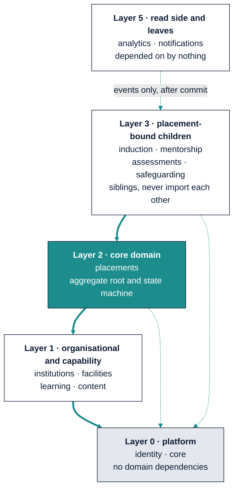

# MentorMAMA — Stage 4: Module Architecture & Module Communication

**Where the modules are, what they own, and how they are allowed to talk**

| Field | Detail |
| --- | --- |
| Product | MentorMAMA — Digital Mentorship Toolkit for Safer Midwifery Clinical Placement |
| Prepared by | Sinaps Technology — Bouric Okwaro Enos (Ric), Co-Founder & Team Lead |
| Document type | Stage 4 of the design sequence: Module Architecture & Module Communication |
| Precedes | Stage 5 (Database Architecture) → Stage 6 (API Design) → Stage 7 (UI/UX) → Stage 8 (Sprints) |
| Builds on | Stage 3.5 Use Cases v1.0 (command, event, and transaction surfaces); Stage 3 Business Rules v1.1; Stage 2 Domain Model |
| Version | 1.0 |
| Date | July 2026 |

---

## 1. What This Stage Decides

Stage 3.5 produced three inventories: every command, every event, and every operation that must be atomic.
Stage 4 turns those into **modules with owners and rules about who may call whom**. It answers four questions:

1. Where are the boundaries?
2. What does each module own — data, commands, events?
3. How do modules communicate, and how do they not?
4. How do we stop the boundaries from eroding once six people are writing code?

The last question is the one that decides whether this document matters in month four. A boundary that is only
described in a document is a suggestion. The enforcement mechanisms in §10 are what make it a rule.

### 1.1 The one rule that shaped everything below

> **A module boundary drawn through a transaction is the wrong boundary.**

Stage 3 §10 lists nine operations that must be atomic. Two of them cross what look like natural context lines:

- **TX-03** — completing an induction checklist *also* transitions the placement to `Active` (INV-02). Induction
  and Placement are different contexts, one transaction.
- **TX-08** — completing a placement requires checking that a final assessment exists (INV-08) and that no
  escalation is open (INV-07). Placement, Assessment, and Safeguarding — one transaction, and the check must be
  correct at the instant of commit.

Most architectures resolve this by giving up: they split the modules and accept eventual consistency on the
guard. That is unacceptable here, because the guards in question are *"no unoriented student practises on a
labour ward"* and *"no placement is signed off while a safeguarding concern is open."* A stale counter that
lets either through once is not a performance issue; it is the product failing at its purpose.

§8 resolves both without merging the modules and without weakening the guard.

---

## 2. Architectural Shape: One Deployable, Many Modules

**Decision: a modular monolith — one deployable application, internally partitioned into modules with enforced
boundaries.** Not microservices.

| Criterion | Modular monolith | Microservices |
| --- | --- | --- |
| Team size (3–6 developers) | Fits | Each service needs an owner; we do not have 11 owners |
| Atomic guards across contexts (§1.1) | Native — one database, one transaction | Requires sagas and compensating actions for INV-02 and INV-07. Enormous complexity for a pilot |
| Pilot scale (30–80 students, 25 mentors) | Vastly over-provisioned already | Solving a load problem we will not have this decade at this scale |
| Operational burden | One deploy, one database, one log stream | Distributed tracing, service discovery, N pipelines — with no ops team |
| Future extraction | Possible, if boundaries are enforced from day one (§10) | Already paid for, whether needed or not |

The trade-off accepted: process isolation does not enforce our boundaries, so **discipline must**. That is
precisely why §10 exists and why boundary checks run in CI rather than living in a wiki.

The path out, if it is ever needed: modules communicate through published interfaces and events already, so
extracting one means replacing an in-process call with a network call and its shared foreign keys with
identifiers. §7.3 records exactly which couplings would have to be paid for at that point, so the bill is known
in advance rather than discovered.

---

## 3. The Module Map

Eleven domain modules plus one platform layer. Each is a bounded context from Stage 2 §5.2, with one rename and
one addition explained in §4.



*Solid arrows are permitted imports, always downward. The dotted arrow from Layer 5 is not an import at all —
`analytics` and `notifications` learn about the world only from events dispatched after commit. Module-level
detail is in §4.*

### 3.1 Layer rules

| Rule | Statement |
| --- | --- |
| MA-01 | Dependencies point **downward only**. A module may import from a lower layer, never from a higher one, never sideways within its own layer. |
| MA-02 | `analytics` and `notifications` are **leaves**. Nothing may depend on them. They learn about the world only through events. |
| MA-03 | `core` and `identity` depend on no domain module. Everything may depend on them. |
| MA-04 | Two modules in the same layer never import each other. If they appear to need to, one of them is in the wrong layer, or the interaction belongs to a lower layer. |
| MA-05 | Cross-layer *upward* needs — a lower module requiring something from a higher one — are resolved by **dependency inversion**, never by an upward import (§8). |

MA-04 is what keeps `induction`, `mentorship`, `assessments`, and `safeguarding` independent of one another.
They are siblings, all children of the same aggregate, and none of them should know the others exist. A session
log must never import the escalation model.

---

## 4. Module Catalogue

Each module owns its data exclusively, publishes a narrow interface, and raises events. "Owns" means: no other
module reads or writes those tables directly — access is through the interface in `api.py`.

### 4.1 Platform layer

| Module | Owns | Public interface | Notes |
| --- | --- | --- | --- |
| `core` | Audit entries, outbox events, idempotency keys, base model, domain error catalogue | `audit.record()`, `outbox.publish()`, `idempotency.guard()`, error classes | No domain concepts. Every module writes audit and outbox rows through this, so the format cannot drift |
| `identity` | User, invitation, credential, **scope resolution** | `authenticate()`, `resolve_scope()`, `user_of(id)` | Scope resolution lives here because every request needs it and it must have exactly one implementation (AUTH-001) |

### 4.2 Layer 1 — Organisational and capability

| Module | Owns | Publishes | Consumes | Key rules |
| --- | --- | --- | --- | --- |
| `institutions` | Institution, Cohort, student enrolment | `CohortCreated`, `StudentEnrolled` | — | Cohort carries `planned_capacity` as a target, never a constraint (POL-008) |
| `facilities` | Facility, Ward, ward capacity | `WardCreated`, `CapacityChanged` | — | Exposes `reserve_capacity()` under a row lock — the only path to INV-16 |
| `learning` | Training Module, Lesson, Quiz, Module Completion | `ModuleCompleted` | — | Exposes `required_modules_complete(user)` for POL-009. Facility-independent by design (POL-010) |
| `content` | Content library items, role visibility | — | — | Files and guides. Deliberately dull |

### 4.3 Layer 2 — Core domain

| Module | Owns | Publishes | Consumes |
| --- | --- | --- | --- |
| `placements` | **Placement** (planned and actual date pairs, POL-020), Student Assignment, Mentor Assignment, Ward Assignment, **Pause Interval** (interruption date, resumption date, controlled-vocabulary reason per POL-021), the state machine and its transition table | `PlacementCreated`, `WardAllocated`, `PlacementScheduled`, `PlacementInvitationIssued`, `PlacementConfirmed`, `MentorAssigned`, `MentorReassigned`, `PlacementActivated`, `PlacementPaused`, `PlacementResumed`, `PlacementCompleted`, `PlacementWithdrawn`, `PlacementArchived` | — |

`placements` is the only module permitted to change placement state. Everything else **requests** a transition
through its interface, which evaluates the guard under a row lock (WFR-028).

```python
# placements/api.py — the surface every other module sees
def request_transition(placement_id, transition, actor, reason=None) -> Placement
def active_mentor_assignment(placement_id) -> MentorAssignment | None
def placement_window(placement_id) -> PlacementPeriod          # for INV-04
def is_active(placement_id) -> bool                            # for INV-05
def register_completion_blocker(blocker: CompletionBlocker)     # see §8.2
```

Note what is **not** in that list: no `set_state()`, no `save()`, no model access. A module that cannot reach in
cannot corrupt the state machine.

### 4.4 Layer 3 — Placement-bound children

| Module | Owns | Publishes | Calls downward into | Key rules |
| --- | --- | --- | --- | --- |
| `induction` | Checklist templates (versioned), Checklists, Items | `InductionOpened`, `ChecklistItemCompleted`, `InductionCompleted` | `placements.request_transition(... ACTIVATE)` — the TX-03 case (§8.1) | Items writable only in state `Induction` (INV-06). Templates versioned so a live checklist never mutates |
| `mentorship` | Mentorship Session, follow-ups, session revisions | `SessionLogged`, `SessionCorrected` | `placements.is_active()`, `placements.placement_window()`, `placements.active_mentor_assignment()` | Sessions belong to the placement (INV-03); Active-only (INV-05); 5-minute duplicate window (WFR-014) |
| `assessments` | Feedback, baseline and endline confidence, evaluations, revisions | `FeedbackSubmitted`, `BaselineSubmitted`, `FinalAssessmentSubmitted` | `placements` state queries | Immutable submissions (INV-14). **Anonymous routing (POL-014) means an anonymous row references cohort, facility, and ward — and holds no placement or student column at all** |
| `safeguarding` | Escalation, reviews, actions, reviewer assignment | `EscalationRaised`, `EscalationUnderReview`, `EscalationResolved`, `EscalationClosed` | `placements` scope queries | Own five-state lifecycle. Field-level access on `description`/`action_taken` enforced in this module's serialisation, never by callers (INV-13) |

### 4.5 Layer 5 — Read side and leaves

| Module | Owns | Consumes | Never does |
| --- | --- | --- | --- |
| `analytics` | Projections, dashboard read models, export records, progress summaries | Every event | Writes domain data. Is imported by another module. Computes a metric a user can edit (WFR-022) |
| `notifications` | Notification records, templates, delivery attempts, retries | Events with routing rules | Decides anything (WFR-023). Receives escalation content, feedback text, or session free text in a payload (WFR-025) |

---

## 5. Renames From the Existing Scaffold

The current `backend/apps/` layout cannot express the workflows: the aggregate root that coordinates all eight
of them has no app, while three of its children do. Mapping:

| Current | Becomes | Why |
| --- | --- | --- |
| — | **`placements`** | **The missing core.** The aggregate root of the entire system had no home |
| `accounts` | `identity` | It owns invitations, credentials, and scope resolution — not just accounts |
| `sessions` | `mentorship` | `apps.sessions` collides in name with `django.contrib.sessions` in every conversation and half the imports. Also: the module is about mentorship, and a "session" is one record inside it |
| `training` | `learning` | Matches the bounded context and leaves room for lessons and content, not only modules |
| `feedback` | `assessments` | It owns confidence scores and evaluations too, and Stage 2 named the context Assessment |
| `escalations` | `safeguarding` | The context is safeguarding; an escalation is one record in it. The name also signals the access rules attached to it |
| `dashboards` | `analytics` | It owns projections and exports, not screens |
| `content_library` | `content` | Shorter, same thing |
| `facilities` | `facilities` | Unchanged |
| `induction` | `induction` | Unchanged |
| `core` | `core` | Unchanged in name; gains outbox, audit, idempotency, and the error catalogue |
| — | `institutions` | The university side had no module — cohorts and enrolment were homeless |
| — | `notifications` | Was implied by the SADD's Notification Service actor but never had a module |

All thirteen apps except `accounts` and `core` are currently **empty stubs with no migrations**, so this is a
rename in name only — near-zero cost today, and a data migration on live pilot records if deferred.
`accounts` → `identity` does carry one migration (the `User` model), which is why it should happen before any
other model exists to reference it.

---

## 6. Directory Structure

Every module has the same internal shape. Predictability here is worth more than expressiveness.

```
backend/
├── config/                      # settings, urls, asgi/wsgi
└── apps/
    ├── core/                    # platform: no domain concepts
    │   ├── models.py            #   BaseModel, AuditEntry, OutboxEvent, IdempotencyKey
    │   ├── audit.py  outbox.py  idempotency.py  errors.py
    │   └── events.py            #   event base class + registry
    ├── identity/
    │   ├── models.py            #   User, Invitation
    │   ├── scope.py             #   resolve_scope() — the single implementation (AUTH-001)
    │   ├── api.py               #   PUBLIC surface
    │   └── permissions.py       #   role x scope checks (Stage 3 Part 8)
    ├── placements/
    │   ├── models.py            #   Placement, StudentAssignment, MentorAssignment,
    │   │                        #   WardAssignment, PauseInterval
    │   ├── state_machine.py     #   the transition table, guards, T-01..T-17
    │   ├── services.py          #   command handlers (internal)
    │   ├── ports.py             #   CompletionBlocker protocol (§8.2)
    │   ├── api.py               #   PUBLIC surface
    │   ├── events.py            #   published event definitions
    │   └── serializers.py views.py urls.py
    ├── induction/  mentorship/  assessments/  safeguarding/
    ├── institutions/  facilities/  learning/  content/
    ├── analytics/
    │   ├── projections/         #   one file per read model
    │   └── handlers.py          #   event subscribers
    └── notifications/
        ├── routing.py           #   which event -> which recipients (WFR-007)
        └── handlers.py
```

**The `api.py` convention is the whole boundary mechanism.** A module's `models.py`, `services.py`, and
`state_machine.py` are internal. Other modules import `api.py` and nothing else. This is enforced in CI (§10),
not trusted to reviewers.

---

## 7. How Modules Communicate

Exactly three mechanisms are permitted. Anything else is a boundary violation.

### 7.1 Synchronous read — downward, through `api.py`

For a guard that must be correct **now**: is the placement active, is this the assigned mentor, has the mentor
completed required training.

```python
# mentorship/services.py
from apps.placements import api as placements     # downward, public surface only

def log_session(cmd, actor):
    if not placements.is_active(cmd.placement_id):          # INV-05
        raise PlacementNotActive
    assignment = placements.active_mentor_assignment(cmd.placement_id)
    if assignment.mentor_id != actor.id:                    # WFR-011
        raise UnauthorizedFacilityAccess
```

Rules: read-only, no side effects, must be safe to call inside a transaction, and returns value objects rather
than ORM instances — so a caller cannot save something it does not own.

### 7.2 Synchronous state-change request — downward, only into `placements`

Only for the transaction inventory's cross-context cases (§8.1), and only through
`placements.request_transition()`, which re-evaluates the guard under the row lock.

### 7.3 Asynchronous event — upward and outward, after commit

Everything else. Notifications, projections, progress recomputation, exports. Events are written to the outbox
inside the transaction and dispatched after commit (WFR-026).

```python
# inside the transaction
outbox.publish(SessionLogged(placement_id=..., mentor_id=..., session_id=...))
# after COMMIT, a worker delivers it to analytics and notifications
```

Event payload rules, from Stage 3 WFR-025: identifiers and a template key. Never escalation content, never
individual feedback text, never session free text. A payload that would embarrass us in a log file is a defect.

### 7.4 What is forbidden

| Forbidden | Why | Instead |
| --- | --- | --- |
| Importing another module's `models`, `services`, or `state_machine` | The internals are internal; today's shortcut is tomorrow's coupling | Its `api.py` |
| A cross-module ORM join or `select_related` across a boundary | Silently couples the two schemas and defeats extraction | Ask the owner via `api.py`, or read the projection in `analytics` |
| Any upward import (a lower layer importing a higher one) | Creates a cycle and inverts ownership | Dependency inversion (§8) |
| A sibling import within layer 3 | Children of one aggregate must not know about each other | Events, or coordinate through `placements` |
| Calling `notifications` or `analytics` directly | Makes side effects part of the write path — the failure WFR-026 exists to prevent | Raise an event |
| Emitting an event *instead of* checking a hard guard | Eventual consistency on an invariant is a violated invariant | Synchronous read (§7.1) |

The last row is the one to watch in review. "We will just publish an event and let the other module handle it"
is correct for a notification and catastrophic for INV-07.

### 7.5 Extraction cost, recorded now

If a module were ever extracted into its own service, these are the couplings that would have to be paid for.
Recording them means the bill is known rather than discovered:

| Coupling | Cost on extraction |
| --- | --- |
| Foreign keys from layer-3 tables to `placements.placement.id` | Become identifiers with no referential integrity; orphan detection moves into the application |
| Foreign keys to `identity.user.id` | Same, everywhere |
| `placements.request_transition()` called in-transaction by `induction` | Becomes a distributed transaction, or a saga with a compensating action |
| The completion-blocker ports (§8.2) | Become synchronous network calls on the completion path, with timeout and failure semantics to define |

Foreign keys **within** a module are unconstrained. Foreign keys **across** modules are limited to
`identity.user` and `placements.placement` — the two identifiers everything legitimately references — and are
listed above rather than left implicit.

---

## 8. Resolving the Two Cross-Boundary Transactions

This is the section §1.1 promised. Both cases are solved without merging modules and without weakening a guard.

### 8.1 TX-03 — completing induction activates the placement

`induction` is layer 3, `placements` is layer 2, so the call is **downward** and legal as written. Induction
calls `placements.request_transition(placement_id, ACTIVATE, actor)` inside its own transaction. Placement
locks its row, re-evaluates INV-02 by asking induction — no. That would be an upward call and a cycle.

Resolution: **the guard's data travels with the request.** Induction has just verified that every required item
is answered; it passes that verified fact as part of the transition request, and `placements` records which
module asserted it, in the audit entry.

```python
# induction/services.py
def sign_induction(checklist_id, actor):
    with transaction.atomic():
        checklist = Checklist.objects.select_for_update().get(id=checklist_id)
        if not checklist.all_required_answered():          # INV-02, verified by the owner of the data
            raise InductionIncomplete
        checklist.mark_complete(actor)
        placements.request_transition(                      # downward, same transaction
            checklist.placement_id, Transition.ACTIVATE, actor,
            asserted_by="induction.sign_induction",
        )
        outbox.publish(InductionCompleted(...), PlacementActivated(...))
```

Why this is sound rather than a loophole: **the module that owns the data evaluates the guard.** Only
`induction` can correctly answer "is this checklist complete", and it does so under its own row lock, in the
same transaction as the transition. `placements` still owns the transition table and refuses `ACTIVATE` from any
state other than `Induction`. Neither module trusts the other about anything it does not own.

### 8.2 TX-08 — completing a placement requires facts from two higher layers

Harder. To satisfy INV-07 and INV-08, `placements` (layer 2) needs answers from `safeguarding` and `assessments`
(layer 3). An upward import would create exactly the cycle MA-01 forbids.

Three options were considered:

| Option | Verdict |
| --- | --- |
| Upward import from `placements` into `safeguarding` and `assessments` | **Rejected.** Creates a cycle; the core domain would depend on its own children, and every future child becomes another edge |
| Event-maintained counters on the placement (`open_escalation_count`) | **Rejected.** The counter is eventually consistent. A dispatch lag of one second lets a placement be signed off with an open safeguarding concern. Correctness is not negotiable on INV-07 |
| **Dependency inversion via a port that `placements` defines and its children implement** | **Adopted** |

`placements` defines what it needs, without knowing who satisfies it:

```python
# placements/ports.py — owned by placements, implemented by others
class CompletionBlocker(Protocol):
    name: str
    def blocks(self, placement_id) -> BlockReason | None: ...
```

Its children register at application start-up:

```python
# safeguarding/apps.py
def ready(self):
    from apps.placements import api as placements
    placements.register_completion_blocker(OpenEscalationBlocker())   # INV-07

# assessments/apps.py
    placements.register_completion_blocker(MissingFinalAssessmentBlocker())  # INV-08
```

And the transition consults them synchronously, under the lock:

```python
# placements/state_machine.py, inside COMPLETE
for blocker in registered_blockers:
    if reason := blocker.blocks(placement.id):
        raise reason.error          # OpenEscalationBlocksCompletion / FinalAssessmentMissing
```

What this buys:

- **The dependency points the right way.** `safeguarding` depends on `placements`; `placements` depends on an
  interface it owns. No cycle, no upward import.
- **The guard is synchronous and exact**, evaluated inside the transaction holding the placement lock.
- **New blockers cost nothing.** If a Phase 2 rule says a placement cannot complete with outstanding CPD
  confirmation, `learning` registers a blocker. Nothing in `placements` changes — which is the real test of
  whether a boundary was drawn correctly.

One consequence to accept: the set of blockers is assembled at start-up, so a module that fails to register is
a silently missing guard. Mitigated by a start-up assertion that the expected blocker names are present, and a
test that a placement with an open escalation cannot complete (Stage 3.5 §11 requires the test regardless).

---

## 9. Read Models: How Dashboards Cross Boundaries Legally

Dashboards need data from every module at once — induction completion rate by facility, sessions per student per
week, escalation counts by severity, mentor training completion. Fetching that by querying eleven modules per
page load is both slow and a boundary violation waiting to happen.

`analytics` owns **projections**: read models maintained by event subscription.

| Projection | Fed by | Serves |
| --- | --- | --- |
| `PlacementSummary` | Placement, induction, mentorship, assessment events | Every dashboard's placement row |
| `FacilityIndicators` | All events, grouped by facility | Nurse Manager dashboard, facility export |
| `CohortIndicators` | All events, grouped by cohort | Coordinator dashboard, institution export |
| `MentorActivity` | `SessionLogged`, `ModuleCompleted`, assignment events | Mentor engagement view, CPD summaries |
| `ProgressSummary` | Induction, learning, session, assessment events | Progress percentages (WFR-022 — computed, never authored) |
| `InterruptionCauses` | `PlacementPaused`, `PlacementResumed` | Days interrupted and causes of interruption by facility and cohort (POL-021) — requested by JKUAT for identifying why training is interrupted |
| `EscalationCounts` | Safeguarding events — **counts and severity only** | Dashboards for all authorised roles (POL-019, INV-13) |
| `FeedbackAggregates` | Assessment events | Mentor-visible summaries. **Suppressed below 3 responses per displayed figure, and carries no student-attribute dimensions at all** (POL-013, POL-013a) — a projection with a breakdown column is a re-identification tool |

Rules for `analytics`:

| ID | Rule |
| --- | --- |
| MA-06 | Projections are derived and disposable. Any projection must be rebuildable from the event history plus the domain tables. Nothing is stored there that exists nowhere else |
| MA-07 | Projections are eventually consistent, and that is acceptable **because no invariant depends on them**. A dashboard one second stale is fine; a completion guard one second stale is not (§8.2) |
| MA-08 | `analytics` applies the same scope filtering and field-level restrictions as the owning module. A projection is not a back door around INV-13 or POL-016 — the export path is where that mistake would be made |
| MA-09 | Every export writes an export record (actor, scope, filters, row count) in the same transaction as the export, and is audited (TX-09, WFR-032) |

MA-08 deserves emphasis. Copying data into a read model is exactly how field-level restrictions get lost: the
projection is built by a trusted subscriber, and then a report reads it without the serialiser that enforced the
restriction. Escalation projections therefore **never contain `description` or `action_taken` at all**. The
safest way not to leak a field is not to have copied it.

---

## 10. Keeping the Boundaries: Enforcement in CI

Without these, §3 through §9 are a description of the first three weeks of the codebase.

| ID | Control | Mechanism |
| --- | --- | --- |
| MA-10 | Layer rules MA-01 to MA-04 are machine-checked | `import-linter` layered contract in CI, failing the build on violation |
| MA-11 | Only `api.py` and `events.py` are importable across modules | `import-linter` forbidden-module contracts: `apps.*.models`, `apps.*.services`, `apps.*.state_machine` are private |
| MA-12 | No cross-module ORM joins | Test asserting every `ForeignKey` crossing a module points only at `identity.User` or `placements.Placement` (§7.5) |
| MA-13 | No external I/O inside a transaction (WFR-027) | Test fixture that fails any test whose transaction block performs HTTP or email I/O |
| MA-14 | Every mutating command writes an audit entry (WFR-030) | Test that iterates command handlers and asserts an audit row is produced |
| MA-15 | Notification payloads carry no restricted fields (WFR-025) | Test scanning every event payload schema for restricted field names |
| MA-16 | All expected completion blockers are registered (§8.2) | Start-up assertion plus a test per blocker |

The `import-linter` contract, concretely:

```ini
[importlinter:contract:layers]
name = MentorMAMA module layers
type = layers
layers =
    apps.analytics | apps.notifications
    apps.induction | apps.mentorship | apps.assessments | apps.safeguarding
    apps.placements
    apps.institutions | apps.facilities | apps.learning | apps.content
    apps.identity
    apps.core

[importlinter:contract:privates]
name = Module internals are private
type = forbidden
source_modules = apps.*
forbidden_modules = apps.*.models apps.*.services apps.*.state_machine
allow_indirect_imports = false
```

The `|` between modules on one layer is `import-linter`'s independence operator: it forbids sibling imports,
which is MA-04 enforced by machine rather than by memory.

---

## 11. Frontend Module Structure

The PWA mirrors the same discipline, with one addition the backend does not need: an offline outbox.

```
apps/portal/src/
├── lib/
│   ├── api/              # client, error mapping to the Stage 3 error catalogue
│   ├── offline/          # local draft store + client outbox + command_id generation
│   ├── scope/            # role-aware routing and navigation
│   └── ui/               # shared primitives (from packages/ui)
└── features/
    ├── auth/             invitation redemption, login
    ├── placement/        my placement (student), placement list (staff)
    ├── induction/        checklist — offline-capable
    ├── session-log/      log a session — offline-capable
    ├── unsynced/         queued and failed commands (OD-09)
    ├── feedback/         feedback and confidence
    ├── safeguarding/     raise and review concerns
    ├── training/         modules and quizzes
    └── dashboard/        role-scoped indicators and exports
```

| ID | Rule |
| --- | --- |
| MA-17 | Features never import each other. Shared behaviour moves to `lib/` |
| MA-18 | Every mutating request goes through `lib/offline`, which assigns a `command_id` at **form-open** time and owns the retry queue. No feature performs its own `fetch` for a write |
| MA-19 | Error handling maps the shared domain error codes (Stage 3 §12) to user-facing copy in one place. A message like "this log could not be saved — the placement is paused" is written once |
| MA-20 | The `unsynced` feature is not optional. Stage 3.5 §7.4 established that a mentor's queued work can legitimately fail on late arrival, and it must be visible and resolvable rather than silently lost |

MA-18 is the load-bearing one. If two features each write their own submit logic, one of them will forget the
idempotency key, and the field failure mode is duplicate session logs that nobody can explain.

---

## 12. Sprint-Shaped Consequences

Stage 8 will produce the plan; this is the ordering that falls out of the module graph, because dependencies
point downward and so must the build order.

| Order | Work | Why here |
| --- | --- | --- |
| 1 | `core` + `identity` — audit, outbox, idempotency, errors, scope resolution | Everything depends on them, and scope resolution is the security foundation |
| 2 | **Walking skeleton**: create a placement, allocate a ward, assign a mentor, complete induction, log one session — end to end, one happy path, invariants enforced at `DB`/`TXN` | Proves the boundary mechanisms and the guards are real against ~400 lines instead of a finished feature set |
| 3 | `institutions`, `facilities`, `learning` | Layer 1; needed by the real placement flows |
| 4 | `placements` in full — every transition, every guard | The core domain |
| 5 | `induction`, `mentorship` | The two highest-value mentor workflows |
| 6 | `assessments`, `safeguarding` | Safeguarding after the placement lifecycle it depends on |
| 7 | `analytics`, `notifications` | Leaves — last by construction, and buildable in parallel with 5–6 |
| 8 | Offline hardening, exports, pilot data governance | Field-readiness |

Step 2 is the one I would defend hardest against being skipped. It is where we find out whether the boundary
enforcement in §10 and the port pattern in §8.2 actually work — and if they do not, we would rather know before
eleven modules are written against them.

---

## 13. Architecture Decision Records

Four decisions from this stage are recorded as ADRs in `docs/architecture/decisions/`, because they will be
questioned later by someone who was not in the room:

| ADR | Decision |
| --- | --- |
| 0001 | Modular monolith over microservices (§2) |
| 0002 | Module internals are private; `api.py` is the only cross-module surface, enforced in CI (§6, §10) |
| 0003 | Cross-layer guards use dependency-inverted ports, not event-maintained counters (§8.2) |
| 0004 | Transactional outbox with post-commit dispatch; no external I/O inside a transaction (§7.3) |

---

## 14. What Stage 5 and Stage 6 Inherit

**Stage 5 — Database Architecture** receives: the module-to-table ownership map (§4), the cross-module foreign
key restriction (§7.5), the projection tables that must be rebuildable (MA-06), the platform tables (audit,
outbox, idempotency), and the constraint list already recorded in SADD v2.0 §6.

**It is now unblocked.** OD-01 was resolved by JKUAT on 30 July 2026: a placement stores planned and actual date
pairs, a pause extends `actual_end`, and each Pause Interval carries a controlled-vocabulary reason
(POL-020, POL-021). Stage 5 therefore knows exactly which date columns exist and which are mutable. One
outstanding question, OD-12, affects it only if the answer is yes: whether the research evaluation requires
sex-disaggregated reporting, which would add an attribute to the University-owned student record and nowhere
else (POL-013b).

**Stage 6 — API Design** receives: the command surface (Stage 3.5 Appendix A) as the operations to expose, the
error catalogue (Stage 3 §12) as the response vocabulary, the requirement that every mutating endpoint accepts a
client idempotency key (MA-18), and the rule that cross-scope denial is 404 rather than 403 (AUTH-004).

Neither inherits any freedom to redraw a module boundary. If either finds one that cannot work, that is a Stage
4 defect and this document changes — not a workaround in a lower layer.

---

*End of Stage 4: Module Architecture & Module Communication — Sinaps Technology / JHUB Africa. Confidential.*
