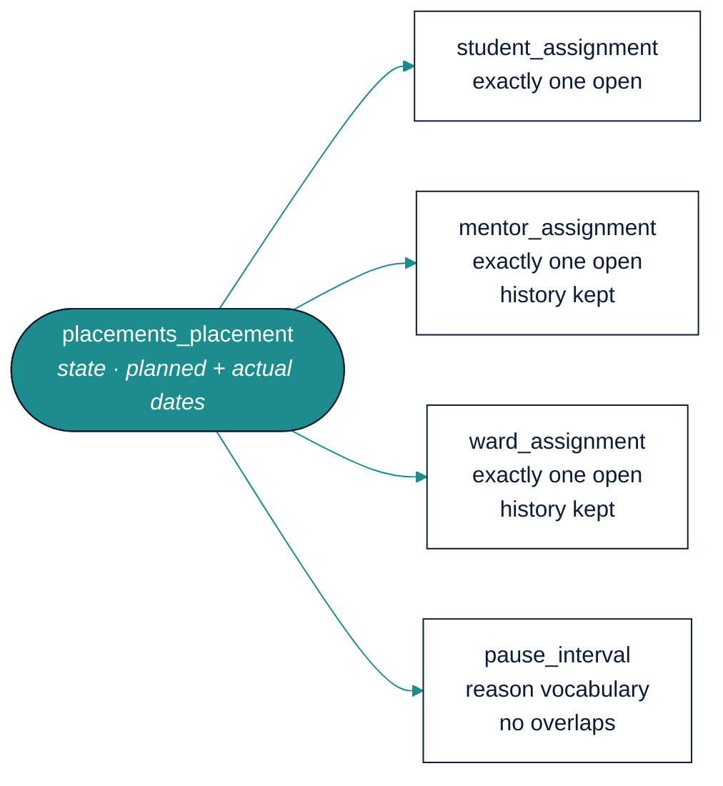
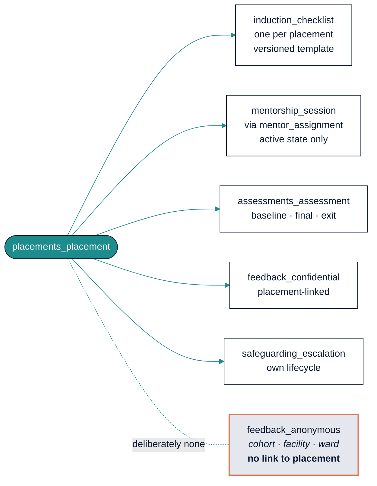

# MentorMAMA — Stage 5: Database Architecture

**The schema that enforces the rules, rather than merely storing them**

| Field | Detail |
| --- | --- |
| Product | MentorMAMA — Digital Mentorship Toolkit for Safer Midwifery Clinical Placement |
| Prepared by | Sinaps Technology — Bouric Okwaro Enos (Ric), Co-Founder & Team Lead |
| Document type | Stage 5 of the design sequence: Database Architecture |
| Precedes | Stage 6 (API Design) → Stage 7 (UI/UX) → Stage 8 (Sprints) |
| Builds on | Stage 4 Module Architecture v1.0; Stage 3 Business Rules v1.2; Stage 3.5 Use Cases v1.1 |
| Engine | PostgreSQL 16 (`btree_gist` extension required — see §6.3) |
| Version | 1.0 |
| Date | July 2026 |

---

## 1. What This Stage Decides — and the One Test It Must Pass

Stage 3 wrote 18 invariants. Stage 3.5 walked them through eight workflows. Stage 4 assigned them to modules.
This stage answers the only remaining question: **which of them the database itself refuses to break.**

That is the test this document is written against. An invariant enforced only in Python is enforced only on the
code path that remembers to call it — and this system will grow a second write path the moment anyone adds a
management command, a bulk import, a data fix, or a Django admin edit. Every rule pushed down to a constraint is
a rule that survives all of them.

The scorecard, stated up front and justified line by line in §7:

| Enforcement | Count | Meaning |
| --- | --- | --- |
| `DB` — constraint, index, or trigger | **12 of 18 invariants** | Cannot be violated by any client, including a psql session |
| `TXN` — guarded inside a locked transaction | 5 | Correct under concurrency; bypassable only by writing raw SQL deliberately |
| `SVC` / `MW` — application layer | 1 | INV-13's field-level read restriction, which is a projection concern (§7.2) |

### 1.1 What this stage does not do

No API shapes, no serializers, no endpoint contracts — those are Stage 6. No ORM model code: this document is
DDL-level, so it stays true if the ORM is ever replaced. Where Django behaviour matters (table naming,
migrations), it is called out explicitly rather than assumed.

---

## 2. Conventions

| Convention | Decision | Why |
| --- | --- | --- |
| **Primary keys** | `uuid` (UUIDv7 where the app generates them) | Non-guessable in URLs, safe to generate client-side for offline records, and v7's time-ordered prefix keeps index locality that v4 destroys |
| **Table naming** | `<module>_<entity>`, singular entity | Django's `app_label` prefix gives module ownership for free — `placements_placement`, `mentorship_session`. Ownership is legible in every query and every slow-query log |
| **Timestamps** | `timestamptz`, never `timestamp` | The pilot is single-timezone; the schema should not have to be migrated when it is not |
| **Dates** | `date` for `session_date`, placement windows, closure dates | A session happened on a day, not at an instant. Storing a timestamp invites device-clock bugs (Stage 3.5 §7.5) |
| **Enumerations** | `text` + `CHECK (col IN (...))` | Postgres native `enum` types cannot have values removed and require `ALTER TYPE` gymnastics; a check constraint is a one-line migration. Values are mirrored in code, single-sourced from the Stage 3 vocabularies |
| **Money** | none | The MVP has none. Deliberately absent |
| **Soft archive** | `archived_at timestamptz NULL` on operational tables | No `is_deleted` boolean: the timestamp answers "when", which the audit trail needs anyway (INV-10) |
| **Row versioning** | `version integer NOT NULL DEFAULT 0` on `placements_placement` | Optimistic concurrency for state transitions (WFR-028), belt to the `SELECT … FOR UPDATE` braces |
| **No nullable booleans** | three-state facts use `text` with a check | `NULL` meaning "unknown" in a boolean column is how audit data quietly rots |
| **Every table** | `created_at`, `updated_at`, and `created_by` where an actor exists | INV-11 attribution |

### 2.1 Naming the enumerated vocabularies

Five controlled vocabularies come from Stage 3 and are enforced as check constraints, not application choices:

| Vocabulary | Values | Source |
| --- | --- | --- |
| Placement state | `draft`, `scheduled`, `awaiting_student`, `orientation`, `induction`, `active`, `paused`, `completed`, `archived`, `withdrawn` | Stage 3 §5.1 |
| Escalation state | `open`, `under_review`, `action_required`, `resolved`, `closed` | Stage 3 §5.3 |
| Pause reason | `student_illness`, `personal_family`, `industrial_action`, `facility_closure`, `ward_capacity`, `academic_examinations`, `mentor_unavailability`, `safeguarding_investigation`, `public_health_emergency`, `other` | POL-021 (JKUAT, 30 Jul 2026) |
| Withdrawal reason | `student_withdrew`, `academic_decision`, `facility_capacity`, `safeguarding`, `administrative_error`, `other` | WFR-004 |
| Feedback mode | `confidential`, `anonymous` | POL-014 |

`other` always requires accompanying free text — enforced, not merely expected:

```sql
CONSTRAINT pause_reason_other_needs_text
  CHECK (reason <> 'other' OR nullif(btrim(reason_note), '') IS NOT NULL)
```

---

## 3. Platform Tables (`core`, `identity`)

### 3.1 `core_audit_entry` — append-only, and provably so

```sql
CREATE TABLE core_audit_entry (
    id            uuid PRIMARY KEY,
    occurred_at   timestamptz NOT NULL DEFAULT now(),
    actor_id      uuid NOT NULL REFERENCES identity_user(id),
    actor_role    text NOT NULL,
    scope         jsonb NOT NULL,          -- resolved scope tuple at the time of the write
    action        text NOT NULL,           -- e.g. 'placement.transition', 'session.log'
    entity_table  text NOT NULL,
    entity_id     uuid NOT NULL,
    changes       jsonb,                   -- {field: {from, to}} — never restricted field VALUES
    is_override   boolean NOT NULL DEFAULT false,
    override_reason text,
    CONSTRAINT override_needs_reason
      CHECK (NOT is_override OR nullif(btrim(override_reason), '') IS NOT NULL)
);

REVOKE UPDATE, DELETE ON core_audit_entry FROM mentormama_app;
CREATE INDEX ON core_audit_entry (entity_table, entity_id, occurred_at DESC);
CREATE INDEX ON core_audit_entry (actor_id, occurred_at DESC);
```

The `REVOKE` is the point. WFR-031 says audit entries are immutable and never deleted; a comment saying so is
not a control. The application role can insert and select, and physically cannot do anything else — so an audit
row cannot be edited by a bug, a migration, or a developer in a hurry.

`override_needs_reason` enforces WFR-033 at the database: an override without a reason cannot be recorded at
all, which means the three overrides the rules permit (orientation bypass, escalation deferral, training bypass)
are self-documenting forever.

### 3.2 `core_outbox_event` — the transactional outbox

```sql
CREATE TABLE core_outbox_event (
    id             uuid PRIMARY KEY,
    occurred_at    timestamptz NOT NULL DEFAULT now(),
    event_type     text NOT NULL,
    payload        jsonb NOT NULL,
    dispatched_at  timestamptz,
    attempts       smallint NOT NULL DEFAULT 0,
    last_error     text
);
CREATE INDEX ON core_outbox_event (occurred_at) WHERE dispatched_at IS NULL;
```

The partial index is what makes the dispatcher cheap: it only ever scans undispatched rows, so the index stays
small however large the table grows. Rows are retained after dispatch (they are the event history that
projections rebuild from — MA-06).

**A payload guard, because WFR-025 is a promise we cannot keep by memory:**

```sql
CREATE OR REPLACE FUNCTION core_outbox_reject_restricted_fields()
RETURNS trigger AS $$
BEGIN
    IF NEW.payload ?| ARRAY['description', 'action_taken', 'comments',
                            'feedback_given', 'what_was_covered'] THEN
        RAISE EXCEPTION
          'outbox payload may not carry restricted content (WFR-025): %', NEW.event_type;
    END IF;
    RETURN NEW;
END $$ LANGUAGE plpgsql;

CREATE TRIGGER core_outbox_payload_guard
    BEFORE INSERT ON core_outbox_event
    FOR EACH ROW EXECUTE FUNCTION core_outbox_reject_restricted_fields();
```

Escalation content leaking into a notification payload is the single highest-consequence mistake available in
this codebase. It is now a runtime error at the point of insert rather than a code-review responsibility.

### 3.3 `core_idempotency_key`

```sql
CREATE TABLE core_idempotency_key (
    command_id   uuid PRIMARY KEY,          -- generated client-side at form-open (Stage 3.5 §2.4)
    actor_id     uuid NOT NULL REFERENCES identity_user(id),
    command_type text NOT NULL,
    result_ref   uuid,                      -- the row the original command produced
    created_at   timestamptz NOT NULL DEFAULT now()
);
```

Client-generated primary key, so a replay collides on insert and the handler returns `result_ref` — the
offline retry path (W-05) becomes a primary-key conflict rather than duplicate business data.

### 3.4 `identity_user`

```sql
CREATE TABLE identity_user (
    id             uuid PRIMARY KEY,
    email          citext UNIQUE NOT NULL,
    phone          text,
    first_name     text NOT NULL,
    last_name      text NOT NULL,
    role           text NOT NULL CHECK (role IN ('student','mentor','nurse_manager',
                                                 'coordinator','program_admin')),
    program_id     uuid NOT NULL REFERENCES identity_program(id),
    institution_id uuid REFERENCES institutions_institution(id),
    facility_id    uuid REFERENCES facilities_facility(id),
    status         text NOT NULL DEFAULT 'invited'
                     CHECK (status IN ('invited','active','suspended','deactivated')),
    -- AUTH-003: exactly one organisation, unless Program Administrator
    CONSTRAINT one_organisation CHECK (
        (role = 'program_admin' AND institution_id IS NULL AND facility_id IS NULL)
     OR (role IN ('student','coordinator') AND institution_id IS NOT NULL AND facility_id IS NULL)
     OR (role IN ('mentor','nurse_manager') AND facility_id IS NOT NULL AND institution_id IS NULL)
    )
);
```

`one_organisation` is worth the ugliness. It makes "a student belongs to a university, a mentor belongs to a
hospital, and nobody belongs to both" a fact about the data rather than an assumption in the scope resolver —
which is the assumption every cross-tenant leak is built on.

Note `citext` for email: a login lookup that is case-sensitive is a support ticket generator.

**No sex or gender column.** POL-013b. If OD-12 comes back "yes", it is added here, on the university-owned
record, and never joined into a mentor-facing projection.

---

## 4. Organisational Tables

```sql
CREATE TABLE institutions_institution (
    id uuid PRIMARY KEY, program_id uuid NOT NULL REFERENCES identity_program(id),
    name text NOT NULL, type text NOT NULL, county text, contact_person text,
    is_active boolean NOT NULL DEFAULT true, archived_at timestamptz
);

CREATE TABLE institutions_cohort (
    id uuid PRIMARY KEY,
    institution_id uuid NOT NULL REFERENCES institutions_institution(id),
    name text NOT NULL,
    start_date date NOT NULL, end_date date NOT NULL,
    planned_capacity integer CHECK (planned_capacity IS NULL OR planned_capacity > 0),
    archived_at timestamptz,
    CONSTRAINT cohort_dates_ordered CHECK (start_date < end_date)
);

CREATE TABLE facilities_facility (
    id uuid PRIMARY KEY, program_id uuid NOT NULL REFERENCES identity_program(id),
    name text NOT NULL, county text, level text, maternity_unit_name text,
    contact_person text, archived_at timestamptz
);

CREATE TABLE facilities_ward (
    id uuid PRIMARY KEY,
    facility_id uuid NOT NULL REFERENCES facilities_facility(id),
    name text NOT NULL, shift_pattern text,
    max_students integer NOT NULL CHECK (max_students > 0),
    nurse_manager_id uuid REFERENCES identity_user(id),
    archived_at timestamptz
);
```

`planned_capacity` is nullable and unconstrained against anything, deliberately: POL-008 makes it a planning
target that warns and never blocks. A `NOT NULL` here would quietly turn Stage 1's explicit
"no capacity workflow in the MVP" decision into a capacity workflow.

---

## 5. The Placement Aggregate

This is the schema's centre, and the place where the rules bite hardest.



*Figure 1 — the aggregate's own tables. "Exactly one open" is a partial unique index, not a convention
(§5.2).*



*Figure 2 — the records produced during a placement. Anonymous feedback is drawn detached because it is
detached: it carries no column that could link it back (§6.2, ADR 0008).*

### 5.1 `placements_placement`

```sql
CREATE TABLE placements_placement (
    id              uuid PRIMARY KEY,
    cohort_id       uuid NOT NULL REFERENCES institutions_cohort(id),

    -- Denormalised for row-level scoping (SADD §6.2), guaranteed equal to the
    -- derived value by placements_scope_guard below (POL-006, INV-17).
    institution_id  uuid NOT NULL REFERENCES institutions_institution(id),
    facility_id     uuid REFERENCES facilities_facility(id),

    state           text NOT NULL DEFAULT 'draft' CHECK (state IN (
                        'draft','scheduled','awaiting_student','orientation','induction',
                        'active','paused','completed','archived','withdrawn')),

    -- OD-01, resolved by JKUAT 30 Jul 2026: planned dates are the original
    -- agreement; actual dates move when a pause extends the placement (POL-020).
    planned_start   date NOT NULL,
    planned_end     date NOT NULL,
    actual_start    date,
    actual_end      date,

    withdrawal_reason text CHECK (withdrawal_reason IN (
                        'student_withdrew','academic_decision','facility_capacity',
                        'safeguarding','administrative_error','other')),
    withdrawal_note   text,
    completed_at      timestamptz,
    archived_at       timestamptz,
    version           integer NOT NULL DEFAULT 0,
    created_at        timestamptz NOT NULL DEFAULT now(),
    created_by        uuid NOT NULL REFERENCES identity_user(id),

    CONSTRAINT planned_dates_ordered CHECK (planned_start < planned_end),
    CONSTRAINT actual_dates_ordered  CHECK (actual_end IS NULL OR actual_start IS NULL
                                            OR actual_start <= actual_end),
    -- WFR-004: a terminal withdrawal always carries a reason
    CONSTRAINT withdrawn_needs_reason CHECK (
        state <> 'withdrawn' OR withdrawal_reason IS NOT NULL),
    CONSTRAINT withdrawal_other_needs_note CHECK (
        withdrawal_reason <> 'other' OR nullif(btrim(withdrawal_note),'') IS NOT NULL),
    -- INV-09 support: a terminal state must record when it became terminal
    CONSTRAINT completed_has_timestamp CHECK (
        state <> 'completed' OR completed_at IS NOT NULL)
);
```

### 5.2 Assignments — "exactly one active" as an index, not a code comment

The three assignment tables share one shape. Mentor assignment shown in full:

```sql
CREATE TABLE placements_mentor_assignment (
    id           uuid PRIMARY KEY,
    placement_id uuid NOT NULL REFERENCES placements_placement(id),
    mentor_id    uuid NOT NULL REFERENCES identity_user(id),
    started_at   timestamptz NOT NULL DEFAULT now(),
    ended_at     timestamptz,
    end_reason   text,
    created_by   uuid NOT NULL REFERENCES identity_user(id),
    CONSTRAINT assignment_interval_ordered CHECK (ended_at IS NULL OR started_at < ended_at)
);

-- INV-12: at most one OPEN mentor assignment per placement. A full unique index
-- would forbid history; the partial index forbids only concurrent ones.
CREATE UNIQUE INDEX one_active_mentor_per_placement
    ON placements_mentor_assignment (placement_id)
    WHERE ended_at IS NULL;

CREATE INDEX mentor_assignment_by_mentor
    ON placements_mentor_assignment (mentor_id) WHERE ended_at IS NULL;
```

That partial unique index is the whole of INV-12 for mentors, and it is the single most valuable line of DDL in
this document: it makes the failure mode that would have destroyed mentorship history — two open assignments,
or a reassignment that overwrites — impossible rather than unlikely. `placements_student_assignment` and
`placements_ward_assignment` carry the identical index; the student one additionally satisfies INV-01.

**A student cannot hold two overlapping placements** (`StudentAlreadyAssigned`), which is a range problem, not a
uniqueness problem:

```sql
CREATE EXTENSION IF NOT EXISTS btree_gist;

ALTER TABLE placements_student_assignment
  ADD COLUMN active_window daterange
    GENERATED ALWAYS AS (daterange(started_on, ended_on, '[)')) STORED;

ALTER TABLE placements_student_assignment
  ADD CONSTRAINT student_no_overlapping_placements
  EXCLUDE USING gist (student_id WITH =, active_window WITH &&)
  WHERE (ended_on IS NULL OR ended_on > started_on);
```

### 5.3 `placements_pause_interval` — the JKUAT reporting requirement

```sql
CREATE TABLE placements_pause_interval (
    id           uuid PRIMARY KEY,
    placement_id uuid NOT NULL REFERENCES placements_placement(id),
    started_on   date NOT NULL,            -- date of interruption
    ended_on     date,                     -- date of resumption, NULL while paused
    reason       text NOT NULL CHECK (reason IN (
                    'student_illness','personal_family','industrial_action',
                    'facility_closure','ward_capacity','academic_examinations',
                    'mentor_unavailability','safeguarding_investigation',
                    'public_health_emergency','other')),
    reason_note  text,
    paused_by    uuid NOT NULL REFERENCES identity_user(id),
    resumed_by   uuid REFERENCES identity_user(id),
    span         daterange GENERATED ALWAYS AS (daterange(started_on, ended_on, '[)')) STORED,
    CONSTRAINT pause_dates_ordered CHECK (ended_on IS NULL OR started_on <= ended_on),
    CONSTRAINT pause_reason_other_needs_note CHECK (
        reason <> 'other' OR nullif(btrim(reason_note),'') IS NOT NULL),
    -- two pauses cannot overlap on one placement
    CONSTRAINT pause_no_overlap
      EXCLUDE USING gist (placement_id WITH =, span WITH &&)
);

CREATE UNIQUE INDEX one_open_pause_per_placement
    ON placements_pause_interval (placement_id) WHERE ended_on IS NULL;
```

`reason` is a constrained vocabulary rather than free text specifically so that Dr. Nyariki's question —
*why is training being interrupted?* — is answerable with a `GROUP BY` instead of by reading notes. The
`interruption_causes` projection (§8) is a three-line query because of this column.

### 5.4 Sessions and the window rules

```sql
CREATE TABLE mentorship_session (
    id                  uuid PRIMARY KEY,
    placement_id        uuid NOT NULL REFERENCES placements_placement(id),
    mentor_assignment_id uuid NOT NULL REFERENCES placements_mentor_assignment(id),
    session_date        date NOT NULL,
    session_type        text NOT NULL,
    duration_minutes    smallint CHECK (duration_minutes IS NULL
                                        OR duration_minutes BETWEEN 1 AND 480),
    what_was_covered    text,      -- restricted from the university side (POL-016)
    feedback_given      text,      -- restricted
    follow_up_action    text,
    submitted_at        timestamptz NOT NULL DEFAULT now(),
    command_id          uuid NOT NULL REFERENCES core_idempotency_key(command_id),
    corrected_by_id     uuid REFERENCES mentorship_session(id),
    created_by          uuid NOT NULL REFERENCES identity_user(id)
);

CREATE TABLE mentorship_session_topic (
    session_id uuid NOT NULL REFERENCES mentorship_session(id),
    topic      text NOT NULL,
    PRIMARY KEY (session_id, topic)
);
```

Two design notes that matter:

- **The session references the mentor *assignment*, not the mentor.** That single choice satisfies INV-03 and
  WFR-011 structurally: a session is attributable to the person who held the role at the time, and it remains
  correctly attributed after reassignment (Stage 3.5 §5.3) with no historical rewrite.
- **Topics are rows, not an array or JSON.** WFR-009 requires at least one topic and the dashboards group by it;
  an array column would make "sessions by topic per facility" a scan.

WFR-009's *at least one topic* is a cross-row rule, so it belongs to the transaction (§7.1) — a check constraint
cannot see another table.

**INV-04 and INV-05 as a trigger**, because both compare a new row against the parent's state and pause history:

```sql
CREATE OR REPLACE FUNCTION mentorship_session_window_guard()
RETURNS trigger AS $$
DECLARE p RECORD;
BEGIN
    SELECT state, planned_start, coalesce(actual_end, planned_end) AS ends
      INTO p FROM placements_placement WHERE id = NEW.placement_id FOR SHARE;

    IF p.state <> 'active' THEN                                   -- INV-05
        RAISE EXCEPTION 'PlacementNotActive: state=%', p.state;
    END IF;
    IF NEW.session_date < p.planned_start OR NEW.session_date > p.ends THEN
        RAISE EXCEPTION 'SessionOutsidePlacementWindow: % not in [%, %]',
              NEW.session_date, p.planned_start, p.ends;          -- INV-04
    END IF;
    IF EXISTS (SELECT 1 FROM placements_pause_interval
                WHERE placement_id = NEW.placement_id
                  AND span @> NEW.session_date) THEN
        RAISE EXCEPTION 'SessionOutsidePlacementWindow: date falls inside a pause';
    END IF;
    RETURN NEW;
END $$ LANGUAGE plpgsql;

CREATE TRIGGER mentorship_session_window
    BEFORE INSERT ON mentorship_session
    FOR EACH ROW EXECUTE FUNCTION mentorship_session_window_guard();
```

The `FOR SHARE` matters: it prevents the placement being paused concurrently between the check and the commit.

**WFR-014's duplicate window**, five minutes, same placement, same mentor, same date:

```sql
CREATE UNIQUE INDEX session_no_duplicate_within_window
    ON mentorship_session (placement_id, mentor_assignment_id, session_date,
                           (date_trunc('hour', submitted_at)
                            + interval '5 min' * floor(extract(minute FROM submitted_at) / 5)));
```

Bucketing to five-minute boundaries makes the rule an index rather than a query. It is deliberately *slightly*
different from "within 5 minutes of each other" — two submissions 4 minutes apart that straddle a bucket
boundary will both be accepted. The application check in the same transaction closes that gap; the index exists
so that a second write path cannot create the field failure mode (duplicate logs nobody can explain) even if it
forgets.

---

## 6. Induction, Assessments, Safeguarding

### 6.1 Induction — versioned templates

```sql
CREATE TABLE induction_checklist_template (
    id uuid PRIMARY KEY, program_id uuid NOT NULL REFERENCES identity_program(id),
    version integer NOT NULL, published_at timestamptz, retired_at timestamptz,
    UNIQUE (program_id, version)
);
CREATE TABLE induction_template_item (
    id uuid PRIMARY KEY,
    template_id uuid NOT NULL REFERENCES induction_checklist_template(id),
    position smallint NOT NULL, label text NOT NULL,
    is_required boolean NOT NULL DEFAULT true,
    completed_by_role text NOT NULL,
    UNIQUE (template_id, position)
);
CREATE TABLE induction_checklist (
    id uuid PRIMARY KEY,
    placement_id uuid NOT NULL UNIQUE REFERENCES placements_placement(id),
    template_id  uuid NOT NULL REFERENCES induction_checklist_template(id),
    opened_at timestamptz NOT NULL DEFAULT now(),
    completed_at timestamptz, signed_by uuid REFERENCES identity_user(id),
    CONSTRAINT completed_needs_signature CHECK (
        completed_at IS NULL OR signed_by IS NOT NULL)
);
CREATE TABLE induction_item_response (
    id uuid PRIMARY KEY,
    checklist_id uuid NOT NULL REFERENCES induction_checklist(id),
    template_item_id uuid NOT NULL REFERENCES induction_template_item(id),
    response text NOT NULL CHECK (response IN ('yes','no','not_applicable')),
    comment text, answered_at timestamptz NOT NULL DEFAULT now(),
    answered_by uuid NOT NULL REFERENCES identity_user(id),
    command_id uuid REFERENCES core_idempotency_key(command_id),
    UNIQUE (checklist_id, template_item_id)
);
```

`placement_id UNIQUE` is one induction per placement, permanently — which is what "induction survives mentor
reassignment" means in schema terms. `template_id` on the checklist rather than on the placement is what stops a
published template edit from changing what a mentor already signed (Stage 3.5 §6.3).

### 6.2 Assessments and feedback — two tables, because anonymity is structural

This is the most consequential modelling decision in this stage.

```sql
-- Confidential feedback: linked to the placement, restricted read (POL-014).
CREATE TABLE assessments_feedback_confidential (
    id           uuid PRIMARY KEY,
    placement_id uuid NOT NULL REFERENCES placements_placement(id),
    submitted_at timestamptz NOT NULL DEFAULT now(),
    unresolved_concern boolean NOT NULL DEFAULT false,
    comments     text,
    revises_id   uuid REFERENCES assessments_feedback_confidential(id),
    command_id   uuid REFERENCES core_idempotency_key(command_id)
);

-- Anonymous feedback: NO placement_id, NO student_id. There is no column to
-- re-identify through, because a placement identifies exactly one student
-- (POL-014, confirmed by JKUAT 30 Jul 2026).
CREATE TABLE assessments_feedback_anonymous (
    id           uuid PRIMARY KEY,
    cohort_id    uuid NOT NULL REFERENCES institutions_cohort(id),
    facility_id  uuid NOT NULL REFERENCES facilities_facility(id),
    ward_id      uuid NOT NULL REFERENCES facilities_ward(id),
    submitted_on date NOT NULL,          -- date, not timestamp: a timestamp plus a
                                         -- server log correlates back to a session
    comments     text
);
```

Two tables rather than one table with nullable columns, and the reason is worth stating plainly: a single table
with a nullable `placement_id` would leave anonymity depending on every future query remembering to filter. A
separate table has **no column to leak**. The guarantee becomes structural instead of behavioural — and if
someone later writes `SELECT * FROM assessments_feedback_anonymous JOIN …`, there is nothing to join on.

Note also `submitted_on date`: storing an exact timestamp for an anonymous submission would let anyone with
application logs correlate the row to a session and de-anonymise it. The date is what the research needs; the
timestamp is a liability.

Scores are rows, not columns, so a new survey instrument is data rather than a migration:

```sql
CREATE TABLE assessments_assessment (
    id uuid PRIMARY KEY,
    placement_id uuid NOT NULL REFERENCES placements_placement(id),
    kind text NOT NULL CHECK (kind IN ('baseline_confidence','final_confidence','exit_survey')),
    submitted_at timestamptz NOT NULL DEFAULT now(),
    revises_id uuid REFERENCES assessments_assessment(id),
    UNIQUE (placement_id, kind, submitted_at)
);
CREATE TABLE assessments_response (
    id uuid PRIMARY KEY,
    assessment_id uuid REFERENCES assessments_assessment(id),
    feedback_confidential_id uuid REFERENCES assessments_feedback_confidential(id),
    feedback_anonymous_id uuid REFERENCES assessments_feedback_anonymous(id),
    question_code text NOT NULL,
    scale text NOT NULL CHECK (scale IN ('likert_1_5','score_0_100','yes_no')),
    value_numeric numeric(5,2),
    value_boolean boolean,
    -- INV-15: ranges enforced per scale, at the database
    CONSTRAINT score_in_range CHECK (
        (scale = 'likert_1_5'  AND value_numeric BETWEEN 1 AND 5)
     OR (scale = 'score_0_100' AND value_numeric BETWEEN 0 AND 100)
     OR (scale = 'yes_no'      AND value_boolean IS NOT NULL AND value_numeric IS NULL)),
    -- a response belongs to exactly one parent
    CONSTRAINT one_parent CHECK (
        (assessment_id IS NOT NULL)::int
      + (feedback_confidential_id IS NOT NULL)::int
      + (feedback_anonymous_id IS NOT NULL)::int = 1)
);
```

**Immutability (INV-14), enforced rather than promised:**

```sql
CREATE OR REPLACE FUNCTION reject_mutation()
RETURNS trigger AS $$
BEGIN
    RAISE EXCEPTION 'FeedbackImmutable: % is append-only — create a revision instead',
                    TG_TABLE_NAME;
END $$ LANGUAGE plpgsql;

CREATE TRIGGER feedback_confidential_immutable
    BEFORE UPDATE OR DELETE ON assessments_feedback_confidential
    FOR EACH ROW EXECUTE FUNCTION reject_mutation();
-- identical triggers on assessments_feedback_anonymous, assessments_assessment,
-- assessments_response
```

### 6.3 Safeguarding

```sql
CREATE TABLE safeguarding_escalation (
    id            uuid PRIMARY KEY,
    placement_id  uuid REFERENCES placements_placement(id),
    facility_id   uuid NOT NULL REFERENCES facilities_facility(id),
    submitted_by  uuid NOT NULL REFERENCES identity_user(id),
    category      text NOT NULL,
    severity      text NOT NULL CHECK (severity IN ('low','medium','high')),
    description   text NOT NULL,          -- RESTRICTED (INV-13)
    state         text NOT NULL DEFAULT 'open'
                    CHECK (state IN ('open','under_review','action_required',
                                     'resolved','closed')),
    reviewer_id   uuid REFERENCES identity_user(id),
    finding       text,                   -- RESTRICTED
    action_taken  text,                   -- RESTRICTED
    resolution_outcome text CHECK (resolution_outcome IS NULL OR resolution_outcome IN
                        ('resolved_internally','referred_externally','no_action_required')),
    closure_date  date,
    related_escalation_id uuid REFERENCES safeguarding_escalation(id),
    created_at    timestamptz NOT NULL DEFAULT now(),

    -- WFR-008: the subject of an escalation may not review it
    CONSTRAINT reviewer_is_not_submitter CHECK (
        reviewer_id IS NULL OR reviewer_id <> submitted_by),
    -- E-02: leaving 'open' requires a reviewer
    CONSTRAINT non_open_needs_reviewer CHECK (
        state = 'open' OR reviewer_id IS NOT NULL),
    -- E-04/E-05: resolution requires documented action
    CONSTRAINT resolved_needs_action CHECK (
        state NOT IN ('resolved','closed')
        OR nullif(btrim(action_taken),'') IS NOT NULL),
    -- E-06: closure requires a date
    CONSTRAINT closed_needs_date CHECK (state <> 'closed' OR closure_date IS NOT NULL)
);

CREATE INDEX escalation_open_by_facility
    ON safeguarding_escalation (facility_id, severity)
    WHERE state <> 'closed';
```

Four of the six escalation transition guards are now check constraints. That is the safeguarding lifecycle being
enforced by the database rather than by whichever service method the caller happened to use.

The partial index on `state <> 'closed'` is what makes INV-07's completion guard cheap — the blocker query in
§7.3 is an index lookup on a small set, on the hot path of every placement completion.

**Restricted-read auditing (WFR-032):**

```sql
CREATE TABLE safeguarding_access_log (
    id uuid PRIMARY KEY,
    escalation_id uuid NOT NULL REFERENCES safeguarding_escalation(id),
    actor_id uuid NOT NULL REFERENCES identity_user(id),
    field text NOT NULL,
    accessed_at timestamptz NOT NULL DEFAULT now()
);
REVOKE UPDATE, DELETE ON safeguarding_access_log FROM mentormama_app;
```

**Optional hardening, recommended before pilot go-live:** Postgres column privileges can make the restriction
physical rather than a serializer rule —

```sql
-- a reporting role that literally cannot read escalation content
CREATE ROLE mentormama_reporting;
GRANT SELECT (id, placement_id, facility_id, severity, state, closure_date)
  ON safeguarding_escalation TO mentormama_reporting;
```

Anything analytics-facing connects as `mentormama_reporting`, and INV-13 stops depending on serializer
correctness for the reporting path. I recommend adopting this — it is cheap, and it converts the highest-severity
risk in the risk register from "mitigated by code review" to "mitigated by the database".

---

## 7. Invariant → Constraint Traceability

The scorecard from §1, justified.

| Invariant | Mechanism | Where |
| --- | --- | --- |
| INV-01 one student assignment | partial unique index `WHERE ended_at IS NULL` | `DB` |
| INV-02 induction gates `Active` | transition function checks `induction_checklist.completed_at` under row lock | `TXN` — cross-table, needs the state machine |
| INV-03 session owned by placement | `placement_id NOT NULL`, no student/mentor FK on the session | `DB` |
| INV-04 session window / pause | `mentorship_session_window` trigger | `DB` |
| INV-05 Active-only logging | same trigger | `DB` |
| INV-06 induction-state items | trigger on `induction_item_response` mirroring the session guard | `DB` |
| INV-07 no completion with open escalation | completion-blocker query under lock (§7.3) + partial index | `TXN` |
| INV-08 final assessment gates completion | same blocker path | `TXN` |
| INV-09 terminal immutability | `placements_terminal_immutable` trigger (§7.4) | `DB` |
| INV-10 no hard delete | no `DELETE` grant on operational tables; `archived_at` only | `DB` |
| INV-11 attributable writes | `created_by NOT NULL` throughout; audit insert in the same transaction | `DB` + `TXN` |
| INV-12 one active assignment | three partial unique indexes | `DB` |
| INV-13 escalation confidentiality | serializer restriction, plus optional column grants (§6.3) | `SVC` (`DB` if hardening adopted) |
| INV-14 immutable submissions | `reject_mutation` triggers on four tables | `DB` |
| INV-15 score ranges | `score_in_range` check per scale | `DB` |
| INV-16 ward capacity | `SELECT … FOR UPDATE` on the ward + count (§7.5) | `TXN` |
| INV-17 derived scope fields | `placements_scope_guard` trigger (§7.2) | `DB` |
| INV-18 no patient data | no column exists to hold it; schema review gate on migrations | `DB` (structural) |

### 7.1 Why five invariants stay at `TXN`

Not laziness — each is a genuine cross-aggregate decision:

- **INV-02, INV-07, INV-08** are transition guards. A trigger *could* enforce them, but it would put business
  logic where nobody looks for it and would make the error vocabulary (Stage 3 §12) impossible to return
  cleanly. They live in the state machine, under `SELECT … FOR UPDATE` on the placement, and the
  completion-blocker ports from Stage 4 §8.2 are how the higher layers contribute their part.
- **INV-16** needs a lock on the *ward*, taken before the placement write. A constraint cannot express
  "count sibling rows under a lock".
- **WFR-009's "at least one topic"** is the same shape: a check constraint cannot see another table, and a
  deferred constraint trigger would fire too late to give a useful error.

### 7.2 `placements_scope_guard` — derive, don't duplicate

```sql
CREATE OR REPLACE FUNCTION placements_scope_guard()
RETURNS trigger AS $$
DECLARE derived_institution uuid; derived_facility uuid;
BEGIN
    SELECT c.institution_id INTO derived_institution
      FROM institutions_cohort c WHERE c.id = NEW.cohort_id;

    SELECT w.facility_id INTO derived_facility
      FROM placements_ward_assignment wa
      JOIN facilities_ward w ON w.id = wa.ward_id
     WHERE wa.placement_id = NEW.id AND wa.ended_at IS NULL;

    IF NEW.institution_id <> derived_institution THEN
        RAISE EXCEPTION 'ScopeDerivationMismatch: institution % <> derived %',
                        NEW.institution_id, derived_institution;
    END IF;
    IF derived_facility IS NOT NULL AND NEW.facility_id <> derived_facility THEN
        RAISE EXCEPTION 'ScopeDerivationMismatch: facility % <> derived %',
                        NEW.facility_id, derived_facility;
    END IF;
    RETURN NEW;
END $$ LANGUAGE plpgsql;
```

This is what makes the SADD's performance denormalisation safe. The columns exist for fast row-level scoping;
the trigger means they cannot drift into being a second, wrong source of truth — which is precisely the failure
S-11 and INV-17 were written to prevent.

### 7.3 The completion blockers, as SQL

```sql
-- INV-07 and INV-08, evaluated inside the transaction that holds the placement lock
SELECT
  EXISTS (SELECT 1 FROM safeguarding_escalation
           WHERE placement_id = $1 AND state <> 'closed')            AS escalation_open,
  NOT EXISTS (SELECT 1 FROM assessments_assessment
               WHERE placement_id = $1 AND kind = 'exit_survey')     AS final_missing;
```

Both sub-queries hit partial or covering indexes, so the guard costs microseconds on the completion path.

### 7.4 Terminal immutability

```sql
CREATE OR REPLACE FUNCTION placements_terminal_immutable()
RETURNS trigger AS $$
BEGIN
    IF OLD.state IN ('archived','withdrawn') THEN
        RAISE EXCEPTION 'PlacementArchived: % placements are immutable', OLD.state;
    END IF;
    RETURN NEW;
END $$ LANGUAGE plpgsql;

CREATE TRIGGER placements_no_write_when_terminal
    BEFORE UPDATE OR DELETE ON placements_placement
    FOR EACH ROW EXECUTE FUNCTION placements_terminal_immutable();
```

INV-09 says *no field, no child record, no exception*. The same trigger shape is applied to every child table,
keyed on the parent's state — because an archived placement whose sessions can still be edited is not archived.

### 7.5 Ward capacity

```sql
-- inside TX-01 / TX-02, before inserting the ward assignment
SELECT max_students INTO cap
  FROM facilities_ward WHERE id = $1 FOR UPDATE;          -- serialises admissions

SELECT count(*) INTO current FROM placements_ward_assignment wa
  JOIN placements_placement p ON p.id = wa.placement_id
 WHERE wa.ward_id = $1 AND wa.ended_at IS NULL
   AND p.state IN ('orientation','induction','active','paused');   -- POL-007

IF current >= cap THEN RAISE EXCEPTION 'WardCapacityExceeded'; END IF;
```

The `FOR UPDATE` on the ward row is the whole mechanism: without it, two coordinators allocating the last slot
concurrently both read `current = cap - 1` and both succeed (Stage 3.5 §4.3).

---

## 8. Read Models

`analytics` owns these. Per MA-06 every one must be rebuildable from the domain tables plus the event history,
so none of them is a source of truth. Implemented as **materialised views** where the query is expressive and
refresh latency of a minute is acceptable, and as **event-maintained tables** where the dashboard needs to be
current.

| Projection | Form | Refresh |
| --- | --- | --- |
| `placement_summary` | event-maintained table | on placement/session/induction events |
| `facility_indicators`, `cohort_indicators` | materialised view | `REFRESH … CONCURRENTLY` every 5 min |
| `mentor_activity` | materialised view | every 5 min |
| `progress_summary` | computed on read (no storage) | — (WFR-022) |
| `interruption_causes` | materialised view | hourly |
| `feedback_aggregate` | materialised view **with min-n suppression built in** | every 15 min |
| `escalation_counts` | materialised view, counts and severity only | every 5 min |

Two of these carry rules and are worth showing.

**`interruption_causes`** — the JKUAT requirement, and it is this short only because POL-021 made the reason a
vocabulary:

```sql
CREATE MATERIALIZED VIEW analytics_interruption_causes AS
SELECT p.facility_id, p.cohort_id, pi.reason,
       count(*) AS interruptions,
       sum(coalesce(pi.ended_on, current_date) - pi.started_on) AS days_interrupted
  FROM placements_pause_interval pi
  JOIN placements_placement p ON p.id = pi.placement_id
 GROUP BY 1, 2, 3;
```

**`feedback_aggregate`** — POL-013 and POL-013a enforced in the projection, so the suppression cannot be
forgotten by a caller:

```sql
CREATE MATERIALIZED VIEW analytics_feedback_aggregate AS
SELECT ma.mentor_id, r.question_code,
       count(*) AS responses,
       CASE WHEN count(*) >= 3 THEN round(avg(r.value_numeric), 2) END AS mean_score
  FROM assessments_response r
  JOIN assessments_feedback_confidential f ON f.id = r.feedback_confidential_id
  JOIN placements_mentor_assignment ma ON ma.placement_id = f.placement_id
 GROUP BY 1, 2;
```

`mean_score` is **NULL below three responses** — the projection returns nothing to display rather than trusting
the caller to check the count. And note what is absent: no year of study, no course, no demographic column, so
no mentor-facing breakdown can exist (POL-013a). A projection that cannot express a filter cannot leak through
one.

```sql
CREATE TABLE analytics_export_record (
    id uuid PRIMARY KEY,
    actor_id uuid NOT NULL REFERENCES identity_user(id),
    scope jsonb NOT NULL, filters jsonb NOT NULL,
    row_count integer NOT NULL, format text NOT NULL,
    created_at timestamptz NOT NULL DEFAULT now()
);
REVOKE UPDATE, DELETE ON analytics_export_record FROM mentormama_app;
```

Written in the same transaction as the export (TX-09), and immutable — so "who extracted what, scoped how, and
how many rows" is answerable during a data-governance review.

---

## 9. Indexing

Indexes follow the queries the workflows actually issue, not every column that looks searchable. The
write-heavy tables (`mentorship_session`, `core_outbox_event`, `core_audit_entry`) are deliberately
under-indexed beyond what the dashboards need.

| Table | Index | Serves |
| --- | --- | --- |
| `identity_user` | `email` UNIQUE (citext) | login, every request |
| `placements_placement` | `(institution_id, state)`, `(facility_id, state)` | row-level scoping — on **every** scoped query |
| `placements_placement` | `(state, coalesce(actual_end, planned_end))` | overdue and closing-window dashboards |
| `placements_mentor_assignment` | `(mentor_id) WHERE ended_at IS NULL` | "my students" |
| `placements_student_assignment` | `(student_id) WHERE ended_at IS NULL` | "my placement" |
| `mentorship_session` | `(placement_id, session_date DESC)` | session history, cadence metrics |
| `mentorship_session` | `(mentor_assignment_id, session_date)` | mentor activity |
| `induction_checklist` | `(placement_id)` UNIQUE | induction status per placement |
| `safeguarding_escalation` | `(facility_id, severity) WHERE state <> 'closed'` | manager queue, INV-07 guard |
| `core_outbox_event` | `(occurred_at) WHERE dispatched_at IS NULL` | dispatcher |
| `core_audit_entry` | `(entity_table, entity_id, occurred_at DESC)` | record history |

At pilot scale — 80 students, ~25 mentors, a few thousand sessions — none of this is load-bearing for
performance. It is here so the row-level scoping predicates are indexed from the first migration, because
`(institution_id, state)` appearing on every query in the system is the one access pattern guaranteed not to
change.

---

## 10. Migrations, Seeding, and the Existing Scaffold

The current backend has exactly one real migration: `accounts.0001_initial`, creating `User`. Stage 4 renames
that app to `identity`. Two options, and the choice is easy at this stage:

| Option | Verdict |
| --- | --- |
| `AlterModelTable` + `SeparateDatabaseAndState` to rename in place | Correct, and unnecessary complexity for a table with no production rows |
| **Delete the migration and the SQLite file, and start the migration history clean** | **Adopted.** There is no production data. A clean history is worth more than a preserved lineage of a scaffold |

Sequence:

1. Drop `backend/db.sqlite3` and `apps/accounts/migrations/0001_initial.py`; restructure apps per Stage 4 §5.
2. Move to **PostgreSQL for all environments including local dev.** SQLite cannot express partial unique
   indexes with the semantics used here, `EXCLUDE` constraints, `citext`, `daterange`, or the triggers — so a
   SQLite dev environment would silently not enforce most of this document. Docker Compose already provisions
   Postgres.
3. `0001_initial` per module, in dependency order: `core` → `identity` → `institutions`/`facilities`/`learning`
   → `placements` → children → `analytics`/`notifications`.
4. A `0002_constraints` migration per module carrying the raw-SQL objects Django cannot express natively:
   triggers, `EXCLUDE` constraints, functional unique indexes, `REVOKE` grants. Each with a tested `reverse_sql`.
5. Seed fixtures: the programme, one institution, one facility, one ward, the induction checklist template from
   Concept Note §11, and the six training modules from §10.

**A migration test gate**, because INV-18 is otherwise a promise:

- CI asserts that no migration introduces a column whose name matches a patient-identifier denylist
  (`patient`, `mrn`, `medical_record`, `nhif`, `id_number`, `date_of_birth`, …).
- CI asserts `makemigrations --check --dry-run` is clean, so models and migrations cannot drift.
- CI runs the constraint suite against a real Postgres: one test per invariant in §7, each attempting the
  violation and asserting the database refuses it. **That suite is the deliverable that makes this document
  true** — without it, §7 is a table of intentions.

---

## 11. Retention, Backup, Recovery

| Concern | Decision |
| --- | --- |
| Backups | Nightly full plus WAL archiving; RTO under 4 hours per SADD §7.5 |
| Restore rehearsal | Restore into a scratch database and run the constraint suite before the pilot opens — an untested backup is not a backup |
| Retention | Operational records retained for the programme's lifetime; archived placements stay queryable (they are the evaluation dataset) |
| Right to correction | Handled by revision rows (INV-14), never by `UPDATE` |
| Deactivation | `identity_user.status = 'deactivated'`; the row remains because audit entries reference it (INV-11) |
| Escalation content | No separate retention rule for the pilot. **Flagged for the governance sign-off:** safeguarding descriptions may warrant a defined retention period, and that is a decision for JKUAT/AfyaVentures, not for us |

---

## 12. New Open Decisions

| ID | Question | Recommendation |
| --- | --- | --- |
| OD-13 | Adopt Postgres column-level grants for escalation content (§6.3)? | **Yes, before pilot go-live.** Converts INV-13 from serializer-dependent to database-enforced for every reporting path |
| OD-14 | Retention period for escalation `description` / `action_taken`? | Needs a governance answer. Recommend defining one rather than defaulting to forever |
| OD-15 | Does the research evaluation need a stable pseudonymous student identifier for longitudinal analysis across cohorts? | If yes, model it now as a dedicated column on the student record, not by re-purposing the UUID in exports |

---

## 13. What Stage 6 Inherits

Stage 6 (API Design) receives: the error vocabulary already mapped onto constraint names (a violation of
`one_active_mentor_per_placement` is `MentorAlreadyAssigned`, so the API layer translates rather than invents);
`command_id` as a first-class column, meaning idempotency is a contract not a convention; and the scope columns
(`institution_id`, `facility_id`) that every list endpoint must filter on.

One instruction to carry forward: **the API layer must translate constraint violations into the domain error
codes, and must never catch-and-ignore one.** A constraint that fires is a rule doing its job; a 500 that hides
it is the rule failing silently.

---

## Appendix A — Architecture Decision Records Added

| ADR | Decision |
| --- | --- |
| 0005 | Single Postgres schema with Django `app_label` table prefixes, rather than schema-per-module |
| 0006 | UUIDv7 primary keys, client-generatable for offline records |
| 0007 | Immutability enforced by triggers plus revoked grants, not by application convention |
| 0008 | Anonymous feedback as a separate table with no re-identifying column |
| 0009 | PostgreSQL in every environment, including local development |

---

*End of Stage 5: Database Architecture — Sinaps Technology / JHUB Africa. Confidential.*
