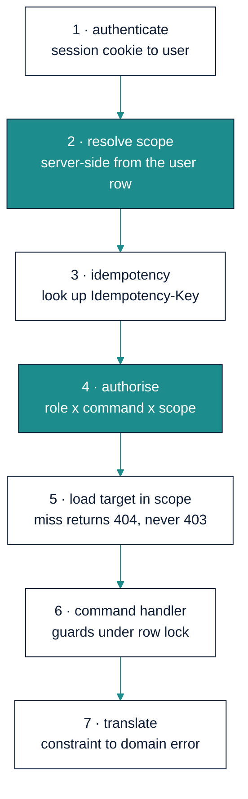

# MentorMAMA — Stage 6: API Design

**The contract between a ward with two bars of signal and a database that refuses to be wrong**

| Field | Detail |
| --- | --- |
| Product | MentorMAMA — Digital Mentorship Toolkit for Safer Midwifery Clinical Placement |
| Prepared by | Sinaps Technology — Bouric Okwaro Enos (Ric), Co-Founder & Team Lead |
| Document type | Stage 6 of the design sequence: API Design |
| Supersedes | SADD v1.0 §6.3 and SADD v2.0 §8.3 (both marked provisional pending this stage) |
| Precedes | Stage 7 (UI/UX) → Stage 8 (Sprints & Delivery) |
| Builds on | Stage 5 Database Architecture v1.0; Stage 4 Module Architecture v1.0; Stage 3.5 Use Cases v1.1; Stage 3 Business Rules v1.2 |
| Version | 1.0 |
| Date | July 2026 |

---

## 1. What This Stage Decides

Stage 3.5 produced a **command surface** — `AssignMentor`, `LogSession`, `CloseEscalation` — deliberately named
as domain operations rather than HTTP calls. Stage 5 produced a schema that raises named errors when a rule is
broken. This stage joins them: the transport, the request pipeline, the error contract, and the offline
protocol.

It also replaces the one part of the original SADD that was most confidently wrong. v1.0 §6.3 listed
`POST /api/placements` for *"create/reassign a PlacementAssignment"* — one endpoint, two operations, two
different actors, two entirely different guard sets, and no way for an audit trail to say which had been
requested. That single line is the argument for everything in §3.

### 1.1 The design constraint that outranks the others

Every other API this team has built could assume the client is online. This one cannot. The Concept Note
requires draft-saving and retry sync on the two forms mentors complete on the ward floor, which means:

> **Every mutating request in the mentor and student journeys will be sent more than once, and some will
> arrive hours late, against a placement whose state has changed in the meantime.**

That is not an edge case to handle at the end. It determines the authentication mechanism (§4), makes
idempotency a first-class part of the contract rather than a header someone might send (§5), requires errors to
declare whether retrying could ever help (§6.3), and adds an endpoint that exists purely so a client can find
out what happened to a request whose response it never received (§8.3).

---

## 2. Conventions

| Concern | Decision |
| --- | --- |
| Base path | `/api/v1` |
| Media type | `application/json; charset=utf-8`; `Content-Type` required on all writes |
| Case | `snake_case` field names, matching the database and the Python layer — no translation layer to get wrong |
| Identifiers | UUIDs in all payloads and paths; never sequential integers, never database row counts |
| Dates | `session_date`, `planned_start` etc. as `YYYY-MM-DD` — **dates, not timestamps** (Stage 5 §2) |
| Timestamps | RFC 3339 UTC with `Z`, e.g. `2026-07-30T14:05:00Z` |
| Enumerations | The exact string values from Stage 3's vocabularies. The client never invents or translates them |
| Empty values | Absent keys and `null` mean the same thing on input; output always includes the key |
| Trailing slashes | Absent. `/api/v1/placements`, not `/placements/` |
| Time budget | p95 under 400 ms for scoped reads, under 800 ms for a command; exports are asynchronous (§9) |

### 2.1 Versioning

`v1` is in the path because a PWA cannot be assumed to have updated. Rules:

- **Additive changes ship without a version bump**: new optional request fields, new response fields, new
  endpoints, new enum values on fields documented as extensible.
- **Anything else is `v2`**: removing or renaming a field, tightening validation, changing a status code,
  changing an error code for an existing condition.
- A retired version is served for **six months** after its successor ships, and returns
  `Deprecation` and `Sunset` headers throughout.

One consequence worth naming: **the error codes in Stage 3 §12 are part of the versioned contract.** The offline
client branches on them (§6.3), so renaming one is a breaking change even though it feels like a string.

---

## 3. Resource Reads, Command Writes

**Decision: reads are resource-oriented REST. State changes are explicit named commands. There is no generic
`PATCH` on any aggregate.**

```
GET    /api/v1/placements/{id}                     read the resource
POST   /api/v1/placements/{id}/assign-mentor       one command, one guard set
POST   /api/v1/placements/{id}/reassign-mentor     a different command, different guards
POST   /api/v1/placements/{id}/pause
POST   /api/v1/placements/{id}/complete
```

Not:

```
PATCH  /api/v1/placements/{id}   {"state": "active"}          ✗
PATCH  /api/v1/placements/{id}   {"mentor_id": "..."}         ✗
```

### 3.1 Why not CRUD

Four reasons, in order of how much trouble each would cause:

1. **The guards differ per command, and they are the product.** `assign-mentor` checks facility scope and
   training completion. `complete` checks the final assessment and open escalations under a row lock. `pause`
   requires a reason from a controlled vocabulary. A `PATCH` handler that inspects which fields changed and
   dispatches accordingly *is* a command router — just one where the routing is implicit, untestable per case,
   and impossible to authorise per case.
2. **The audit trail needs the intent, not the diff.** Stage 3 WFR-030 records the action. "State changed from
   `active` to `completed`" loses the fact that a Nurse Manager pressed *Complete Placement* and which guards
   were evaluated. Reconstructing intent from a field diff is exactly the forensic problem safeguarding review
   cannot afford.
3. **`PATCH {"state": ...}` invites the client to drive the state machine.** The transition table (Stage 3 §5.2)
   is server-owned. An endpoint shaped like "set the state" is an endpoint shaped like an invitation to
   disagree with it.
4. **Authorisation is per command in Stage 3 §9.2.** A Coordinator may withdraw a placement but not complete
   one; a Nurse Manager may do both. That matrix maps one-to-one onto command endpoints and awkwardly onto
   field-level `PATCH` permissions.

### 3.2 Why not GraphQL

Tempting for the dashboards, and rejected on two specific grounds rather than taste:

- **Field-level restrictions become adversarial.** INV-13 restricts escalation `description`; POL-016 gives the
  Coordinator session metadata but not free text; POL-013a forbids any mentor-visible breakdown. In GraphQL
  each of those becomes a per-field resolver guard against arbitrary client-composed queries — every new query
  shape is a new chance to leak. With role-shaped serializers, the server decides what a role can see once.
- **Aggregate suppression needs to be server-side.** `feedback_aggregate` returns `NULL` below three responses
  (Stage 5 §8). A query language whose selling point is letting clients pick their own groupings is the wrong
  tool for data whose central rule is *which groupings are forbidden*.

At pilot scale there is no performance argument on the other side.

### 3.3 Command endpoint shape

Every command endpoint takes the same envelope:

```http
POST /api/v1/placements/8f14e45f-.../assign-mentor HTTP/1.1
Idempotency-Key: 018f6e2a-7c31-7a4e-9f2b-1c4d5e6f7a8b
Content-Type: application/json

{
  "mentor_id": "3c9e6679-...",
  "reason": null
}
```

Success returns **200** with the affected resource in its post-command state, so the client never needs a
follow-up read:

```json
{
  "data": {
    "id": "8f14e45f-...",
    "state": "scheduled",
    "active_mentor": { "id": "3c9e6679-...", "name": "A. Wanjiru", "assigned_at": "2026-07-30T14:05:00Z" },
    "version": 4
  },
  "meta": { "command": "assign_mentor", "idempotency_replayed": false }
}
```

`version` is the row version from Stage 5 §2. Clients echo it back on subsequent commands via
`If-Match: "4"`; a mismatch returns **409 `StaleResource`**. That closes the lost-update window when two staff
act on the same placement from different devices.

---

## 4. Authentication and Scope

### 4.1 Sessions, not bearer tokens

**Decision: `httpOnly`, `Secure`, `SameSite=Lax` cookie sessions with server-side state.** Not JWT.

This reverses SADD v1.0 §6.4, and the reason is a rule rather than a preference. AUTH-001 requires scope to be
resolved server-side on every request, and Stage 3 §S-17 identified the failure a stateless token creates: a
mentor reassigned to another facility, or deactivated after a safeguarding concern, keeps their old access until
the token expires. In a safeguarding product, "revocation takes effect in fifteen minutes" is not an acceptable
property.

| Requirement | Cookie session | Stateless JWT |
| --- | --- | --- |
| Immediate revocation on reassignment or deactivation | Delete the session row | Not possible without a blocklist — which is a session store with extra steps |
| Scope correct after a mid-placement reassignment | Resolved per request from the user row | Stale until refresh |
| Offline queue survives app restart | Cookie persists in the browser store | Token persists too, but expiry mid-outage strands the queue |
| XSS exposure of the credential | `httpOnly` — script cannot read it | Readable if held in `localStorage` |
| Native app later | Needs a token path — see OD-16 | Native-friendly today |

CSRF, since cookies are used: `SameSite=Lax` plus a required `X-Requested-With: mentormama` header on all
mutating requests, which a cross-site form post cannot set. No CSRF token round-trip, which matters for a client
replaying a queue after hours offline — a stale CSRF token would fail the whole drain.

### 4.2 The request pipeline



The order is the specification, carried from Stage 3.5 §2.2. Two properties fall out of it:

- **Idempotency is checked before authorisation** (step 3 before 4), deliberately. A replay of a command that
  succeeded must return the original result even if the actor's scope has since changed — otherwise a mentor
  reassigned between submission and retry gets a permission error for work already recorded.
- **Scope is never read from the request.** No `?facility_id=` that the server trusts, no `institution_id` in a
  body. Any such field present in a request is ignored, and its presence is logged as a client defect.

### 4.3 Not found, not forbidden

AUTH-004, restated as an API rule because it is easy to undo by accident: a request for a resource outside the
actor's scope returns **404 with `UnauthorizedFacilityAccess`**, not 403. A 403 confirms the record exists,
which is itself a disclosure when the record is a placement at another hospital. This applies to reads and
commands alike, and it applies to the *existence* of an escalation as much as its content.

---

## 5. The Idempotency Contract

```http
Idempotency-Key: <uuid>        required on every POST that changes state
```

Generated by the client at **form-open time**, not at send time (Stage 3.5 §2.4), and reused unchanged across
every retry of that submission. Server semantics, exhaustively:

| Condition | Response |
| --- | --- |
| Key unseen | Execute. Store `command_id` → result. Return 200/201, `Idempotency-Replayed: false` |
| Key seen, same command, same payload | **Do not execute.** Return the original response body, 200, `Idempotency-Replayed: true` |
| Key seen, different payload or command | **409 `IdempotencyKeyReused`** — a client bug, never silently resolved |
| Key seen, original still in flight | **409 `CommandInProgress`**, `Retry-After: 2` |
| Key absent on a mutating request | **400 `IdempotencyKeyRequired`** |

The key is the primary key of `core_idempotency_key` (Stage 5 §3.3), so a replay is a primary-key conflict
inside the same transaction as the business write. Idempotency cannot be half-applied: either the row and the
key both committed, or neither did.

**`DuplicateSession` returns 200, not an error.** WFR-014 treats a duplicate session log as satisfied rather
than rejected, and the body carries the original session. A mentor who taps Save twice on a bad connection has
logged one session and should be told it worked — not shown a conflict they cannot interpret on a ward floor.

---

## 6. The Error Contract

### 6.1 Envelope

```json
{
  "error": {
    "code": "OpenEscalationBlocksCompletion",
    "message": "This placement cannot be completed while a concern is still open.",
    "retryable": false,
    "details": {
      "escalation_count": 1,
      "highest_severity": "high"
    }
  }
}
```

| Field | Contract |
| --- | --- |
| `code` | From the Stage 3 §12 catalogue. Stable, versioned, the only field a client branches on |
| `message` | Human-readable, end-user safe, English now and translatable later. **Never** contains a restricted field value |
| `retryable` | Whether an identical retry could ever succeed. The offline client's queue depends on this |
| `details` | Machine-usable context. Never includes escalation content, feedback text or session free text |

Validation failures carry field paths:

```json
{ "error": { "code": "SessionValidationFailed", "retryable": false,
             "details": { "fields": { "topics": "at least one topic is required" } } } }
```

### 6.2 Constraint violations must be translated, never swallowed

Stage 5 pushed 12 invariants into the database, which means the API will receive `IntegrityError` and
`RaiseException` from Postgres on legitimate rule violations. The contract:

| Database object | Domain code | HTTP |
| --- | --- | --- |
| `one_active_mentor_per_placement` | `MentorAlreadyAssigned` | 409 |
| `one_active_student_per_placement` | `StudentAlreadyAssigned` | 409 |
| `student_no_overlapping_placements` | `StudentAlreadyAssigned` | 409 |
| `pause_no_overlap`, `one_open_pause_per_placement` | `InvalidTransition` | 409 |
| `session_no_duplicate_within_window` | `DuplicateSession` | **200** (§5) |
| `mentorship_session_window` trigger | `PlacementNotActive` / `SessionOutsidePlacementWindow` | 409 / 422 |
| `score_in_range` | `ScoreOutOfRange` | 422 |
| `reviewer_is_not_submitter` | `ReviewerConflictOfInterest` | 409 |
| `resolved_needs_action`, `closed_needs_date`, `non_open_needs_reviewer` | `InvalidEscalationTransition` | 409 |
| `withdrawn_needs_reason`, `*_other_needs_note` | `OverrideReasonRequired` | 422 |
| `feedback_*_immutable` triggers | `FeedbackImmutable` | 409 |
| `placements_no_write_when_terminal` | `PlacementArchived` | 409 |
| `placements_scope_guard` | `ScopeDerivationMismatch` | **500** |
| `override_needs_reason` | `OverrideReasonRequired` | 422 |

Two rules about this table:

- **A constraint that fires is a rule doing its job.** The handler translates it into the code above. A bare
  `except IntegrityError: pass`, or a generic 500, converts an enforced invariant into a silent failure — which
  is worse than not having the constraint, because everyone now believes the rule holds.
- **`ScopeDerivationMismatch` is a 500 on purpose.** It means the denormalised scope columns diverged from the
  derived values, which is an integrity bug in our code, not user error. It should page someone, not be shown
  to a nurse.

The mapping is a single table in `core.errors`, shared by the API layer, the tests and the generated OpenAPI
document, so a new constraint without an entry fails a contract test rather than reaching a user as a 500.

### 6.3 `retryable`, and why the offline client depends on it

| Situation | `retryable` | Client behaviour |
| --- | --- | --- |
| Network failure, 502, 503, `CommandInProgress` | `true` | Stay queued, exponential backoff |
| `PlacementNotActive` on a late replay | **`false`** | Move to the mentor's *Unsynced* view for human resolution (OD-09) |
| `UnauthorizedFacilityAccess` after reassignment | `false` | Retain, route to Nurse Manager for reattribution (Stage 3.5 §7.5) |
| `SessionValidationFailed` | `false` | Reopen the form with field errors |
| `DuplicateSession` | n/a — 200 | Clear the queue entry, show success |

Without this flag the client has to keep its own list of which error codes are worth retrying, which drifts from
the server's on the first new error code. Making retryability part of the response is what lets the queue drain
correctly without the client knowing the domain.

---

## 7. Endpoint Catalogue

Actor and scope for every endpoint are as defined in Stage 3 §9.2; this table names the transport. `†` marks
endpoints requiring `Idempotency-Key`.

### 7.1 Identity and session

| Method & path | Actor | Purpose |
| --- | --- | --- |
| `POST /auth/session` | all | Log in. Sets the session cookie |
| `DELETE /auth/session` | all | Log out. Deletes server-side session state |
| `GET /me` | all | Identity, role, resolved scope, capability flags for UI gating |
| `POST /invitations/{token}/redeem` † | invited user | Activate an account, set a password |
| `POST /users/invite` † | Coordinator, Program Admin | Issue a role-scoped invitation |
| `POST /users/{id}/deactivate` † | Program Admin | Deactivate. Revokes sessions immediately (§4.1) |

`GET /me` returning **capability flags** rather than a raw role is deliberate: the UI must not re-implement the
authorisation matrix by branching on role strings, which is how a client and server slowly disagree about who
may complete a placement.

### 7.2 Institutions and facilities

| Method & path | Purpose |
| --- | --- |
| `GET /institutions`, `GET /institutions/{id}` | Program Admin; Coordinator sees own |
| `GET /cohorts`, `POST /cohorts` †, `GET /cohorts/{id}` | Coordinator, own institution |
| `POST /cohorts/{id}/enrol-students` † | Coordinator. Bulk; partial success reported per row (§7.8) |
| `GET /facilities`, `POST /facilities` † | Program Admin; Nurse Manager reads own |
| `GET /facilities/{id}/wards`, `POST /wards` † | Ward setup, including `max_students` |
| `GET /wards/{id}/capacity` | Live capacity: `max_students`, `occupied`, `available` (INV-16) |

### 7.3 Placements — the core surface

| Method & path | Command | Guards |
| --- | --- | --- |
| `GET /placements` | — | Scope-filtered, cursor-paginated, filter whitelist §8.1 |
| `GET /placements/{id}` | — | Role-shaped representation §8.2 |
| `POST /placements` † | `CreatePlacement` | Cohort in scope, dates ordered |
| `POST /placements/{id}/allocate-ward` † | `AllocateWard` | Ward lock, INV-16, may fire T-01 |
| `POST /placements/{id}/transfer-ward` † | `TransferWard` | Same facility only (POL-003) |
| `POST /placements/{id}/assign-mentor` † | `AssignMentor` | Facility scope, mentor employed there |
| `POST /placements/{id}/reassign-mentor` † | `ReassignMentor` | Closes current, opens new (INV-12) |
| `POST /placements/{id}/invite` † | `InvitePlacementParticipant` | State `scheduled`, POL-009 |
| `POST /placements/{id}/confirm` † | `ConfirmPlacement` | Actor is this placement's student |
| `POST /placements/{id}/pause` † | `PausePlacement` | Reason from POL-021 vocabulary |
| `POST /placements/{id}/resume` † | `ResumePlacement` | Extends `actual_end` (POL-020) |
| `POST /placements/{id}/complete` † | `CompletePlacement` | INV-07, INV-08 via blocker ports |
| `POST /placements/{id}/withdraw` † | `WithdrawPlacement` | Reason mandatory (WFR-004) |
| `GET /placements/{id}/transitions` | — | Which commands are legal **now**, and why not for the rest |

`GET /placements/{id}/transitions` is the endpoint I would defend hardest against being cut. It returns the
server's own reading of the transition table:

```json
{ "data": {
  "state": "active",
  "available": ["pause", "withdraw"],
  "blocked": [
    { "command": "complete", "reasons": [
        { "code": "FinalAssessmentMissing" },
        { "code": "OpenEscalationBlocksCompletion", "details": { "escalation_count": 1 } } ] }
  ] } }
```

Without it, every client re-implements the state machine to decide which buttons to enable — and the two
implementations drift, producing buttons that fail on press. With it, the UI renders what the server says, and
"why can't I complete this placement?" is answerable in the interface rather than by a support call.

### 7.4 Induction

| Method & path | Notes |
| --- | --- |
| `GET /placements/{id}/induction` | Checklist with the template version it was instantiated from |
| `POST /placements/{id}/induction/open` † | `OpenInduction`; supports the T-08 override with reason |
| `PUT /induction/{id}/items/{item_id}` † | Idempotent per item — the offline-friendliest shape available |
| `POST /induction/{id}/sign` † | `SignInduction`; activates the placement in one transaction (TX-03) |

`PUT` per item rather than a batch: a mentor completes items over a shift with connectivity coming and going, and
one failed item in a batch of twelve should not fail the other eleven.

### 7.5 Mentorship sessions

| Method & path | Notes |
| --- | --- |
| `GET /placements/{id}/sessions` | Free text redacted for Coordinators (POL-016) |
| `POST /placements/{id}/sessions` † | `LogSession`. The highest-frequency write; must succeed in one round trip |
| `POST /sessions/{id}/correct` † | Within 24h edits in place; after, creates a linked revision (WFR-013) |
| `GET /me/students` | Mentor's assigned placements — the session form's picker |
| `GET /me/follow-ups` | Open follow-ups across the mentor's placements |

### 7.6 Assessments and feedback

| Method & path | Notes |
| --- | --- |
| `POST /placements/{id}/feedback` † | `mode: confidential \| anonymous`. Anonymous routes to the detached table (ADR 0008) |
| `POST /placements/{id}/assessments` † | `kind: baseline_confidence \| final_confidence \| exit_survey` |
| `GET /placements/{id}/assessments` | Own placement, or facility/institution scope |
| `GET /me/feedback-summary` | Mentor aggregates only, suppressed below n = 3, no breakdowns (POL-013a) |

The anonymous path deserves an API-level note: the response returns **no identifier** for an anonymous
submission. There is nothing to return that would not create a handle for re-identification, and a client that
cannot reference it cannot accidentally build a feature that does.

### 7.7 Safeguarding

| Method & path | Notes |
| --- | --- |
| `POST /escalations` † | `RaiseEscalation`. UI states plainly that this is not anonymous |
| `GET /escalations` | Reviewer queue; **content omitted from list responses entirely** |
| `GET /escalations/{id}` | Content released only to the assigned reviewer, submitter, or Program Admin — access logged (WFR-032) |
| `POST /escalations/{id}/assign-reviewer` † | Blocks reviewer = subject (WFR-008) |
| `POST /escalations/{id}/record-finding` † | → `action_required` |
| `POST /escalations/{id}/record-action` † | → `resolved`; requires `action_taken` |
| `POST /escalations/{id}/close` † | → `closed`; requires `closure_date` |

**List responses never carry `description`.** Not truncated, not redacted — absent. A field that is never
serialised into a list cannot be exposed by a caching layer, a log line, or a client that renders more than it
should.

### 7.8 Analytics and exports

| Method & path | Notes |
| --- | --- |
| `GET /dashboard` | Role-scoped indicator set; served from projections (Stage 5 §8) |
| `GET /dashboard/interruptions` | Days interrupted and causes, by facility and cohort (POL-021) |
| `POST /exports` † | Requests an export. **202** with a job id |
| `GET /exports/{id}` | Job status; on completion a short-lived signed download URL |
| `GET /exports` | The actor's export history, from `analytics_export_record` |

Exports are asynchronous because a cohort-wide CSV is not reliably a sub-second operation, and because TX-09
requires the export record and its row count to be written transactionally — which is a job, not a streaming
response. The signed URL expires in 15 minutes and its retrieval is audited.

### 7.9 Content, training, notifications

| Method & path | Notes |
| --- | --- |
| `GET /training/modules`, `GET /training/modules/{id}` | Role-visible content |
| `POST /training/modules/{id}/attempts` † | Quiz attempt; failures recorded, not discarded (POL-011) |
| `GET /me/training` | Completion state, required-module progress (POL-009) |
| `GET /content` | Library, filtered by role visibility |
| `GET /me/notifications`, `POST /me/notifications/{id}/read` † | Payloads carry template keys, never content (WFR-025) |

---

## 8. Reads: Shape, Scope, and Paging

### 8.1 Lists

Cursor pagination, not offset:

```
GET /api/v1/placements?state=active&cursor=eyJpZCI6...&limit=50
→ { "data": [...], "meta": { "next_cursor": "eyJpZCI6...", "has_more": true } }
```

Offset pagination double-counts and skips rows when the underlying set changes between pages, which it will
during a cohort intake. `limit` is capped at 100. Filters are a **per-endpoint whitelist** — an unrecognised
query parameter is a 400, not a silent no-op, because a silently ignored `facility_id=` filter is exactly how a
client ends up believing it is showing scoped data.

Sorting is fixed per endpoint. Client-chosen sort keys are an index-planning decision disguised as a feature.

### 8.2 Role-shaped representations

The same resource serialises differently by role, decided server-side. This is where POL-016, POL-017 and
INV-13 actually live:

| Resource | Student | Mentor | Nurse Manager | Coordinator | Program Admin |
| --- | --- | --- | --- | --- | --- |
| Session | own, no free text of others | full, own entries | full, own facility | **metadata only** | full |
| Escalation | own submissions | own submissions | if assigned reviewer | if assigned reviewer | full |
| Feedback | own | aggregate, n ≥ 3 | full, own facility | full, own institution | full |
| Mentor record | — | own | own facility | **never** (POL-017) | full |

There is no `?fields=` parameter. Letting the client request fields makes every field a permission decision at
request time; letting the server choose makes it a decision made once, in one place, and testable.

### 8.3 `GET /commands/{command_id}` — the lost-response endpoint

A mentor submits a session log on a failing connection. The server commits. The response never arrives. The
client cannot distinguish this from "the request never landed".

```
GET /api/v1/commands/018f6e2a-7c31-7a4e-9f2b-1c4d5e6f7a8b
→ 200 { "data": { "status": "applied", "command": "log_session",
                  "result": { "type": "session", "id": "..." },
                  "applied_at": "2026-07-30T14:05:00Z" } }
→ 404 CommandNotFound        — never arrived; safe to send
```

Re-sending would also be safe, since the key makes it idempotent. But a client that can *ask* can reconcile its
queue without generating write traffic over the connection that was already failing — and can tell the mentor
"this was saved" rather than leaving a spinner. This endpoint exists because of §1.1 and nothing else.

---

## 9. Cross-Cutting

| Concern | Contract |
| --- | --- |
| Rate limiting | 300 requests/min/session; 20/min on `POST /auth/session` per IP. `429` with `Retry-After`. The outbox drain respects it |
| Payload limits | 256 KB JSON; free-text fields capped at 4,000 characters, enforced server-side |
| Timeouts | 10 s server-side; the client's offline queue treats a timeout as `retryable` |
| Compression | gzip on responses over 1 KB — the whole point of the low-bandwidth requirement |
| Caching | `Cache-Control: no-store` on everything scoped or restricted. Content library and training modules use `ETag` |
| Clock | The server stamps `submitted_at`. A client-supplied timestamp is accepted only as `session_date` (a date) and never trusted for the duplicate window (Stage 3.5 §7.5) |
| Patient data | Every free-text field's OpenAPI description carries the no-patient-identifiers instruction, so it appears in generated docs and client tooling as well as in the UI (POL-015) |
| Health | `GET /healthz` (liveness), `GET /readyz` (database and outbox worker) — unauthenticated, no data |

### 9.1 Documentation and contract tests

`drf-spectacular` generates the OpenAPI 3.1 document from the code, and three tests keep it honest:

1. **Error catalogue completeness** — every code in Stage 3 §12 appears in at least one documented response, and
   every constraint in Stage 5 §7 maps to a code (§6.2).
2. **Scope isolation** — for each list endpoint, a request bearing a valid session from another facility or
   institution returns an empty set or a 404, never another tenant's row. Parameterised over every endpoint, so
   a new endpoint that forgets its filter fails on arrival.
3. **Idempotency** — every `†` endpoint is exercised twice with one key, asserting one database row and
   `Idempotency-Replayed: true` on the second call.

Test 2 is the one that would have caught the failure mode the whole authorisation model exists to prevent, and
it costs almost nothing once parameterised.

---

## 10. New Open Decisions

| ID | Question | Recommendation |
| --- | --- | --- |
| OD-16 | If a native Android app follows the PWA, cookie sessions need a token path. Add one now or later? | **Later.** The Concept Note defers native apps until the PWA is tested. Adding a second credential path now doubles the auth surface for a client that may never exist |
| OD-17 | Should exports over a threshold be delivered by email link instead of in-app download? | Revisit after the first cohort export is measured. Below ~50k rows the in-app job is fine |
| OD-18 | Do Coordinators need session free text when an escalation is raised on that placement? | Stage 1 §8 hints at "unless escalated". Recommend **no** for the pilot — the escalation itself carries the narrative to the authorised reviewer. Confirm with JKUAT |

---

## 11. What Stage 7 Inherits

Stage 7 (UI/UX) receives four things it must not re-derive:

1. **`GET /me` capability flags** — the UI gates on these, never on role strings.
2. **`GET /placements/{id}/transitions`** — buttons are enabled from the server's answer, and the `blocked`
   reasons are the copy shown when an action is unavailable.
3. **The error catalogue with `retryable`** — every code needs one piece of user-facing copy, written once
   (MA-19), including the offline cases.
4. **The Unsynced view's contract** — §6.3 defines exactly which failures land there, which is the screen
   OD-09 committed us to and which the Concept Note does not describe.

---

## Appendix A — Architecture Decision Records Added

| ADR | Decision |
| --- | --- |
| 0010 | Command endpoints for state changes; no generic `PATCH` on aggregates |
| 0011 | Server-side cookie sessions rather than stateless JWTs |
| 0012 | Idempotency-Key required on every state-changing request |

---

*End of Stage 6: API Design — Sinaps Technology / JHUB Africa. Confidential.*
