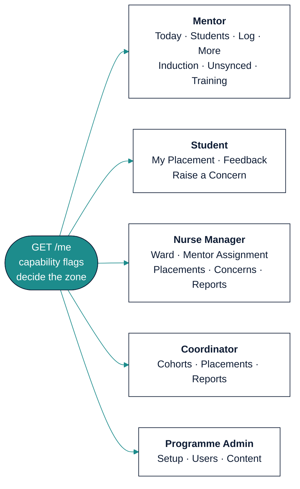
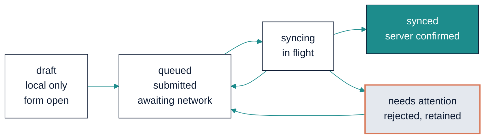

# MentorMAMA — Stage 7: UI / UX Architecture

**Designing for a mentor on a ward floor with two bars of signal and three minutes**

| Field | Detail |
| --- | --- |
| Product | MentorMAMA — Digital Mentorship Toolkit for Safer Midwifery Clinical Placement |
| Prepared by | Sinaps Technology — Bouric Okwaro Enos (Ric), Co-Founder & Team Lead |
| Document type | Stage 7 of the design sequence: UI / UX Architecture |
| Supersedes | SADD v2.0 §8.1–8.2 (information architecture and UI principles) |
| Precedes | Stage 8 (Sprints & Delivery Plan) |
| Builds on | Stage 6 API Design v1.0; Stage 5 Database Architecture v1.0; Stage 3 Business Rules v1.2; Brand Guidelines v1.0 |
| Version | 1.0 |
| Date | July 2026 |

---

## 1. What This Stage Decides

Everything the interface must do has already been decided somewhere else. The state machine is server-owned
(Stage 3). Authorisation is a scope intersection (Stage 3 Part 8). Idempotency is a contract (Stage 6). What
remains is the part nobody else can decide: **what a person sees, in what order, when the connection drops
halfway through.**

This stage is written against one user, not a persona set: a clinical mentor, standing, mid-shift, on a phone,
having just finished a teaching moment with a student, with a ward round starting in four minutes. If the
interface works for her it will work for the Coordinator at a desk. The reverse is not true.

### 1.1 What Stage 7 inherits — and does not re-derive

Four things arrived from Stage 6 and the walking skeleton as **running endpoints**, not proposals. The UI
consumes them; it does not reimplement them.

| Inherited | Shape | Consequence for the UI |
| --- | --- | --- |
| `GET /me` capability flags | `{"capabilities": {"log_session": true, "complete_placement": false, …}}` | Navigation and buttons render from flags. **Never from a role string** (FE-04) |
| `GET /placements/{id}/transitions` | `{"state": "active", "available": ["paused","completed","withdrawn"], "blocked": [{"command":"complete","reasons":[{"code":"FinalAssessmentMissing"}]}]}` | Action buttons are enabled from `available`; `blocked` reasons become the explanatory copy (FE-05) |
| The error catalogue with `retryable` | `{"code": "PlacementNotActive", "retryable": false, …}` | One sentence of copy per code, written once (§9). `retryable` decides queue behaviour, not the client |
| The idempotency contract | `Idempotency-Key` assigned at **form-open** | The client owns a queue, not a retry button (§6) |

### 1.2 What this stage does not do

No visual design comps, no Figma file, no per-pixel spacing. Those are production artifacts that follow from
this. This document decides **structure, states, copy rules, and the offline model** — the parts that are
architecture rather than taste, and the parts that are expensive to change later.

---

## 2. Principles, in Priority Order

When two of these conflict, the higher one wins. That ordering is the useful part; every product claims all
five.

1. **Never lose a mentor's work.** She documented something that actually happened. If we cannot save it, we
   say so, keep it, and let her resolve it. Silence is the one unacceptable outcome (§6).
2. **Three minutes, and it is not negotiable.** The Concept Note's acceptance criterion. A session log that
   takes five minutes will be filled in at the end of the week from memory, or not at all — at which point the
   product measures nothing.
3. **The student must be able to speak safely.** The feedback and escalation paths are the reason the product
   is ethically defensible. Their copy must be plain about who will read what (§7).
4. **Show the state, including the awkward ones.** Empty, loading, offline-queued, blocked, failed. A screen
   that only renders its happy path is unfinished (§5).
5. **Calm, not cheerful.** This is a hospital. The brand's own voice rule: *"encouraging without being cheerful
   — this is a hospital, not a wellness app."*

---

## 3. Information Architecture

Five role-scoped zones, driven by capability flags. A user sees exactly one zone.



### 3.1 Navigation model

| Breakpoint | Pattern |
| --- | --- |
| Mobile (375–767px) | Bottom tab bar, **max four tabs**, plus one primary action. Thumb-reachable; no hamburger for primary destinations |
| Tablet (768–1023px) | Same tabs, promoted to a side rail |
| Desktop (1024px+) | Persistent left navigation. Same destinations, no extra features — a Nurse Manager on a phone is not a second-class user |

Mentor tabs: **Today · Students · Log · More**. The primary action (Log a session) is a tab rather than a
floating button, because it is used dozens of times a week and a FAB is a smaller target that overlaps content.

### 3.2 The Mentor's "Today"

The landing screen answers three questions in one glance, ordered by consequence:

1. **Anything unsynced?** If yes, this is the first thing on the screen, always (§6.4).
2. **Who needs an induction?** Students whose placement is in `induction` — blocking their ward practice.
3. **Who has not been seen recently?** Assigned students ranked by days since last session.

No graphs. A mentor mid-shift needs a list of names and a next action, not a bar chart of her own activity.

---

## 4. The Session Log — the screen the product lives or dies on

Every other screen can be mediocre and the pilot can still succeed. If this one takes five minutes, nothing
else matters.

### 4.1 Field specification

| # | Field | Control | Required | Default |
| --- | --- | --- | --- | --- |
| 1 | Student | Single-select list | Yes | Pre-selected if entered from a student's page |
| 2 | Date | Date, `session_date` | Yes | **Today** |
| 3 | Session type | Chip group, single select, 7 options | Yes | none |
| 4 | Topics | Chip group, **multi**-select, 8 options | Yes (≥1) | none |
| 5 | Time spent | Chip group: 5 / 10 / 15 / 30 / 45+ min | No | none |
| 6 | What was covered | Textarea, 2 rows | No | — |
| 7 | Feedback given | Textarea, 2 rows | No | — |
| 8 | Follow-up | Single-select, 5 options | No | "None" |

Chips rather than dropdowns for 3–5: a native select on Android costs a tap, a modal, a scroll and a
confirm — four interactions where a chip costs one. Fields 1–4 are the only required ones, so **the form is
submittable in five taps**.

Fields 6 and 7 are optional and last, with the no-patient-identifiers instruction shown at the point of entry
(POL-015) — not in a tooltip, not in a help page.

### 4.2 Interaction rules

- `Idempotency-Key` is generated **when the form opens** (Stage 6 §5), not on submit.
- The draft is persisted locally on every field change. Closing the app mid-form loses nothing.
- Submit is enabled as soon as fields 1–4 are valid. It never spins for longer than 400ms before showing an
  outcome — if the request is still in flight, the outcome shown is **"Queued"**, which is true (§6).
- After submit: a single confirmation line and the option to log another for the same student, because mentors
  work through students in batches.
- No confirmation dialogue. The correction window (WFR-013, 24 hours) exists precisely so that a mis-tap is
  fixable without a modal in front of every save.

### 4.3 The three-minute budget, allocated

| Step | Budget |
| --- | --- |
| Open the app to the form (including cold start) | 20s |
| Select student and date | 15s |
| Type and topics | 20s |
| Optional free text (when used) | 60s |
| Submit and confirm | 5s |
| **Total, worst case** | **2:00** |

The margin is deliberate. If the measured median in usability testing exceeds 2:00, fields 6–7 move behind a
"Add detail" disclosure rather than the budget being renegotiated.

---

## 5. Screen States — all six are mandatory

Every screen defines all of these before it is considered done (FE-06). Five come from the SADD; the sixth is
new and comes from the authorisation model.

| State | Rule | Example copy |
| --- | --- | --- |
| **Loading** | Skeleton matching the eventual layout, never a centred spinner on a full page. No layout shift on arrival | — |
| **Empty** | Says why it is empty and what to do next. Never just "No data" | "No students assigned yet. Your nurse manager assigns students when they arrive on the ward." |
| **Error** | The catalogue sentence for the code (§9), plus the one action available | "We couldn't load this. Try again." |
| **Offline-queued** | Explicit and reassuring. The item is visible and marked, not hidden | "Saved on this phone. It will sync when you have signal." |
| **Blocked** | The action exists but is unavailable, and the screen says why — from `transitions.blocked` | "Can't complete yet: the student's exit survey hasn't been submitted." |
| **Success** | Confirms what changed, in the user's terms | "Session logged for Amina." |

The **Blocked** state is the one teams skip, and it is the difference between an interface that explains the
rules and one that appears broken. A disabled button with no reason produces a support call; a disabled button
with `"Can't complete yet: one concern is still open"` produces a resolved concern.

---

## 6. The Offline Model

This is the section that justifies the stage. Everything here follows from one fact established in Stage 3.5
§2.4: **every mutating request in the mentor and student journeys will be sent more than once, and some will
arrive hours late against a placement whose state has changed.**

### 6.1 One queue, owned by `lib/offline`

No feature performs its own write (FE-02). Every command goes into a single client outbox with a durable status:



`syncing → queued` is a retryable failure (network, 503, `CommandInProgress`). `syncing → needs attention` is a
non-retryable rejection. The client makes that decision from the response's `retryable` field, never from its
own list of error codes (Stage 6 §6.3).

### 6.2 Nothing is ever silently dropped

| Situation | What the mentor sees |
| --- | --- |
| Submitted with no signal | "Saved on this phone. It will sync when you have signal." Row appears with a queued marker |
| Response lost, command actually applied | Reconciled via `GET /commands/{command_id}`; the row flips to synced with no duplicate |
| Replay of an applied command | Server returns the original; the client clears the queue entry silently |
| Late arrival, placement now paused | Row moves to **needs attention** with the reason, and the option to ask the nurse manager or discard deliberately |
| Reassigned between draft and sync | Row moves to needs attention: "You're no longer this student's mentor. Send to the nurse manager to reattribute?" |

### 6.3 A queued item is a first-class citizen

Queued sessions appear **in the student's session list**, marked, counted in "days since last session", and
included in the mentor's own activity view. They are not hidden until sync.

The reason is behavioural: if a mentor logs a session and it vanishes from the list until the connection
returns, she will log it again. Hiding queued work manufactures the duplicates the idempotency contract then has
to clean up.

Server-derived numbers (dashboards, cohort indicators) never include queued items, because those come from
projections. Any figure that mixes local and server state is labelled "including 2 not yet synced".

### 6.4 The Unsynced screen

Required by OD-09, and absent from the Concept Note — flagged there as a scope addition.

- Reachable in one tap from Today whenever the queue is non-empty, and **not shown at all** when it is empty.
- Grouped: *Needs attention* first, then *Waiting for signal*.
- Each row: what it was, who it was about, when it was captured, and — for needs-attention — the reason in
  plain language plus one or two actions.
- A manual "Sync now", because a mentor who has just walked into a signal area will press it, and denying her
  that produces a reload-the-app superstition.

---

## 7. Safeguarding and Feedback UX

The two flows where the interface carries ethical weight rather than merely functional weight.

### 7.1 Raise a Concern — honest before submission

The escalation path is **not anonymous** (Stage 3.5 §9.3): an uninvestigable safeguarding report helps nobody.
The interface says so **before** the text field, not after submission:

> Your name is shared with the reviewer handling this. Only they, and the programme administrator, can read what
> you write here.

Also stated: severity affects who is notified (WFR-007), and the student may see status changes but not the
reviewer's notes.

### 7.2 Feedback — two modes, and the trade-off stated plainly

POL-014a requires the choice at submission, defaulting to confidential. The copy must make the consequence
legible to a 21-year-old student on a phone, not to a lawyer:

| Mode | Label | Explanation shown |
| --- | --- | --- |
| Confidential (default) | "Confidential" | "Your nurse manager and university coordinator can see this and who wrote it. Your mentor cannot." |
| Anonymous | "Anonymous" | "Nobody can tell this came from you — not even us. Because of that, nobody can follow it up with you, and it won't be linked to your placement." |

The anonymous option must not be presented as the safer choice by default styling. It is a genuine trade-off,
and a student who wants follow-up should not have to discover afterwards that she chose against it.

### 7.3 Reviewer and mentor views

- Escalation **lists never contain content** (SEC-05) — category, severity, state and age only. This is a UI
  consequence of a serialisation rule, and both must hold.
- The mentor's feedback view shows aggregates only, and below three responses shows
  **"Not enough responses yet"** — not an empty chart, because an empty chart tells the mentor a response
  exists (POL-013).
- No filters on the mentor's aggregate view. Not "no filters for now": the projection has no attribute columns
  to filter on (POL-013a), and the UI must not imply a capability the data model deliberately lacks.

---

## 8. Actions Driven by the Server

### 8.1 Buttons come from `transitions`

```
GET /placements/{id}/transitions
→ available: ["paused", "completed", "withdrawn"]
  blocked:   [{command: "complete", reasons: [{code: "FinalAssessmentMissing"}]}]
```

Rendering rule: an action in `available` is enabled. An action in `blocked` is **visible but disabled, with its
reason shown inline** — not hidden. Hiding it makes the workflow unlearnable; showing it with a reason teaches
the rule at the moment it matters.

### 8.2 Navigation comes from capabilities

`GET /me` decides which zone and which destinations exist. A client that infers `role === "mentor"` and builds a
menu has re-implemented the authorisation matrix, and will drift from it the first time a rule changes
(FE-04). The flags exist so that never happens.

---

## 9. Error Copy Catalogue

One sentence per code, written once, mapped in `lib/api` (MA-19, FE-03). Extracted here because the copy is a
design artifact, not a string constant.

| Code | User-facing copy | Retry | Screen state |
| --- | --- | --- | --- |
| `PlacementNotActive` | "This placement isn't active, so sessions can't be logged right now." | No | Needs attention |
| `SessionOutsidePlacementWindow` | "That date is outside the placement period." | No | Field error on date |
| `SessionValidationFailed` | "Add at least one topic before saving." | No | Field error |
| `DuplicateSession` | "Already logged — we kept the first one." | n/a (200) | Success |
| `SessionCorrectionWindowClosed` | "This session is older than 24 hours. Add a correction instead." | No | Blocked |
| `InductionIncomplete` | "Some required checklist items are still unanswered." | No | Blocked |
| `FinalAssessmentMissing` | "Can't complete yet: the student's exit survey hasn't been submitted." | No | Blocked |
| `OpenEscalationBlocksCompletion` | "Can't complete yet: a concern is still open on this placement." | No | Blocked |
| `MentorAlreadyAssigned` | "This placement already has an active mentor." | No | Blocked |
| `WardCapacityExceeded` | "This ward is full. Choose another ward or free a place first." | No | Blocked |
| `TrainingIncomplete` | "This mentor still has required training to finish." | No | Blocked |
| `StudentAlreadyAssigned` | "This student already has a placement over these dates." | No | Blocked |
| `FeedbackImmutable` | "Submitted feedback can't be edited. You can add a correction." | No | Blocked |
| `ReviewerConflictOfInterest` | "Someone else needs to review this — it concerns you." | No | Blocked |
| `InvalidTransition` | "That isn't possible from the placement's current state." | No | Blocked |
| `UnauthorizedFacilityAccess` | "Not found." | No | Empty / 404 |
| `IdempotencyKeyRequired` | *(never shown — a client bug; log it)* | No | — |
| `CommandInProgress` | "Still saving. One moment." | Yes | Syncing |
| `StaleResource` | "Someone changed this while you had it open. Reload to see the latest." | No | Error with reload |
| network / 5xx | "No connection. Saved on this phone and will sync." | Yes | Offline-queued |

Two deliberate choices. `UnauthorizedFacilityAccess` renders as an ordinary not-found, because AUTH-004's whole
point is not confirming the record exists. And `IdempotencyKeyRequired` is never shown to a user: if it happens,
the client failed to do its job, and the fix is a bug report rather than copy.

---

## 10. Accessibility and Performance Budgets

### 10.1 Accessibility — non-negotiable, not aspirational

| Requirement | Standard |
| --- | --- |
| Contrast | 4.5:1 body, 3:1 large text. Terracotta on white fails at small sizes — never body text |
| Touch targets | 44 × 44px minimum, 8px apart. Chips are 44px tall regardless of label length |
| Keyboard | Every action reachable and operable; visible focus ring (never `outline: none`) |
| Screen readers | Form fields labelled, not placeholder-only. The logo carries `aria-label="MentorMAMA"` |
| Motion | Honour `prefers-reduced-motion` — the site uses GSAP, so this is a real obligation, not a checkbox |
| Errors | Announced via `aria-live`, and associated with their field via `aria-describedby` |
| Zoom | Usable at 200% without horizontal scrolling |

### 10.2 Performance — budgets, because "fast" is not a requirement

| Metric | Budget | Why |
| --- | --- | --- |
| First contentful paint, 3G, mid-range Android | < 2.0s | SADD §7.5 |
| Time to interactive on the session log | < 2.5s | Inside the three-minute budget |
| JS bundle, initial route | < 180KB gzipped | The marketing site is already 150KB; the portal must not exceed it |
| Fonts | 2 families, 4 weights total, `font-display: swap`, preconnected | Manrope + Inter (Brand §07) |
| Images | None on the mentor critical path. Content-library media is lazy and behind a tap | Bandwidth is a clinical constraint |
| Offline shell | Service worker caches the app shell and the mentor's assigned-student list | The form must open with no connection |

---

## 11. Reuse and Tokens

The portal uses `packages/ui` and the brand tokens rather than starting a second design system.

- Palette from `packages/ui/src/tokens/colors.ts`: navy ~30%, white/mist ~50%, teal ~15%, terracotta **under
  5% and never decorative** — a rule this repo has already broken once and had to repair.
- Type: Manrope headings, Inter body, per Brand §07. The marketing site's Playfair Display was a deviation and
  was corrected; the portal must not reintroduce it.
- The logo comes from the `Logo` component, never re-set as text (`assets/brand/logo/README.md`).
- Shape language: soft, rounded, continuous. Radius 8px for cards and inputs, pill for primary actions.

---

## 12. New Open Decisions

| ID | Question | Recommendation |
| --- | --- | --- |
| OD-19 | Do queued sessions count toward the "days since last session" indicator the mentor sees? | **Yes** locally, labelled — §6.3. Server projections never count them, so mentor-local and dashboard figures can differ by design. Confirm this is acceptable to the programme team |
| OD-20 | Does a student see the status of a concern she raised, and at what granularity? | Recommend state only (`under review`, `resolved`, `closed`) with no reviewer notes. Needs JKUAT confirmation — it is a safeguarding-communication decision, not a UI one |
| OD-21 | Is English-only acceptable for the pilot UI, with Kiswahili after usability testing? | Yes, per Concept Note §19 — but copy should be written for translation now (no concatenated sentences, no text baked into images) |

---

## 13. What Stage 8 Inherits

Stage 8 (Sprints & Delivery) receives a screen inventory with states, the offline model, the copy catalogue, and
the budgets. Two things it should carry forward as sequencing constraints:

1. **The mentor journey ships first and complete**, including the Unsynced screen. A partial offline
   implementation is worse than none, because it teaches mentors that the app loses work.
2. **Usability testing measures the three-minute budget on real devices** before feature breadth is added. If
   the median exceeds 2:00, the response is to move fields behind disclosure, not to renegotiate the budget.

---

*End of Stage 7: UI / UX Architecture — Sinaps Technology / JHUB Africa. Confidential.*
